# GitHub Organization Project Management Automation

**Version:** 2.0.0
**Last Updated:** 2025-10-27

## TL;DR

**Automated GitHub organization setup**: This Makefile automates the creation of teams, repositories, and standard files (README, GitHub Actions workflows, CODEOWNERS) across multiple projects. **Key features**: Idempotent operations (safe to run multiple times) → Dry-run mode for testing → Reads configuration from JSON → Clones repos and commits changes. **Quick start**: Copy `.env.example` to `.env`, set your `ORG` name, configure `project-config.json`, run `make all`.

**📚 New to this tool?** See the [User Guide](docs/user-guide.md) for step-by-step instructions.

---

## Documentation

| Document | Purpose | Audience |
|----------|---------|----------|
| **[User Guide](docs/user-guide.md)** | Complete setup and usage guide | All users |
| **[Quick Reference](docs/quick-reference.md)** | Command cheat sheet | Power users |
| **[Test Report](TEST-REPORT.md)** | Test results and findings | Developers |
| **[Test Suite](tests/README.md)** | Testing documentation | Contributors |
| **[CI Parallelization](docs/ci-parallelization-strategies.md)** | GitHub Actions optimization | DevOps |

---

## Overview

This automation tool streamlines the setup and management of GitHub organizations with multiple projects, teams, and repositories. Instead of manually creating dozens of repos and configuring permissions, this tool does it all from a single JSON configuration file.

### What It Does

- ✅ Creates GitHub teams with proper privacy settings
- ✅ Creates private repositories with naming conventions
- ✅ Assigns teams to repositories with specific permissions
- ✅ Adds README templates based on repository role
- ✅ Configures GitHub Actions CI/CD workflows
- ✅ Sets up CODEOWNERS files for code review automation
- ✅ Idempotent: Safe to run multiple times
- ✅ Dry-run mode: Preview changes before applying

---

## Architecture Overview


---

## Workflow Diagram


---

## Prerequisites

### Required Tools

| Tool | Purpose | Installation |
|------|---------|--------------|
| `gh` | GitHub CLI | https://cli.github.com |
| `jq` | JSON processor | `apt-get install jq` or `brew install jq` |
| `git` | Version control | https://git-scm.com |

### Required Files

```
project-management/
├── .env                          # Your configuration (copy from .env.example)
├── project-config.json           # Project/team/repo definitions
└── templates/
    ├── README-frontend.md        # Frontend README template
    ├── README-backend.md         # Backend README template
    ├── README-infra.md           # Infrastructure README template
    ├── workflow-frontend.yml     # Frontend CI/CD workflow
    ├── workflow-backend.yml      # Backend CI/CD workflow
    ├── workflow-infra.yml        # Infrastructure CI/CD workflow
    └── CODEOWNERS                # Code review assignments
```

---

## Setup

### 1. Initial Configuration

```bash
# Clone or create your project-management directory
cd project-management

# Copy environment template
cp .env.example .env

# Edit .env with your organization name
nano .env  # or vim, code, etc.
```

**Edit `.env`:**
```bash
ORG=your-github-org-name
```

### 2. Configure Projects and Teams

Create `project-config.json`:

```json
{
  "teams": [
    "frontend-team",
    "backend-team",
    "infra-team"
  ],
  "projects": [
    {
      "name": "alpha",
      "repos": [
        {
          "name": "frontend",
          "team": "frontend-team",
          "permission": "push"
        },
        {
          "name": "backend",
          "team": "backend-team",
          "permission": "push"
        },
        {
          "name": "infra",
          "team": "infra-team",
          "permission": "admin"
        }
      ]
    },
    {
      "name": "beta",
      "repos": [
        {
          "name": "frontend",
          "team": "frontend-team",
          "permission": "push"
        },
        {
          "name": "backend",
          "team": "backend-team",
          "permission": "push"
        },
        {
          "name": "infra",
          "team": "infra-team",
          "permission": "admin"
        }
      ]
    }
  ]
}
```

This creates:
- Teams: `frontend-team`, `backend-team`, `infra-team`
- Repos: `project-alpha-frontend`, `project-alpha-backend`, `project-alpha-infra`, `project-beta-frontend`, `project-beta-backend`, `project-beta-infra`

### 3. Create Templates

Create template files in `templates/` directory:

```bash
mkdir -p templates
```

See [Templates](#templates) section for examples.

### 4. Authenticate with GitHub

```bash
gh auth login
```

---

## Usage

### Run Everything

```bash
make all
```

This executes all targets in order:
1. Prerequisites check
2. Create teams
3. Create repositories
4. Add README files
5. Add workflow files
6. Add CODEOWNERS files

### Individual Targets

```bash
make teams          # Create teams only
make repos          # Create repositories only
make readmes        # Add README files only
make workflows      # Add GitHub Actions workflows only
make codeowners     # Add CODEOWNERS files only
make clean          # Clean up temporary files
```

### Dry-Run Mode

Preview what would be created **without making changes**:

```bash
make all DRY_RUN=1
make teams DRY_RUN=1
make repos DRY_RUN=1
```

Example output:
```
🔍 Checking prerequisites...
✅ All prerequisites met (ORG: acme-corp)
🔧 Creating teams...
[DRY RUN] Would create team: frontend-team
[DRY RUN] Would create team: backend-team
[DRY RUN] Would create team: infra-team
```

---

## Template Matching Flow

This diagram shows how repositories are created and templates are automatically applied based on the **role** defined in `project-config.json`.

### Example Configuration

```json
{
  "projects": [
    {
      "name": "alpha",
      "repos": [
        {"name": "frontend", "team": "frontend-team", "permission": "push"},
        {"name": "backend", "team": "backend-team", "permission": "push"}
      ]
    },
    {
      "name": "beta",
      "repos": [
        {"name": "frontend", "team": "frontend-team", "permission": "push"},
        {"name": "infra", "team": "infra-team", "permission": "admin"}
      ]
    }
  ]
}
```

### Repository Creation and Template Application

```mermaid
flowchart TB
    subgraph Config["project-config.json"]
        A1["Project: alpha<br/>- frontend<br/>- backend"]
        A2["Project: beta<br/>- frontend<br/>- infra"]
    end

    subgraph Create["Step 1: Create Repositories"]
        B1["project-alpha-frontend"]
        B2["project-alpha-backend"]
        B3["project-beta-frontend"]
        B4["project-beta-infra"]
    end

    subgraph Templates["Available Templates"]
        T1["📄 README-frontend.md<br/>⚙️ workflow-frontend.yml"]
        T2["📄 README-backend.md<br/>⚙️ workflow-backend.yml"]
        T3["📄 README-infra.md<br/>⚙️ workflow-infra.yml"]
        T4["👥 CODEOWNERS<br/>(applied to all)"]
    end

    subgraph Apply["Step 2: Apply Templates Based on Role"]
        C1["project-alpha-frontend<br/>✅ README-frontend.md → README.md<br/>✅ workflow-frontend.yml → .github/workflows/ci.yml<br/>✅ CODEOWNERS → .github/CODEOWNERS"]

        C2["project-alpha-backend<br/>✅ README-backend.md → README.md<br/>✅ workflow-backend.yml → .github/workflows/ci.yml<br/>✅ CODEOWNERS → .github/CODEOWNERS"]

        C3["project-beta-frontend<br/>✅ README-frontend.md → README.md<br/>✅ workflow-frontend.yml → .github/workflows/ci.yml<br/>✅ CODEOWNERS → .github/CODEOWNERS"]

        C4["project-beta-infra<br/>✅ README-infra.md → README.md<br/>✅ workflow-infra.yml → .github/workflows/ci.yml<br/>✅ CODEOWNERS → .github/CODEOWNERS"]
    end

    A1 --> B1
    A1 --> B2
    A2 --> B3
    A2 --> B4

    B1 -->|role: frontend| T1
    B2 -->|role: backend| T2
    B3 -->|role: frontend| T1
    B4 -->|role: infra| T3

    T1 -.->|copy| C1
    T2 -.->|copy| C2
    T1 -.->|copy| C3
    T3 -.->|copy| C4
    T4 -.->|copy to all| C1
    T4 -.->|copy to all| C2
    T4 -.->|copy to all| C3
    T4 -.->|copy to all| C4

    style Config fill:#e3f2fd
    style Create fill:#fff3e0
    style Templates fill:#f3e5f5
    style Apply fill:#e8f5e9
```



### Role Extraction Logic

The Makefile extracts the **role** from the repository configuration:

| Config `name` | Repository Name | Template Used | Files Created |
|---------------|-----------------|---------------|---------------|
| `frontend` | `project-{name}-frontend` | `README-frontend.md`<br/>`workflow-frontend.yml` | `README.md`<br/>`.github/workflows/ci.yml`<br/>`.github/CODEOWNERS` |
| `backend` | `project-{name}-backend` | `README-backend.md`<br/>`workflow-backend.yml` | `README.md`<br/>`.github/workflows/ci.yml`<br/>`.github/CODEOWNERS` |
| `infra` | `project-{name}-infra` | `README-infra.md`<br/>`workflow-infra.yml` | `README.md`<br/>`.github/workflows/ci.yml`<br/>`.github/CODEOWNERS` |

**Key Points:**
- Repository role is determined by the `name` field in `project-config.json`
- Template selection is automatic based on role name
- CODEOWNERS is applied to all repositories regardless of role
- All templates are committed to their respective repositories via git

---

## How It Works

### Target: `check-prereqs`


**What it checks:**
1. `.env` file exists
2. `ORG` variable is set
3. Required tools installed (`gh`, `jq`, `git`)
4. Configuration file exists
5. GitHub authentication is active
6. All template files exist

---

### Target: `teams`

```mermaid
flowchart TD
    A[teams target] --> B[Read teams from config.json]
    B --> C{For each team}
    C --> D{DRY_RUN?}
    D -->|Yes| E[Print: Would create team]
    D -->|No| F{Team exists?}
    F -->|Yes| G[⏭️ Skip: Already exists]
    F -->|No| H[✨ Create team via gh API]
    H --> I{Success?}
    I -->|No| J[❌ Error: Failed to create]
    I -->|Yes| K[✅ Team created]
    E --> L[Next team]
    G --> L
    K --> L
    L --> C
    C -->|Done| M[✅ Teams creation complete]

    style E fill:#fff9c4
    style G fill:#fff9c4
    style K fill:#c8e6c9
    style J fill:#ffebee
    style M fill:#c8e6c9
```



**Idempotency:** Checks if team exists before creating. Safe to run multiple times.

**API Call:**
```bash
gh api -X POST /orgs/$ORG/teams -f name="$TEAM" -f privacy="closed"
```

---

### Target: `repos`

```mermaid
flowchart TD
    A[repos target] --> B[Read projects from config.json]
    B --> C{For each project}
    C --> D{For each repo in project}
    D --> E{DRY_RUN?}
    E -->|Yes| F[Print: Would create repo]
    E -->|No| G{Repo exists?}
    G -->|Yes| H[⏭️ Skip creation]
    G -->|No| I[✨ Create private repo]
    I --> J{Success?}
    J -->|No| K[❌ Error: Failed]
    J -->|Yes| L[Sleep 1s]
    L --> M[Assign team with permissions]
    H --> M
    M --> N[Next repo]
    F --> N
    N --> D
    D -->|Done| O[Next project]
    O --> C
    C -->|Done| P[✅ Repositories complete]

    style F fill:#fff9c4
    style H fill:#fff9c4
    style I fill:#c8e6c9
    style M fill:#c8e6c9
    style K fill:#ffebee
    style P fill:#c8e6c9
```



**Repository naming:** `project-{PROJECT_NAME}-{REPO_NAME}`

Example: `project-alpha-frontend`, `project-beta-backend`

**Permissions:** `pull`, `push`, `admin`, `maintain`, `triage`

---

### Target: `readmes`, `workflows`, `codeowners`

These targets follow the same pattern:

```mermaid
flowchart TD
    A[File addition target] --> B[Create temp directory]
    B --> C[Read projects from config.json]
    C --> D{For each repo}
    D --> E{DRY_RUN?}
    E -->|Yes| F[Print: Would add file]
    E -->|No| G[Clone repository to temp dir]
    G --> H[Copy template file]
    H --> I[Git add + commit + push]
    I --> J{Success?}
    J -->|No| K[⏭️ No changes or error]
    J -->|Yes| L[✅ File added]
    L --> M[Remove temp clone]
    K --> M
    M --> N[Next repo]
    F --> N
    N --> D
    D -->|Done| O[✅ Files addition complete]

    style F fill:#fff9c4
    style K fill:#fff9c4
    style L fill:#c8e6c9
    style O fill:#c8e6c9
```



**File mapping:**

| Target | Template | Destination | Commit Message |
|--------|----------|-------------|----------------|
| `readmes` | `templates/README-{role}.md` | `README.md` | `docs: add README template for {role}` |
| `workflows` | `templates/workflow-{role}.yml` | `.github/workflows/ci.yml` | `ci: add GitHub Actions workflow for {role}` |
| `codeowners` | `templates/CODEOWNERS` | `.github/CODEOWNERS` | `chore: add CODEOWNERS file` |

**Role determination:** Extracted from `repo.name` in `project-config.json`

---

## Configuration Reference

### Environment Variables (`.env`)

```bash
# Required
ORG=your-github-org        # GitHub organization name

# Optional (with defaults)
CONFIG=project-config.json # Configuration file path
DEFAULT_BRANCH=main        # Default git branch
DRY_RUN=0                  # Dry-run mode (0=off, 1=on)
VERBOSE=0                  # Verbose output (0=off, 1=on)
```

### Project Configuration Schema

```json
{
  "teams": ["string"],           // Array of team names
  "projects": [
    {
      "name": "string",          // Project name (used in repo naming)
      "repos": [
        {
          "name": "string",      // Repo role (frontend/backend/infra)
          "team": "string",      // Team to assign (must exist in teams array)
          "permission": "string" // Permission level (pull/push/admin/maintain/triage)
        }
      ]
    }
  ]
}
```

**Permission Levels:**

| Level | Access |
|-------|--------|
| `pull` | Read-only access |
| `push` | Read + write access |
| `maintain` | Push + manage issues/PRs |
| `admin` | Full admin access |
| `triage` | Read + manage issues/PRs (no code) |

---

## Templates

### README Template Example

**`templates/README-frontend.md`:**

```markdown
# Frontend Application

## Overview

This is the frontend application for the project.

## Tech Stack

- React 18
- TypeScript
- Vite
- Tailwind CSS

## Getting Started

\`\`\`bash
npm install
npm run dev
\`\`\`

## Available Scripts

- `npm run dev` - Start development server
- `npm run build` - Build for production
- `npm run test` - Run tests
- `npm run lint` - Lint code

## Project Structure

\`\`\`
src/
├── components/
├── pages/
├── hooks/
├── utils/
└── App.tsx
\`\`\`
```

### Workflow Template Example

**`templates/workflow-frontend.yml`:**

```yaml
name: Frontend CI

on:
  push:
    branches: [main, develop]
  pull_request:
    branches: [main, develop]

jobs:
  test:
    runs-on: ubuntu-latest
    steps:
      - uses: actions/checkout@v4

      - name: Setup Node.js
        uses: actions/setup-node@v4
        with:
          node-version: '20'
          cache: 'npm'

      - name: Install dependencies
        run: npm ci

      - name: Run tests
        run: npm test

      - name: Build
        run: npm run build
```

### CODEOWNERS Template Example

**`templates/CODEOWNERS`:**

```
# Global owners
* @your-org/admins

# Frontend code
/src/components/ @your-org/frontend-team
/src/pages/ @your-org/frontend-team

# Backend code
/api/ @your-org/backend-team
/services/ @your-org/backend-team

# Infrastructure
/terraform/ @your-org/infra-team
/docker/ @your-org/infra-team
/.github/ @your-org/infra-team
```

---

## Complete Data Flow


---

## Error Handling

### Common Errors and Solutions

| Error | Cause | Solution |
|-------|-------|----------|
| `❌ .env file not found` | Missing `.env` file | Copy `.env.example` to `.env` |
| `❌ ORG variable not set` | Empty `ORG` in `.env` | Edit `.env` and set `ORG=your-org-name` |
| `❌ gh CLI not installed` | GitHub CLI missing | Install from https://cli.github.com |
| `❌ jq not installed` | JSON processor missing | `apt-get install jq` or `brew install jq` |
| `❌ Not authenticated with GitHub` | No gh auth | Run `gh auth login` |
| `❌ project-config.json not found` | Missing config | Create configuration file |
| `❌ templates/README-*.md not found` | Missing template | Create template files |
| `Team already exists` | Running multiple times | This is OK - idempotent operation |
| `Repository already exists` | Running multiple times | This is OK - idempotent operation |
| `Failed to clone` | Repo doesn't exist or no access | Check repo exists and you have access |

### Debug Mode

For troubleshooting, you can:

1. **Use dry-run mode:**
   ```bash
   make all DRY_RUN=1
   ```

2. **Run targets individually:**
   ```bash
   make check-prereqs  # Validate setup
   make teams          # Test team creation only
   ```

3. **Check GitHub CLI authentication:**
   ```bash
   gh auth status
   ```

4. **Validate JSON configuration:**
   ```bash
   jq . project-config.json
   ```

---

## Advanced Usage

### Custom Configuration File

```bash
# Use a different config file
CONFIG=my-custom-config.json make all
```

### Override Organization

```bash
# Override ORG from command line
ORG=different-org make all
```

### Run Only Specific Targets

```bash
# Create teams and repos only (skip file additions)
make teams repos
```

### Clean Up Temporary Files

```bash
# Remove temporary clone directories
make clean
```

---

## State Diagram: Repository Creation


---

## Security Considerations

### Best Practices

✅ **DO:**
- Keep `.env` file in `.gitignore`
- Use minimal permissions for team assignments
- Review dry-run output before executing
- Use private repositories by default
- Regularly audit team memberships

❌ **DON'T:**
- Commit `.env` file to version control
- Grant `admin` permission unless necessary
- Run without dry-run on first execution
- Share `.env` file with others
- Use this for public repositories without review

### Secrets Management

The `.env` file contains your organization name, which should be kept private:

```bash
# .gitignore already includes:
.env
```

Never commit:
- `.env` (contains org name)
- Temporary clone directories (`.tmp-repos/`)

Always commit:
- `.env.example` (template without secrets)
- `project-config.json` (if not sensitive)
- Templates (generic files)

---

## Project Structure

```
project-management/
├── .env                          # Your configuration (gitignored)
├── .env.example                  # Configuration template
├── .gitignore                    # Git ignore rules
├── Makefile                      # Main automation script
├── README.md                     # This file
├── project-config.json           # Projects/teams/repos definition
├── templates/                    # Template files
│   ├── CODEOWNERS                # Code review assignments
│   ├── README-backend.md         # Backend README template
│   ├── README-frontend.md        # Frontend README template
│   ├── README-infra.md           # Infrastructure README template
│   ├── workflow-backend.yml      # Backend CI/CD workflow
│   ├── workflow-frontend.yml     # Frontend CI/CD workflow
│   └── workflow-infra.yml        # Infrastructure CI/CD workflow
└── .tmp-repos/                   # Temporary clones (gitignored, auto-created)
```

---

## Troubleshooting

### Makefile fails with "missing separator"

**Cause:** Makefile uses TABS, not spaces for indentation.

**Solution:** Ensure all command lines start with TAB character, not spaces.

### Teams/repos already exist

**Expected behavior:** The Makefile is idempotent. It will skip existing resources and only create missing ones.

### Git push fails with authentication error

**Cause:** SSH keys not configured or HTTPS authentication failed.

**Solution:**
1. Set up SSH keys: https://docs.github.com/en/authentication/connecting-to-github-with-ssh
2. Or use `gh auth login` to configure credentials

### Template file not found

**Cause:** Missing template file in `templates/` directory.

**Solution:**
1. Check which template is missing from error message
2. Create the template file
3. Ensure filename matches exactly (case-sensitive)

### JSON parsing errors

**Cause:** Invalid JSON syntax in `project-config.json`.

**Solution:**
```bash
# Validate JSON syntax
jq . project-config.json
```

Fix any syntax errors (missing commas, quotes, brackets).

---

## FAQ

### Q: Can I add more projects later?

**A:** Yes! Just edit `project-config.json` and run `make all` again. Existing teams/repos won't be affected.

### Q: Can I use this for public repositories?

**A:** Yes, but you'll need to modify the `gh repo create` command in the Makefile to remove `--private`.

### Q: What if I want different template files per project?

**A:** You'll need to modify the Makefile to support project-specific templates. Currently, it uses role-based templates.

### Q: Can I delete all created resources?

**A:** Not automatically. You'll need to manually delete teams and repos via GitHub UI or CLI. We may add a `make destroy` target in the future.

### Q: Does this work with GitHub Enterprise?

**A:** Yes, as long as `gh` CLI is configured for your enterprise instance.

### Q: Can I run this in CI/CD?

**A:** Yes, but ensure you have proper authentication configured (GitHub App or token).

---

## Roadmap

Future enhancements:

- [ ] Support for project-specific templates
- [ ] Destruction target (`make destroy`)
- [ ] Branch protection rules automation
- [ ] Issue/PR templates setup
- [ ] Labels and milestones creation
- [ ] Wiki initialization
- [ ] Repository settings configuration (branch rules, merge options)
- [ ] Support for GitHub Enterprise Server
- [ ] Parallel execution for faster processing
- [ ] Interactive mode for configuration

---

## Contributing

Improvements welcome! Some areas to contribute:

1. **Template library:** Share your template files
2. **Error handling:** Improve error messages and recovery
3. **Features:** Add new automation capabilities
4. **Documentation:** Improve this guide
5. **Testing:** Add validation and testing scripts

---

## License

MIT License - See LICENSE file for details

---

## Resources

- **GitHub CLI Documentation:** https://cli.github.com/manual/
- **GitHub API Reference:** https://docs.github.com/en/rest
- **jq Manual:** https://stedolan.github.io/jq/manual/
- **GNU Make Documentation:** https://www.gnu.org/software/make/manual/

---

**Version History:**

| Version | Date | Changes |
|---------|------|---------|
| 2.0.0 | 2025-10-27 | Complete rewrite with idempotency, dry-run, .env support |
| 1.0.0 | - | Initial version (basic automation) |

---

*Last Updated: 2025-10-27*
