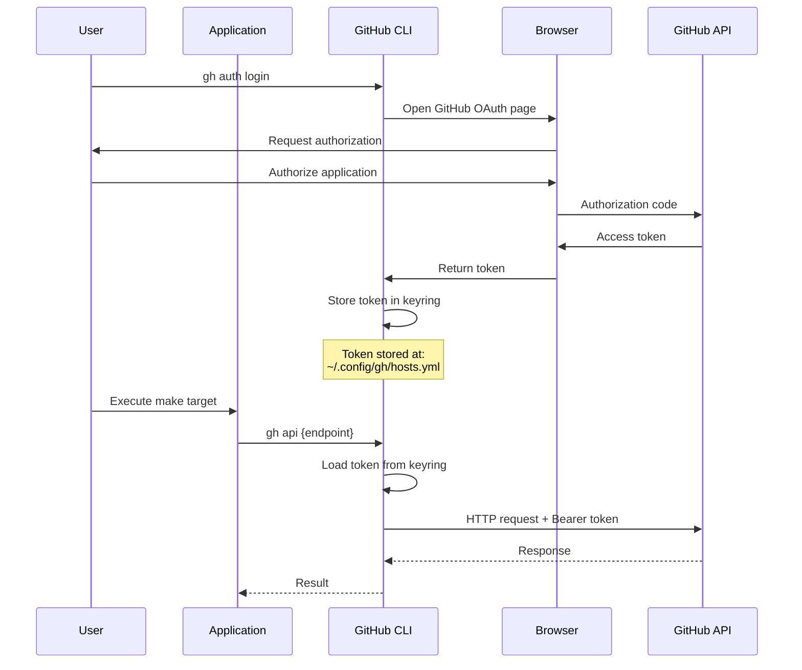
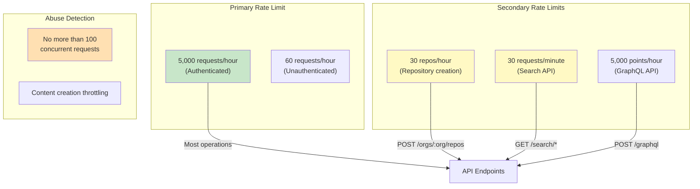
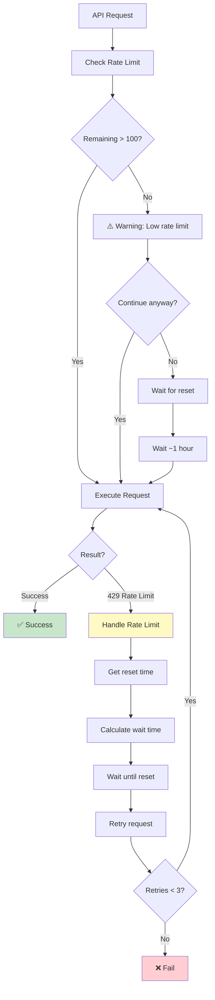

# API Design - GitHub Organization Automation

**Date:** 2025-10-27
**Version:** 1.0

---

## Overview

This document specifies the GitHub API integration design for the GitHub Organization Automation system. It covers all API endpoints used, authentication mechanisms, request/response formats, error handling, and rate limiting strategies.

---

## API Architecture

```mermaid
graph TB
    subgraph "Application Layer"
        Make[Makefile]
        Scripts[Bash Scripts]
    end

    subgraph "Integration Layer"
        GH[GitHub CLI - gh]
        Wrapper[API Wrapper Functions]
    end

    subgraph "GitHub API"
        subgraph "Teams API"
            TeamList[GET /orgs/:org/teams]
            TeamGet[GET /orgs/:org/teams/:slug]
            TeamCreate[POST /orgs/:org/teams]
            TeamDelete[DELETE /orgs/:org/teams/:slug]
        end

        subgraph "Repos API"
            RepoList[GET /orgs/:org/repos]
            RepoGet[GET /repos/:owner/:repo]
            RepoCreate[POST /orgs/:org/repos]
            RepoDelete[DELETE /repos/:owner/:repo]
        end

        subgraph "Team Repos API"
            TeamRepoAdd[PUT /orgs/:org/teams/:slug/repos/:owner/:repo]
            TeamRepoList[GET /orgs/:org/teams/:slug/repos]
        end

        subgraph "Contents API"
            ContentGet[GET /repos/:owner/:repo/contents/:path]
            ContentCreate[PUT /repos/:owner/:repo/contents/:path]
            ContentUpdate[PUT /repos/:owner/:repo/contents/:path]
            ContentDelete[DELETE /repos/:owner/:repo/contents/:path]
        end

        subgraph "Auth API"
            User[GET /user]
            RateLimit[GET /rate_limit]
            OrgMembership[GET /orgs/:org/memberships/:username]
        end
    end

    Make --> Scripts
    Scripts --> Wrapper
    Wrapper --> GH
    GH --> TeamList
    GH --> TeamGet
    GH --> TeamCreate
    GH --> RepoList
    GH --> RepoGet
    GH --> RepoCreate
    GH --> TeamRepoAdd
    GH --> ContentGet
    GH --> ContentCreate
    GH --> User
    GH --> RateLimit
    GH --> OrgMembership

    style Make fill:#e3f2fd
    style GH fill:#fff3e0
    style Wrapper fill:#ffe0b2
```



---

## Authentication

### OAuth Token Authentication



### Token Storage

**GitHub CLI Configuration:**
```yaml
# ~/.config/gh/hosts.yml
github.com:
    user: username
    oauth_token: ghp_xxxxxxxxxxxxxxxxxxxx
    git_protocol: https
```

**Token Scopes Required:**
- `repo` - Full control of private repositories
- `admin:org` - Full control of orgs and teams
- `workflow` - Update GitHub Action workflows

### Authentication Check

```bash
# Check authentication status
gh auth status

# Output (authenticated)
✓ Logged in to github.com as username (oauth_token)
✓ Git operations for github.com configured to use https protocol.
✓ Token: ghp_************************************
✓ Token scopes: admin:org, repo, workflow

# Output (not authenticated)
✗ You are not logged into any GitHub hosts. Run gh auth login to authenticate.
```

### API Authentication Flow

```bash
# Every API call includes authentication
gh api {endpoint}

# Internally executes:
curl -H "Authorization: Bearer ghp_xxxx" \
     -H "Accept: application/vnd.github+json" \
     -H "X-GitHub-Api-Version: 2022-11-28" \
     https://api.github.com{endpoint}
```

---

## API Endpoints Specification

### 1. Teams API

#### List Teams

**Endpoint:** `GET /orgs/{org}/teams`

**Purpose:** List all teams in the organization

**Request:**
```bash
gh api /orgs/phdsystems/teams
```

**Response (200 OK):**
```json
[
  {
    "id": 12345,
    "node_id": "MDQ6VGVhbTEyMzQ1",
    "url": "https://api.github.com/teams/12345",
    "html_url": "https://github.com/orgs/phdsystems/teams/frontend-team",
    "name": "frontend-team",
    "slug": "frontend-team",
    "description": "",
    "privacy": "closed",
    "permission": "pull",
    "members_url": "https://api.github.com/teams/12345/members{/member}",
    "repositories_url": "https://api.github.com/teams/12345/repos",
    "parent": null
  }
]
```

**Rate Limit:** Primary limit (5000/hour)

---

#### Get Team by Slug

**Endpoint:** `GET /orgs/{org}/teams/{team_slug}`

**Purpose:** Check if team exists, get team details

**Request:**
```bash
gh api /orgs/phdsystems/teams/frontend-team
```

**Response (200 OK):**
```json
{
  "id": 12345,
  "node_id": "MDQ6VGVhbTEyMzQ1",
  "url": "https://api.github.com/teams/12345",
  "html_url": "https://github.com/orgs/phdsystems/teams/frontend-team",
  "name": "frontend-team",
  "slug": "frontend-team",
  "description": "",
  "privacy": "closed",
  "permission": "pull",
  "created_at": "2025-10-27T10:00:00Z",
  "updated_at": "2025-10-27T10:00:00Z",
  "members_count": 5,
  "repos_count": 3
}
```

**Response (404 Not Found):**
```json
{
  "message": "Not Found",
  "documentation_url": "https://docs.github.com/rest/teams/teams#get-a-team-by-name"
}
```

**Use Case:** Idempotent team creation (check before create)

**Rate Limit:** Primary limit (5000/hour)

---

#### Create Team

**Endpoint:** `POST /orgs/{org}/teams`

**Purpose:** Create a new team in the organization

**Request:**
```bash
gh api /orgs/phdsystems/teams \
  -f name="frontend-team" \
  -f privacy="closed"
```

**Request Body:**
```json
{
  "name": "frontend-team",
  "description": "",
  "privacy": "closed",
  "permission": "pull"
}
```

**Parameters:**

| Field | Type | Required | Default | Description |
|-------|------|----------|---------|-------------|
| `name` | string | Yes | - | Team name |
| `description` | string | No | "" | Team description |
| `privacy` | string | No | "closed" | `closed` or `secret` |
| `permission` | string | No | "pull" | Default repo permission |
| `parent_team_id` | integer | No | null | Parent team ID |

**Response (201 Created):**
```json
{
  "id": 12345,
  "node_id": "MDQ6VGVhbTEyMzQ1",
  "url": "https://api.github.com/teams/12345",
  "html_url": "https://github.com/orgs/phdsystems/teams/frontend-team",
  "name": "frontend-team",
  "slug": "frontend-team",
  "description": "",
  "privacy": "closed",
  "permission": "pull",
  "created_at": "2025-10-27T10:00:00Z",
  "updated_at": "2025-10-27T10:00:00Z"
}
```

**Response (422 Unprocessable Entity):**
```json
{
  "message": "Validation Failed",
  "errors": [
    {
      "resource": "Team",
      "code": "already_exists",
      "field": "name",
      "message": "name already exists on this account"
    }
  ]
}
```

**Rate Limit:** Primary limit (5000/hour)

---

### 2. Repositories API

#### List Organization Repositories

**Endpoint:** `GET /orgs/{org}/repos`

**Purpose:** List all repositories in the organization

**Request:**
```bash
gh api /orgs/phdsystems/repos
```

**Response (200 OK):**
```json
[
  {
    "id": 67890,
    "node_id": "MDEwOlJlcG9zaXRvcnk2Nzg5MA==",
    "name": "project-alpha-frontend",
    "full_name": "phdsystems/project-alpha-frontend",
    "private": false,
    "owner": {...},
    "html_url": "https://github.com/phdsystems/project-alpha-frontend",
    "description": "Frontend application",
    "fork": false,
    "created_at": "2025-10-27T10:00:00Z",
    "updated_at": "2025-10-27T10:00:00Z",
    "pushed_at": "2025-10-27T10:00:00Z",
    "size": 123,
    "stargazers_count": 0,
    "watchers_count": 0,
    "language": "TypeScript",
    "has_issues": true,
    "has_projects": true,
    "has_downloads": true,
    "has_wiki": false,
    "has_pages": false,
    "default_branch": "main"
  }
]
```

**Query Parameters:**

| Parameter | Type | Default | Description |
|-----------|------|---------|-------------|
| `type` | string | "all" | `all`, `public`, `private`, `forks`, `sources`, `member` |
| `sort` | string | "created" | `created`, `updated`, `pushed`, `full_name` |
| `direction` | string | "desc" | `asc`, `desc` |
| `per_page` | integer | 30 | Results per page (max 100) |
| `page` | integer | 1 | Page number |

**Rate Limit:** Primary limit (5000/hour)

---

#### Get Repository

**Endpoint:** `GET /repos/{owner}/{repo}`

**Purpose:** Check if repository exists, get repository details

**Request:**
```bash
gh api /repos/phdsystems/project-alpha-frontend
```

**Simpler via gh repo:**
```bash
gh repo view phdsystems/project-alpha-frontend
```

**Response (200 OK):**
```json
{
  "id": 67890,
  "node_id": "MDEwOlJlcG9zaXRvcnk2Nzg5MA==",
  "name": "project-alpha-frontend",
  "full_name": "phdsystems/project-alpha-frontend",
  "private": false,
  "owner": {
    "login": "phdsystems",
    "id": 11111,
    "type": "Organization"
  },
  "html_url": "https://github.com/phdsystems/project-alpha-frontend",
  "description": "Frontend application",
  "default_branch": "main",
  "created_at": "2025-10-27T10:00:00Z",
  "updated_at": "2025-10-27T10:00:00Z",
  "permissions": {
    "admin": true,
    "maintain": true,
    "push": true,
    "triage": true,
    "pull": true
  }
}
```

**Response (404 Not Found):**
```json
{
  "message": "Not Found",
  "documentation_url": "https://docs.github.com/rest/repos/repos#get-a-repository"
}
```

**Use Case:** Idempotent repo creation (check before create)

**Rate Limit:** Primary limit (5000/hour)

---

#### Create Repository

**Endpoint:** `POST /orgs/{org}/repos`

**Purpose:** Create a new repository in the organization

**Request:**
```bash
gh api /orgs/phdsystems/repos \
  -f name="project-alpha-frontend" \
  -f description="Frontend application" \
  -F private=false \
  -F auto_init=true \
  -f default_branch="main"
```

**Simpler via gh repo:**
```bash
gh repo create phdsystems/project-alpha-frontend \
  --public \
  --description "Frontend application" \
  --enable-issues \
  --enable-wiki=false
```

**Request Body:**
```json
{
  "name": "project-alpha-frontend",
  "description": "Frontend application",
  "homepage": "",
  "private": false,
  "has_issues": true,
  "has_projects": true,
  "has_wiki": false,
  "auto_init": true,
  "default_branch": "main",
  "allow_squash_merge": true,
  "allow_merge_commit": true,
  "allow_rebase_merge": true,
  "delete_branch_on_merge": false
}
```

**Parameters:**

| Field | Type | Required | Default | Description |
|-------|------|----------|---------|-------------|
| `name` | string | Yes | - | Repository name |
| `description` | string | No | "" | Short description |
| `homepage` | string | No | "" | Homepage URL |
| `private` | boolean | No | false | Public or private |
| `has_issues` | boolean | No | true | Enable issues |
| `has_projects` | boolean | No | true | Enable projects |
| `has_wiki` | boolean | No | true | Enable wiki |
| `auto_init` | boolean | No | false | Initialize with README |
| `default_branch` | string | No | "main" | Default branch name |

**Response (201 Created):**
```json
{
  "id": 67890,
  "node_id": "MDEwOlJlcG9zaXRvcnk2Nzg5MA==",
  "name": "project-alpha-frontend",
  "full_name": "phdsystems/project-alpha-frontend",
  "private": false,
  "owner": {
    "login": "phdsystems",
    "id": 11111,
    "type": "Organization"
  },
  "html_url": "https://github.com/phdsystems/project-alpha-frontend",
  "description": "Frontend application",
  "fork": false,
  "created_at": "2025-10-27T10:00:00Z",
  "updated_at": "2025-10-27T10:00:00Z",
  "default_branch": "main"
}
```

**Response (422 Unprocessable Entity):**
```json
{
  "message": "Validation Failed",
  "errors": [
    {
      "resource": "Repository",
      "code": "custom",
      "field": "name",
      "message": "name already exists on this account"
    }
  ]
}
```

**Rate Limit:** Secondary limit (30 repos/hour)

---

### 3. Team Repository Permissions API

#### Add Team to Repository

**Endpoint:** `PUT /orgs/{org}/teams/{team_slug}/repos/{owner}/{repo}`

**Purpose:** Grant team access to repository with specified permission

**Request:**
```bash
gh api -X PUT /orgs/phdsystems/teams/frontend-team/repos/phdsystems/project-alpha-frontend \
  -f permission="push"
```

**Request Body:**
```json
{
  "permission": "push"
}
```

**Permission Levels:**

| Permission | Access Rights |
|------------|---------------|
| `pull` | Read-only: clone, pull |
| `triage` | Manage issues and PRs (no code access) |
| `push` | Read + write: push commits, create branches |
| `maintain` | Push + manage issues/PRs/settings (no admin) |
| `admin` | Full repository access including settings |

**Response (204 No Content):**
- Empty response body
- Success indicated by 204 status code

**Response (422 Unprocessable Entity):**
```json
{
  "message": "Validation Failed",
  "errors": [
    {
      "resource": "TeamRepository",
      "code": "invalid",
      "field": "permission",
      "message": "permission is invalid"
    }
  ]
}
```

**Use Case:** Assign team to repository after creation

**Rate Limit:** Primary limit (5000/hour)

---

### 4. Repository Contents API

#### Get File Contents

**Endpoint:** `GET /repos/{owner}/{repo}/contents/{path}`

**Purpose:** Check if file exists in repository

**Request:**
```bash
gh api /repos/phdsystems/project-alpha-frontend/contents/README.md
```

**Response (200 OK):**
```json
{
  "type": "file",
  "encoding": "base64",
  "size": 5362,
  "name": "README.md",
  "path": "README.md",
  "content": "IyBGcm9udGVuZCBBcHBsaWNhdGlvbgoK...",
  "sha": "3d21ec53a331a6f037a91c368710b99387d012c1",
  "url": "https://api.github.com/repos/phdsystems/project-alpha-frontend/contents/README.md",
  "git_url": "https://api.github.com/repos/phdsystems/project-alpha-frontend/git/blobs/3d21ec53a331a6f037a91c368710b99387d012c1",
  "html_url": "https://github.com/phdsystems/project-alpha-frontend/blob/main/README.md",
  "download_url": "https://raw.githubusercontent.com/phdsystems/project-alpha-frontend/main/README.md",
  "_links": {
    "git": "...",
    "self": "...",
    "html": "..."
  }
}
```

**Response (404 Not Found):**
```json
{
  "message": "Not Found",
  "documentation_url": "https://docs.github.com/rest/repos/contents#get-repository-content"
}
```

**Use Case:** Idempotent file creation (check before create)

**Rate Limit:** Primary limit (5000/hour)

---

#### Create/Update File

**Endpoint:** `PUT /repos/{owner}/{repo}/contents/{path}`

**Purpose:** Create new file or update existing file in repository

**Request (Create):**
```bash
# Base64 encode file
CONTENT=$(base64 -w 0 < templates/README-frontend.md)

# Create file
gh api -X PUT /repos/phdsystems/project-alpha-frontend/contents/README.md \
  -f message="docs: add README from template" \
  -f content="$CONTENT" \
  -f branch="main"
```

**Request Body (Create):**
```json
{
  "message": "docs: add README from template",
  "content": "IyBGcm9udGVuZCBBcHBsaWNhdGlvbgoK...",
  "branch": "main"
}
```

**Request Body (Update):**
```json
{
  "message": "docs: update README",
  "content": "IyBGcm9udGVuZCBBcHBsaWNhdGlvbgoK...",
  "sha": "3d21ec53a331a6f037a91c368710b99387d012c1",
  "branch": "main"
}
```

**Parameters:**

| Field | Type | Required | Description |
|-------|------|----------|-------------|
| `message` | string | Yes | Commit message |
| `content` | string | Yes | Base64-encoded file content |
| `branch` | string | No | Branch name (default: repo default branch) |
| `sha` | string | For update | Current file SHA (required for updates) |
| `committer` | object | No | Committer details |
| `author` | object | No | Author details |

**Response (201 Created):**
```json
{
  "content": {
    "name": "README.md",
    "path": "README.md",
    "sha": "3d21ec53a331a6f037a91c368710b99387d012c1",
    "size": 5362,
    "url": "...",
    "html_url": "...",
    "git_url": "...",
    "download_url": "...",
    "type": "file",
    "_links": {...}
  },
  "commit": {
    "sha": "7638417db6d59f3c431d3e1f261cc637155684cd",
    "node_id": "...",
    "url": "...",
    "html_url": "...",
    "author": {
      "name": "username",
      "email": "user@example.com",
      "date": "2025-10-27T10:00:00Z"
    },
    "committer": {...},
    "tree": {...},
    "message": "docs: add README from template",
    "parents": [...]
  }
}
```

**Response (422 Unprocessable Entity):**
```json
{
  "message": "Invalid request.\n\n\"sha\" wasn't supplied."
}
```

**Rate Limit:** Primary limit (5000/hour)

---

### 5. Authentication & Meta API

#### Get Authenticated User

**Endpoint:** `GET /user`

**Purpose:** Get current authenticated user details

**Request:**
```bash
gh api /user
```

**Response (200 OK):**
```json
{
  "login": "username",
  "id": 12345,
  "node_id": "MDQ6VXNlcjEyMzQ1",
  "avatar_url": "https://avatars.githubusercontent.com/u/12345?v=4",
  "type": "User",
  "site_admin": false,
  "name": "User Name",
  "company": "Company",
  "email": "user@example.com",
  "hireable": null,
  "bio": "Bio text",
  "public_repos": 10,
  "public_gists": 5,
  "followers": 20,
  "following": 15,
  "created_at": "2020-01-01T00:00:00Z",
  "updated_at": "2025-10-27T10:00:00Z"
}
```

**Use Case:** Verify authentication, get username

**Rate Limit:** Primary limit (5000/hour)

---

#### Get User/Organization Type

**Endpoint:** `GET /users/{username}`

**Purpose:** Check if account is User or Organization

**Request:**
```bash
gh api /users/phdsystems | jq -r '.type'
```

**Response (200 OK):**
```json
{
  "login": "phdsystems",
  "id": 11111,
  "node_id": "...",
  "avatar_url": "...",
  "type": "Organization",
  "site_admin": false,
  "name": "PHD Systems",
  "company": null,
  "blog": "https://phdsystems.com",
  "location": "Location",
  "email": "contact@phdsystems.com",
  "public_repos": 15,
  "public_gists": 0,
  "followers": 5,
  "following": 0,
  "created_at": "2020-01-01T00:00:00Z",
  "updated_at": "2025-10-27T10:00:00Z"
}
```

**Type Values:**
- `"User"` - Personal user account
- `"Organization"` - Organization account

**Use Case:** Prerequisites check (verify Organization account)

**Rate Limit:** Primary limit (5000/hour)

---

#### Get Organization Membership

**Endpoint:** `GET /orgs/{org}/memberships/{username}`

**Purpose:** Check user's role in organization

**Request:**
```bash
gh api /orgs/phdsystems/memberships/username
```

**Response (200 OK):**
```json
{
  "url": "https://api.github.com/orgs/phdsystems/memberships/username",
  "state": "active",
  "role": "admin",
  "organization_url": "https://api.github.com/orgs/phdsystems",
  "organization": {
    "login": "phdsystems",
    "id": 11111,
    "url": "...",
    "avatar_url": "..."
  },
  "user": {
    "login": "username",
    "id": 12345,
    "url": "...",
    "avatar_url": "..."
  }
}
```

**Role Values:**
- `"member"` - Regular member
- `"admin"` - Organization admin
- `"billing_manager"` - Billing manager

**State Values:**
- `"active"` - Membership is active
- `"pending"` - Invitation pending

**Use Case:** Prerequisites check (verify admin permissions)

**Rate Limit:** Primary limit (5000/hour)

---

#### Get Rate Limit Status

**Endpoint:** `GET /rate_limit`

**Purpose:** Check current rate limit status

**Request:**
```bash
gh api /rate_limit
```

**Response (200 OK):**
```json
{
  "resources": {
    "core": {
      "limit": 5000,
      "used": 123,
      "remaining": 4877,
      "reset": 1698422400
    },
    "search": {
      "limit": 30,
      "used": 5,
      "remaining": 25,
      "reset": 1698422400
    },
    "graphql": {
      "limit": 5000,
      "used": 0,
      "remaining": 5000,
      "reset": 1698422400
    }
  },
  "rate": {
    "limit": 5000,
    "used": 123,
    "remaining": 4877,
    "reset": 1698422400
  }
}
```

**Rate Limit Categories:**
- `core` - REST API endpoints (most operations)
- `search` - Search API
- `graphql` - GraphQL API

**Fields:**
- `limit` - Maximum requests per hour
- `used` - Requests used in current window
- `remaining` - Requests remaining
- `reset` - Unix timestamp when limit resets

**Use Case:** Monitor rate limit, prevent 429 errors

**Rate Limit:** Does NOT count against rate limit

---

## Rate Limiting

### Rate Limit Types



### Rate Limit Handling Strategy



### Implementation

**Check rate limit before execution:**
```bash
check_rate_limit() {
    local remaining=$(gh api /rate_limit | jq -r '.rate.remaining')
    local reset=$(gh api /rate_limit | jq -r '.rate.reset')
    local reset_time=$(date -d @$reset)

    echo "Rate limit: $remaining remaining"

    if [ "$remaining" -lt 100 ]; then
        echo "⚠️  WARNING: Only $remaining API calls remaining" >&2
        echo "   Rate limit resets at: $reset_time" >&2
        echo "   Consider waiting before continuing" >&2
        return 1
    fi

    return 0
}
```

**Handle 429 response:**
```bash
api_call_with_retry() {
    local endpoint="$1"
    local max_retries=3
    local retry_count=0

    while [ $retry_count -lt $max_retries ]; do
        local response
        local status_code

        response=$(gh api "$endpoint" 2>&1)
        status_code=$?

        if [ $status_code -eq 0 ]; then
            echo "$response"
            return 0
        fi

        # Check if rate limit error
        if echo "$response" | grep -q "API rate limit exceeded"; then
            local reset=$(gh api /rate_limit | jq -r '.rate.reset')
            local wait_time=$((reset - $(date +%s) + 10))

            echo "❌ Rate limit exceeded" >&2
            echo "   Waiting $wait_time seconds until reset..." >&2
            sleep $wait_time

            ((retry_count++))
            continue
        fi

        # Other error
        echo "$response" >&2
        return $status_code
    done

    echo "❌ Max retries exceeded" >&2
    return 1
}
```

---

## Error Handling

### HTTP Status Codes

| Code | Name | Meaning | Action |
|------|------|---------|--------|
| 200 | OK | Request successful | Process response |
| 201 | Created | Resource created | Success |
| 204 | No Content | Success (no body) | Success |
| 304 | Not Modified | Cached data valid | Use cache |
| 400 | Bad Request | Invalid parameters | Fix request |
| 401 | Unauthorized | Not authenticated | Run `gh auth login` |
| 403 | Forbidden | Insufficient permissions | Check permissions |
| 404 | Not Found | Resource doesn't exist | Create or check URL |
| 422 | Unprocessable Entity | Validation failed | Fix data |
| 429 | Too Many Requests | Rate limit exceeded | Wait and retry |
| 500 | Internal Server Error | GitHub API issue | Retry later |
| 502 | Bad Gateway | Gateway error | Retry later |
| 503 | Service Unavailable | Service down | Retry later |

### Error Response Format

**Standard Error Response:**
```json
{
  "message": "Error message",
  "documentation_url": "https://docs.github.com/rest/...",
  "status": "404"
}
```

**Validation Error Response:**
```json
{
  "message": "Validation Failed",
  "errors": [
    {
      "resource": "Team",
      "code": "already_exists",
      "field": "name",
      "message": "name already exists on this account"
    }
  ],
  "documentation_url": "https://docs.github.com/rest/..."
}
```

### Error Handling Implementation

```bash
handle_api_error() {
    local response="$1"
    local status_code="$2"

    case $status_code in
        200|201|204)
            return 0
            ;;

        401)
            echo "❌ ERROR: Not authenticated with GitHub" >&2
            echo "   Run: gh auth login" >&2
            return 1
            ;;

        403)
            echo "❌ ERROR: Forbidden - insufficient permissions" >&2
            echo "   Check that you have admin access to the organization" >&2
            return 1
            ;;

        404)
            echo "❌ ERROR: Resource not found" >&2
            echo "   $response" >&2
            return 1
            ;;

        422)
            local message=$(echo "$response" | jq -r '.message')
            local errors=$(echo "$response" | jq -r '.errors[] | .message' 2>/dev/null)

            echo "❌ ERROR: Validation failed" >&2
            echo "   $message" >&2
            if [ -n "$errors" ]; then
                echo "   Details:" >&2
                echo "$errors" | sed 's/^/     - /' >&2
            fi
            return 1
            ;;

        429)
            local reset=$(gh api /rate_limit | jq -r '.rate.reset')
            local reset_time=$(date -d @$reset)

            echo "❌ ERROR: Rate limit exceeded" >&2
            echo "   Rate limit resets at: $reset_time" >&2
            return 1
            ;;

        500|502|503)
            echo "❌ ERROR: GitHub API error (HTTP $status_code)" >&2
            echo "   GitHub may be experiencing issues" >&2
            echo "   Check https://www.githubstatus.com/" >&2
            return 1
            ;;

        *)
            echo "❌ ERROR: Unknown error (HTTP $status_code)" >&2
            echo "   $response" >&2
            return 1
            ;;
    esac
}
```

---

## API Usage Summary

### Operations per Execution

**For configuration with:**
- 2 teams
- 2 projects
- 4 repositories (2 per project)
- 3 files per repository (README, workflow, CODEOWNERS)

**API Calls:**

| Operation | Endpoint | Count | Total |
|-----------|----------|-------|-------|
| Check prerequisites | GET /user | 1 | 1 |
| Check account type | GET /users/{org} | 1 | 1 |
| Check permissions | GET /orgs/{org}/memberships/{user} | 1 | 1 |
| Check team exists | GET /orgs/{org}/teams/{team} | 2 | 2 |
| Create teams | POST /orgs/{org}/teams | 2 | 2 |
| Check repo exists | GET /repos/{org}/{repo} | 4 | 4 |
| Create repos | POST /orgs/{org}/repos | 4 | 4 |
| Assign teams | PUT /orgs/{org}/teams/{team}/repos/{org}/{repo} | 4 | 4 |
| Check file exists | GET /repos/{org}/{repo}/contents/{path} | 12 | 12 |
| Create files | PUT /repos/{org}/{repo}/contents/{path} | 12 | 12 |
| **TOTAL** | | | **43 API calls** |

**Rate Limit Impact:**
- 43 calls out of 5,000 limit = 0.86%
- Can create ~116 similar configurations per hour
- Repository creation limited to 30/hour (7.5 full configurations)

---

*Last Updated: 2025-10-27*
