# Architecture Design - Git Platform Organization Automation

**Date:** 2025-10-27
**Version:** 2.1.0

## TL;DR

**Architecture**: Multi-platform automation supporting both GitHub and Gitea via backend abstraction layer. **Two interfaces**: Makefile (legacy) and CLI tool (gh-org). **Key patterns**: Backend routing → Configuration-driven → Idempotent operations → Template matching by convention. **Critical design**: Stateless execution, platform-agnostic via router pattern, supports gh and tea CLI tools interchangeably.

---

## Table of Contents

- [Overview](#overview)
- [System Architecture](#system-architecture)
- [CLI Architecture](#cli-architecture)
- [Backend Abstraction Architecture](#backend-abstraction-architecture)
- [Component Architecture](#component-architecture)
- [Data Flow](#data-flow)
- [Technology Stack](#technology-stack)
- [Design Patterns](#design-patterns)
- [Usage Examples](#usage-examples)
- [Deployment Architecture](#deployment-architecture)
- [Scalability](#scalability)
- [Security Architecture](#security-architecture)

---

## Overview

### System Purpose

Automate the creation and configuration of teams, repositories, and standard files across multiple projects within Git platform organizations. Supports both GitHub (cloud/enterprise) and Gitea (self-hosted) with identical configuration and commands.

### Architecture Goals

1. **Platform Agnostic** - Support GitHub and Gitea with same config
2. **Simplicity** - Minimal dependencies, clear structure
3. **Idempotency** - Safe to run multiple times
4. **Transparency** - Clear, readable automation steps
5. **Flexibility** - Configuration-driven, easy to customize
6. **Reliability** - Fail-fast with clear error messages

### Architecture Principles

- **Backend Abstraction** - Platform-specific logic isolated via router pattern
- **Configuration over Code** - JSON config drives all operations
- **Convention over Configuration** - Template matching by naming
- **Stateless Operation** - Platform API is source of truth (GitHub/Gitea)
- **Progressive Enhancement** - Build incrementally (teams → repos → files)
- **Fail-Fast** - Validate early, exit on error

---

## System Architecture

### High-Level Architecture

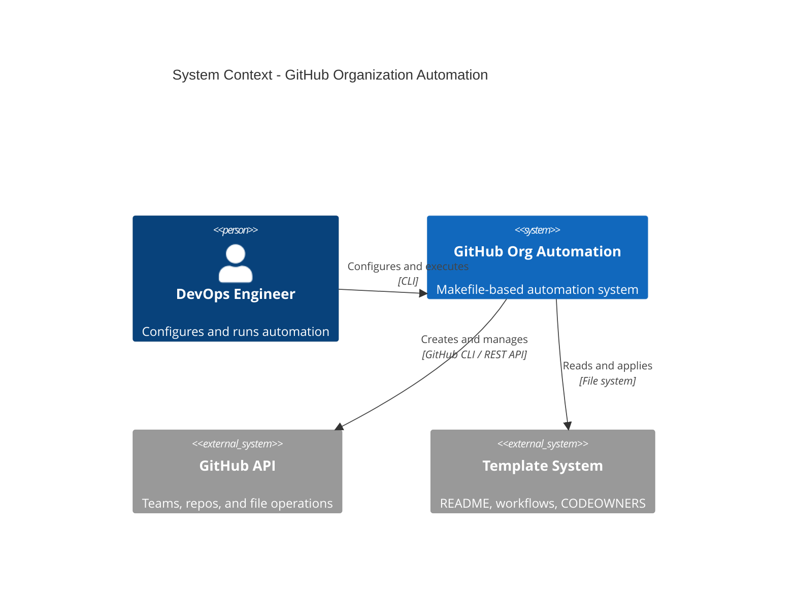
```mermaid
C4Context
    title System Context - GitHub Organization Automation

    Person(user, "DevOps Engineer", "Configures and runs automation")

    System(automation, "GitHub Org Automation", "Makefile-based automation system")

    System_Ext(github, "GitHub API", "Teams, repos, and file operations")
    System_Ext(templates, "Template System", "README, workflows, CODEOWNERS")

    Rel(user, automation, "Configures and executes", "CLI")
    Rel(automation, github, "Creates and manages", "GitHub CLI / REST API")
    Rel(automation, templates, "Reads and applies", "File system")

    UpdateRelStyle(user, automation, $offsetX="-40", $offsetY="-30")
    UpdateRelStyle(automation, github, $offsetX="0", $offsetY="-30")
```

### Layered Architecture

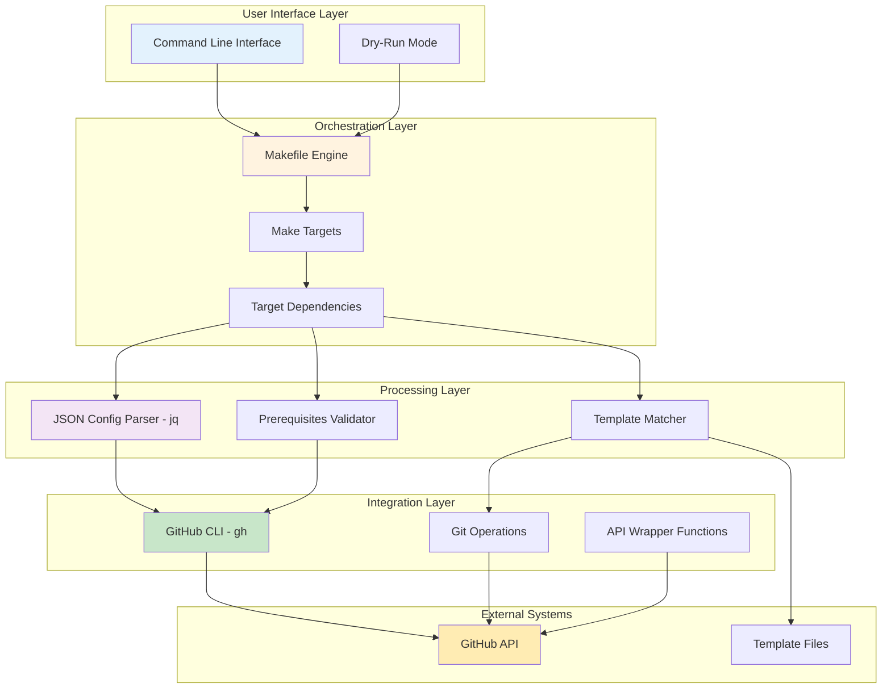
```mermaid
graph TB
    subgraph "User Interface Layer"
        CLI[Command Line Interface]
        DryRun[Dry-Run Mode]
    end

    subgraph "Orchestration Layer"
        Makefile[Makefile Engine]
        Targets[Make Targets]
        Dependencies[Target Dependencies]
    end

    subgraph "Processing Layer"
        ConfigParser[JSON Config Parser - jq]
        TemplateEngine[Template Matcher]
        Validator[Prerequisites Validator]
    end

    subgraph "Integration Layer"
        GitHubCLI[GitHub CLI - gh]
        GitOps[Git Operations]
        APIWrapper[API Wrapper Functions]
    end

    subgraph "External Systems"
        GitHub[GitHub API]
        FileSystem[Template Files]
    end

    CLI --> Makefile
    DryRun --> Makefile
    Makefile --> Targets
    Targets --> Dependencies

    Dependencies --> ConfigParser
    Dependencies --> TemplateEngine
    Dependencies --> Validator

    ConfigParser --> GitHubCLI
    TemplateEngine --> GitOps
    Validator --> GitHubCLI

    GitHubCLI --> GitHub
    GitOps --> GitHub
    APIWrapper --> GitHub

    TemplateEngine --> FileSystem

    style CLI fill:#e3f2fd
    style Makefile fill:#fff3e0
    style ConfigParser fill:#f3e5f5
    style GitHubCLI fill:#c8e6c9
    style GitHub fill:#ffecb3
```

---

## CLI Architecture

### CLI Tool Structure

The `gh-org` CLI tool follows a modular design inspired by GitHub CLI:

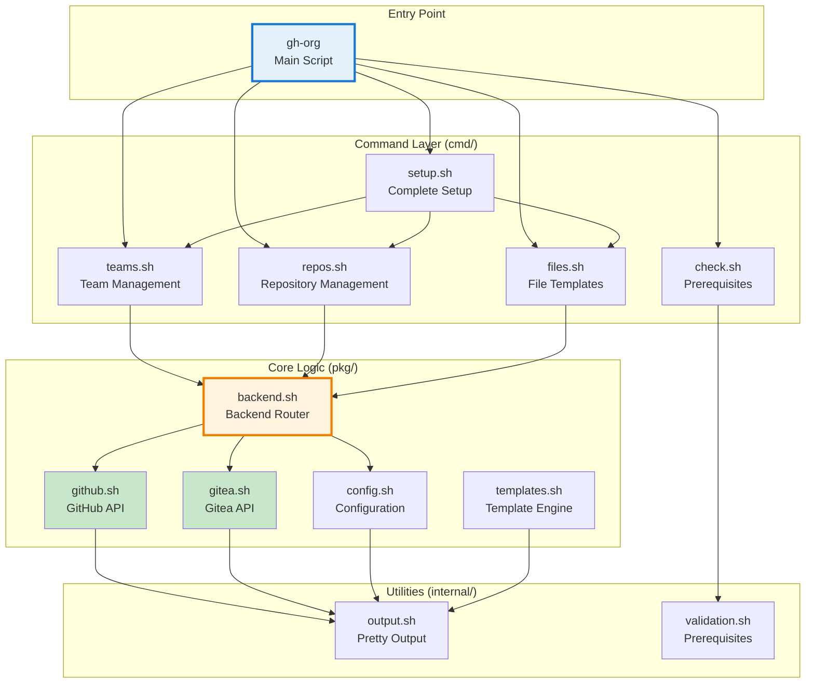
```mermaid
graph TB
    subgraph "Entry Point"
        MAIN[gh-org<br/>Main Script]
    end

    subgraph "Command Layer (cmd/)"
        CHECK[check.sh<br/>Prerequisites]
        TEAMS[teams.sh<br/>Team Management]
        REPOS[repos.sh<br/>Repository Management]
        FILES[files.sh<br/>File Templates]
        SETUP[setup.sh<br/>Complete Setup]
    end

    subgraph "Core Logic (pkg/)"
        CONFIG[config.sh<br/>Configuration]
        BACKEND[backend.sh<br/>Backend Router]
        GITHUB[github.sh<br/>GitHub API]
        GITEA[gitea.sh<br/>Gitea API]
        TEMPLATES[templates.sh<br/>Template Engine]
    end

    subgraph "Utilities (internal/)"
        OUTPUT[output.sh<br/>Pretty Output]
        VALIDATION[validation.sh<br/>Prerequisites]
    end

    MAIN --> CHECK
    MAIN --> TEAMS
    MAIN --> REPOS
    MAIN --> FILES
    MAIN --> SETUP

    TEAMS --> BACKEND
    REPOS --> BACKEND
    FILES --> BACKEND
    SETUP --> TEAMS
    SETUP --> REPOS
    SETUP --> FILES

    BACKEND --> GITHUB
    BACKEND --> GITEA

    GITHUB --> OUTPUT
    GITEA --> OUTPUT
    CONFIG --> OUTPUT
    TEMPLATES --> OUTPUT

    CHECK --> VALIDATION
    BACKEND --> CONFIG

    style MAIN fill:#e3f2fd,stroke:#1976d2,stroke-width:3px
    style BACKEND fill:#fff3e0,stroke:#f57c00,stroke-width:3px
    style GITHUB fill:#c8e6c9
    style GITEA fill:#c8e6c9
```

### CLI Command Hierarchy

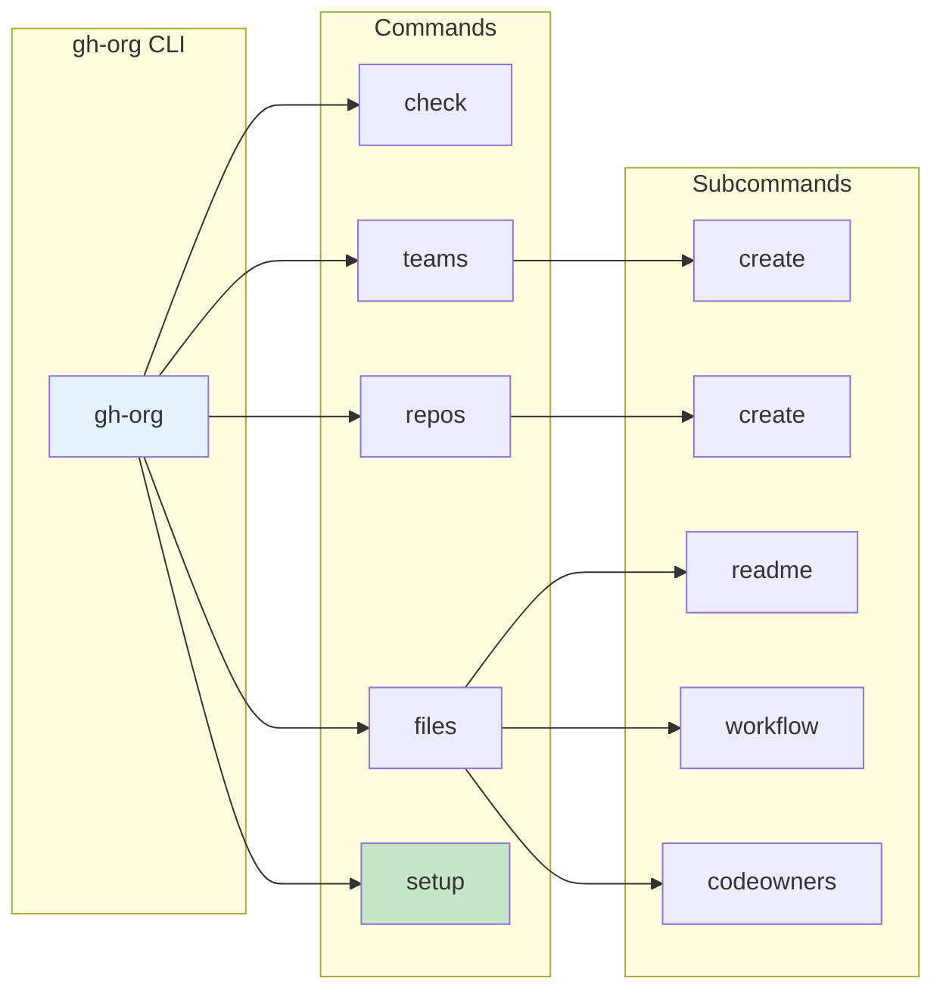
```mermaid
graph LR
    subgraph "gh-org CLI"
        ROOT[gh-org]
    end

    subgraph "Commands"
        CHECK[check]
        TEAMS[teams]
        REPOS[repos]
        FILES[files]
        SETUP[setup]
    end

    subgraph "Subcommands"
        TEAMS_CREATE[create]
        REPOS_CREATE[create]
        FILES_README[readme]
        FILES_WORKFLOW[workflow]
        FILES_CODEOWNERS[codeowners]
    end

    ROOT --> CHECK
    ROOT --> TEAMS
    ROOT --> REPOS
    ROOT --> FILES
    ROOT --> SETUP

    TEAMS --> TEAMS_CREATE
    REPOS --> REPOS_CREATE
    FILES --> FILES_README
    FILES --> FILES_WORKFLOW
    FILES --> FILES_CODEOWNERS

    style ROOT fill:#e3f2fd
    style SETUP fill:#c8e6c9
```

### CLI Execution Flow

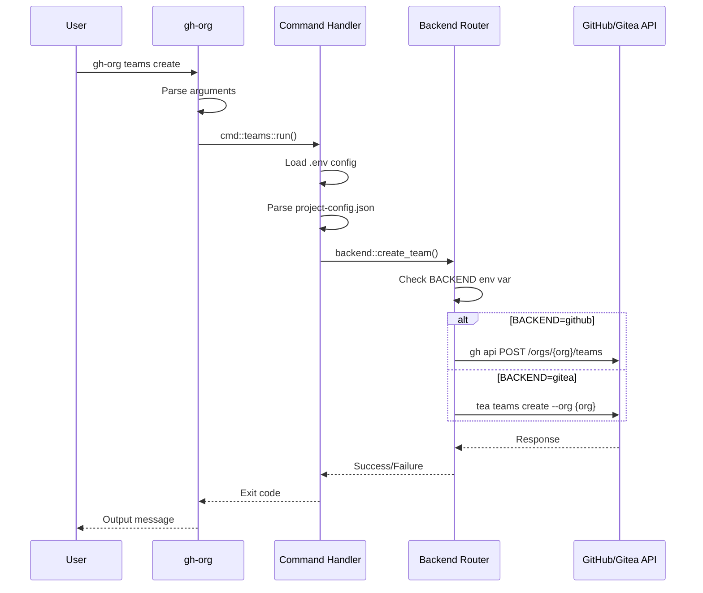
```mermaid
sequenceDiagram
    participant User
    participant CLI as gh-org
    participant Cmd as Command Handler
    participant Backend as Backend Router
    participant API as GitHub/Gitea API

    User->>CLI: gh-org teams create
    CLI->>CLI: Parse arguments
    CLI->>Cmd: cmd::teams::run()
    Cmd->>Cmd: Load .env config
    Cmd->>Cmd: Parse project-config.json
    Cmd->>Backend: backend::create_team()
    Backend->>Backend: Check BACKEND env var
    alt BACKEND=github
        Backend->>API: gh api POST /orgs/{org}/teams
    else BACKEND=gitea
        Backend->>API: tea teams create --org {org}
    end
    API-->>Backend: Response
    Backend-->>Cmd: Success/Failure
    Cmd-->>CLI: Exit code
    CLI-->>User: Output message
```

---

## Backend Abstraction Architecture

### Backend Router Pattern

The system uses a router pattern to support multiple Git platforms:

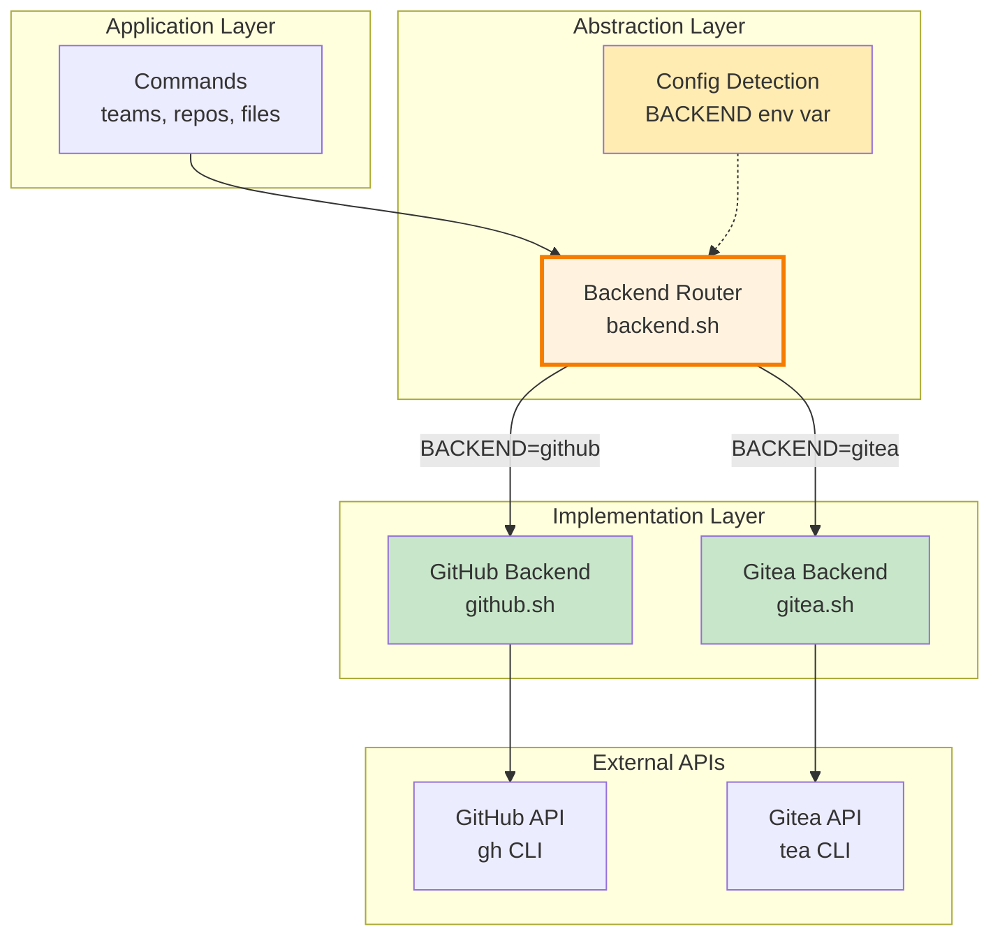
```mermaid
graph TB
    subgraph "Application Layer"
        CMD[Commands<br/>teams, repos, files]
    end

    subgraph "Abstraction Layer"
        ROUTER[Backend Router<br/>backend.sh]
        CONFIG[Config Detection<br/>BACKEND env var]
    end

    subgraph "Implementation Layer"
        GITHUB[GitHub Backend<br/>github.sh]
        GITEA[Gitea Backend<br/>gitea.sh]
    end

    subgraph "External APIs"
        GH_API[GitHub API<br/>gh CLI]
        TEA_API[Gitea API<br/>tea CLI]
    end

    CMD --> ROUTER
    CONFIG -.-> ROUTER

    ROUTER -->|BACKEND=github| GITHUB
    ROUTER -->|BACKEND=gitea| GITEA

    GITHUB --> GH_API
    GITEA --> TEA_API

    style ROUTER fill:#fff3e0,stroke:#f57c00,stroke-width:3px
    style CONFIG fill:#ffecb3
    style GITHUB fill:#c8e6c9
    style GITEA fill:#c8e6c9
```

### Permission Mapping Architecture

GitHub and Gitea have different permission models. The system automatically maps them:

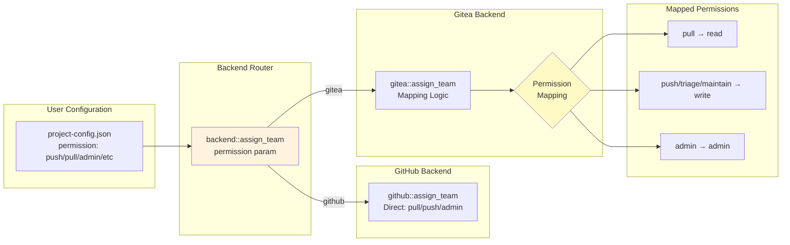
```mermaid
graph LR
    subgraph "User Configuration"
        CONFIG[project-config.json<br/>permission: push/pull/admin/etc]
    end

    subgraph "Backend Router"
        ROUTER[backend::assign_team<br/>permission param]
    end

    subgraph "GitHub Backend"
        GH[github::assign_team<br/>Direct: pull/push/admin]
    end

    subgraph "Gitea Backend"
        GITEA[gitea::assign_team<br/>Mapping Logic]
        MAP{Permission<br/>Mapping}
    end

    subgraph "Mapped Permissions"
        READ[pull → read]
        WRITE[push/triage/maintain → write]
        ADMIN[admin → admin]
    end

    CONFIG --> ROUTER
    ROUTER -->|github| GH
    ROUTER -->|gitea| GITEA

    GITEA --> MAP
    MAP --> READ
    MAP --> WRITE
    MAP --> ADMIN

    style MAP fill:#fff9c4
    style ROUTER fill:#fff3e0
```

**Permission Mapping Table:**

| GitHub Permission | Gitea Permission | Access Level |
|-------------------|------------------|--------------|
| `pull` | `read` | Read-only |
| `push` | `write` | Read + write |
| `triage` | `write` | Read + write + issues |
| `maintain` | `write` | Read + write + issues |
| `admin` | `admin` | Full control |

### Backend Detection Flow

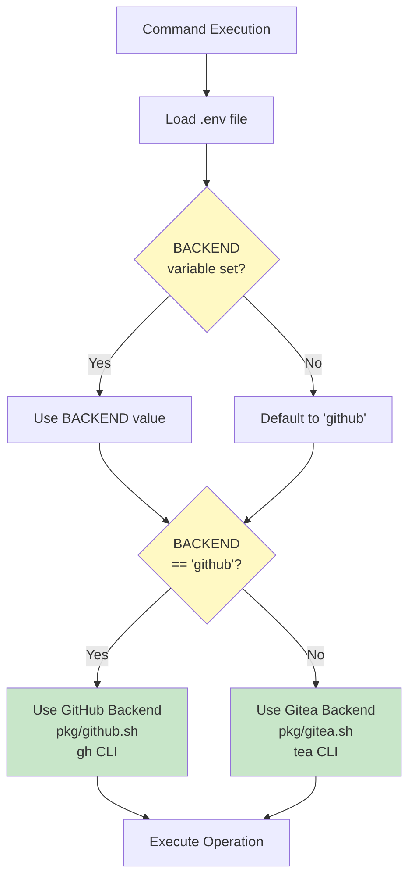
```mermaid
flowchart TD
    START[Command Execution] --> LOAD[Load .env file]
    LOAD --> CHECK{BACKEND<br/>variable set?}

    CHECK -->|Yes| DETECT[Use BACKEND value]
    CHECK -->|No| DEFAULT[Default to 'github']

    DETECT --> GITHUB{BACKEND<br/>== 'github'?}
    DEFAULT --> GITHUB

    GITHUB -->|Yes| GH_CLI[Use GitHub Backend<br/>pkg/github.sh<br/>gh CLI]
    GITHUB -->|No| TEA_CLI[Use Gitea Backend<br/>pkg/gitea.sh<br/>tea CLI]

    GH_CLI --> EXEC[Execute Operation]
    TEA_CLI --> EXEC

    style CHECK fill:#fff9c4
    style GITHUB fill:#fff9c4
    style GH_CLI fill:#c8e6c9
    style TEA_CLI fill:#c8e6c9
```

### Backend Implementation Comparison

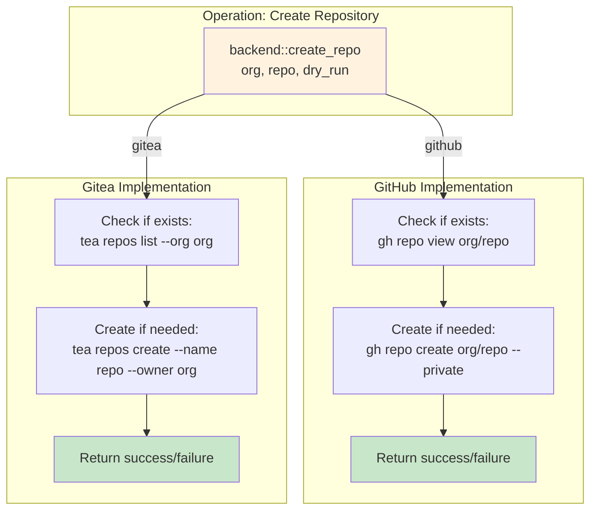
```mermaid
graph TB
    subgraph "Operation: Create Repository"
        OP[backend::create_repo<br/>org, repo, dry_run]
    end

    subgraph "GitHub Implementation"
        GH1[Check if exists:<br/>gh repo view org/repo]
        GH2[Create if needed:<br/>gh repo create org/repo --private]
        GH3[Return success/failure]
    end

    subgraph "Gitea Implementation"
        GT1[Check if exists:<br/>tea repos list --org org]
        GT2[Create if needed:<br/>tea repos create --name repo --owner org]
        GT3[Return success/failure]
    end

    OP -->|github| GH1
    OP -->|gitea| GT1

    GH1 --> GH2
    GH2 --> GH3

    GT1 --> GT2
    GT2 --> GT3

    style OP fill:#fff3e0
    style GH3 fill:#c8e6c9
    style GT3 fill:#c8e6c9
```

---

## Component Architecture

### Component Diagram

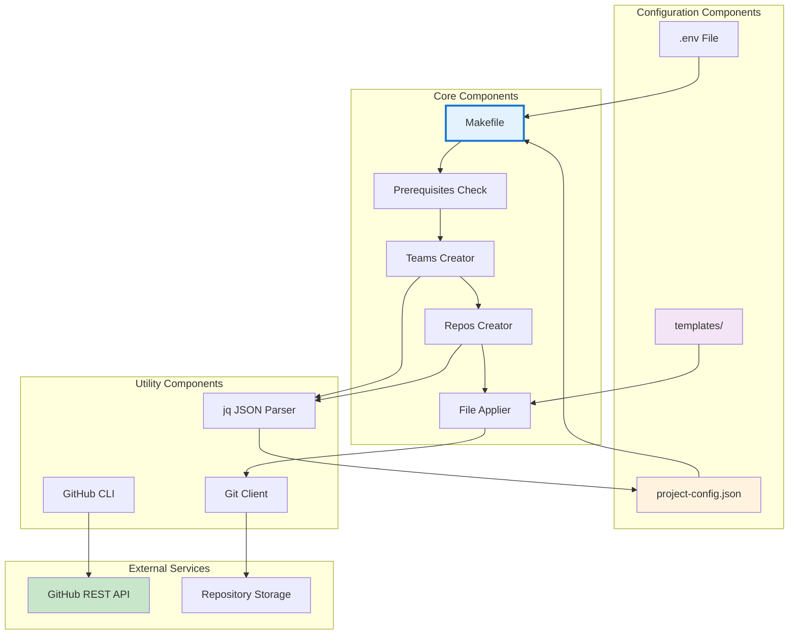
```mermaid
graph TB
    subgraph "Configuration Components"
        ENV[.env File]
        CONFIG[project-config.json]
        TEMPLATES[templates/]
    end

    subgraph "Core Components"
        MAKEFILE[Makefile]
        PREREQS[Prerequisites Check]
        TEAMS[Teams Creator]
        REPOS[Repos Creator]
        FILES[File Applier]
    end

    subgraph "Utility Components"
        JQ[jq JSON Parser]
        GH[GitHub CLI]
        GIT[Git Client]
    end

    subgraph "External Services"
        GITHUB_API[GitHub REST API]
        GITHUB_REPOS[Repository Storage]
    end

    ENV --> MAKEFILE
    CONFIG --> MAKEFILE
    TEMPLATES --> FILES

    MAKEFILE --> PREREQS
    PREREQS --> TEAMS
    TEAMS --> REPOS
    REPOS --> FILES

    TEAMS --> JQ
    REPOS --> JQ
    FILES --> GIT

    JQ --> CONFIG
    GH --> GITHUB_API
    GIT --> GITHUB_REPOS

    style MAKEFILE fill:#e3f2fd,stroke:#1976d2,stroke-width:3px
    style CONFIG fill:#fff3e0
    style TEMPLATES fill:#f3e5f5
    style GITHUB_API fill:#c8e6c9
```

### Component Responsibilities

| Component | Responsibility | Technology |
|-----------|---------------|------------|
| **Makefile** | Orchestration, workflow control | GNU Make 4.x |
| **Prerequisites Check** | Validate tools, files, auth | Bash + gh CLI |
| **Teams Creator** | Create/verify GitHub teams | gh api + jq |
| **Repos Creator** | Create repos, assign teams | gh repo + gh api |
| **File Applier** | Clone, commit, push templates | git + bash |
| **JSON Parser** | Extract config values | jq 1.6+ |
| **GitHub CLI** | API abstraction | gh CLI 2.x |
| **Git Client** | Repository operations | git 2.x |

---

## Data Flow

### Overall Data Flow

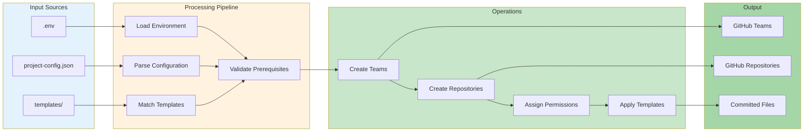
```mermaid
flowchart LR
    subgraph Input["Input Sources"]
        A1[.env]
        A2[project-config.json]
        A3[templates/]
    end

    subgraph Processing["Processing Pipeline"]
        B1[Load Environment]
        B2[Parse Configuration]
        B3[Match Templates]
        B4[Validate Prerequisites]
    end

    subgraph Operations["Operations"]
        C1[Create Teams]
        C2[Create Repositories]
        C3[Assign Permissions]
        C4[Apply Templates]
    end

    subgraph Output["Output"]
        D1[GitHub Teams]
        D2[GitHub Repositories]
        D3[Committed Files]
    end

    A1 --> B1
    A2 --> B2
    A3 --> B3

    B1 --> B4
    B2 --> B4
    B3 --> B4

    B4 --> C1
    C1 --> C2
    C2 --> C3
    C3 --> C4

    C1 --> D1
    C2 --> D2
    C4 --> D3

    style Input fill:#e3f2fd
    style Processing fill:#fff3e0
    style Operations fill:#c8e6c9
    style Output fill:#a5d6a7
```

### Configuration Data Flow

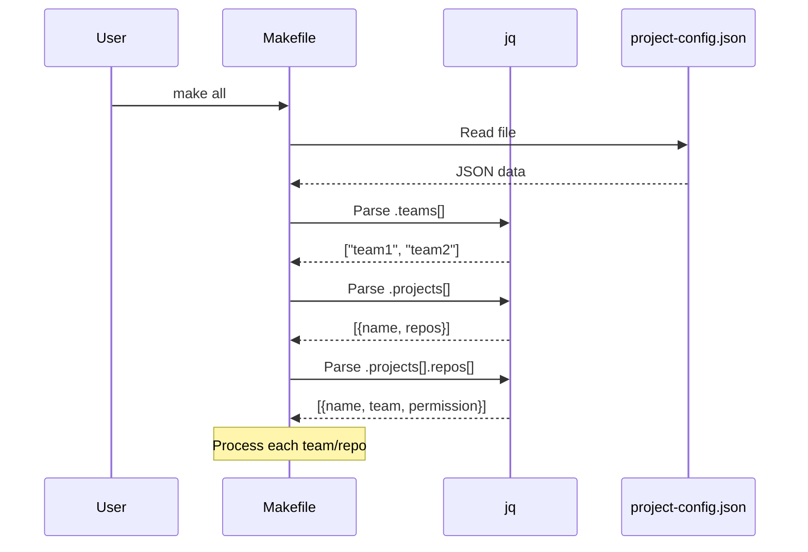
```mermaid
sequenceDiagram
    participant User
    participant Makefile
    participant jq
    participant Config as project-config.json

    User->>Makefile: make all
    Makefile->>Config: Read file
    Config-->>Makefile: JSON data

    Makefile->>jq: Parse .teams[]
    jq-->>Makefile: ["team1", "team2"]

    Makefile->>jq: Parse .projects[]
    jq-->>Makefile: [{name, repos}]

    Makefile->>jq: Parse .projects[].repos[]
    jq-->>Makefile: [{name, team, permission}]

    Note over Makefile: Process each team/repo
```

---

## Technology Stack

### Core Technologies

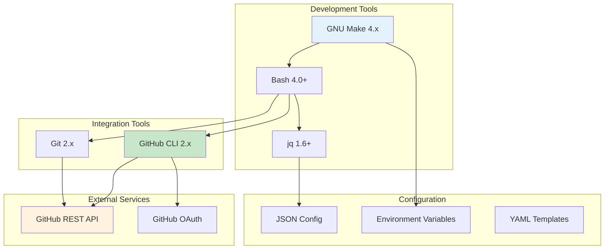
```mermaid
graph TB
    subgraph "Development Tools"
        MAKE[GNU Make 4.x]
        BASH[Bash 4.0+]
        JQ[jq 1.6+]
    end

    subgraph "Integration Tools"
        GH[GitHub CLI 2.x]
        GIT[Git 2.x]
    end

    subgraph "Configuration"
        JSON[JSON Config]
        ENV[Environment Variables]
        YAML[YAML Templates]
    end

    subgraph "External Services"
        API[GitHub REST API]
        AUTH[GitHub OAuth]
    end

    MAKE --> BASH
    BASH --> JQ
    BASH --> GH
    BASH --> GIT

    JQ --> JSON
    MAKE --> ENV

    GH --> API
    GH --> AUTH
    GIT --> API

    style MAKE fill:#e3f2fd
    style GH fill:#c8e6c9
    style API fill:#fff3e0
```

### Technology Decisions

| Technology | Chosen | Rationale |
|------------|--------|-----------|
| **Orchestration** | Makefile | Universal, declarative, built-in dependencies |
| **Shell** | Bash | Ubiquitous, powerful, readable |
| **JSON Parser** | jq | Industry standard, powerful queries |
| **GitHub Integration** | gh CLI | Official, well-maintained, auth handled |
| **VCS** | Git | Required for repo operations |
| **Config Format** | JSON | Standard, validated, IDE support |
| **Templates** | Plain text files | Simple, flexible, version controlled |

---

## Design Patterns

### Pattern 1: Configuration-Driven Execution

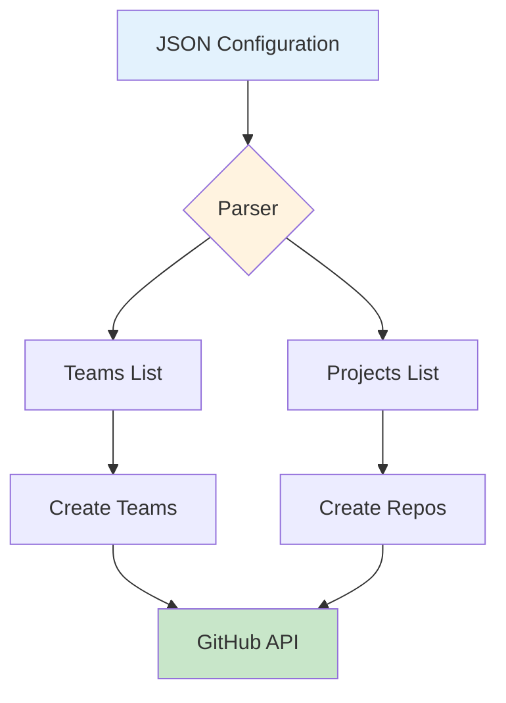
```mermaid
flowchart TD
    A[JSON Configuration] --> B{Parser}
    B --> C[Teams List]
    B --> D[Projects List]

    C --> E[Create Teams]
    D --> F[Create Repos]

    E --> G[GitHub API]
    F --> G

    style A fill:#e3f2fd
    style B fill:#fff3e0
    style G fill:#c8e6c9
```

**Benefits:**
- Single source of truth
- Easy to version control
- Declarative intent
- No code changes needed

### Pattern 2: Idempotent Operations

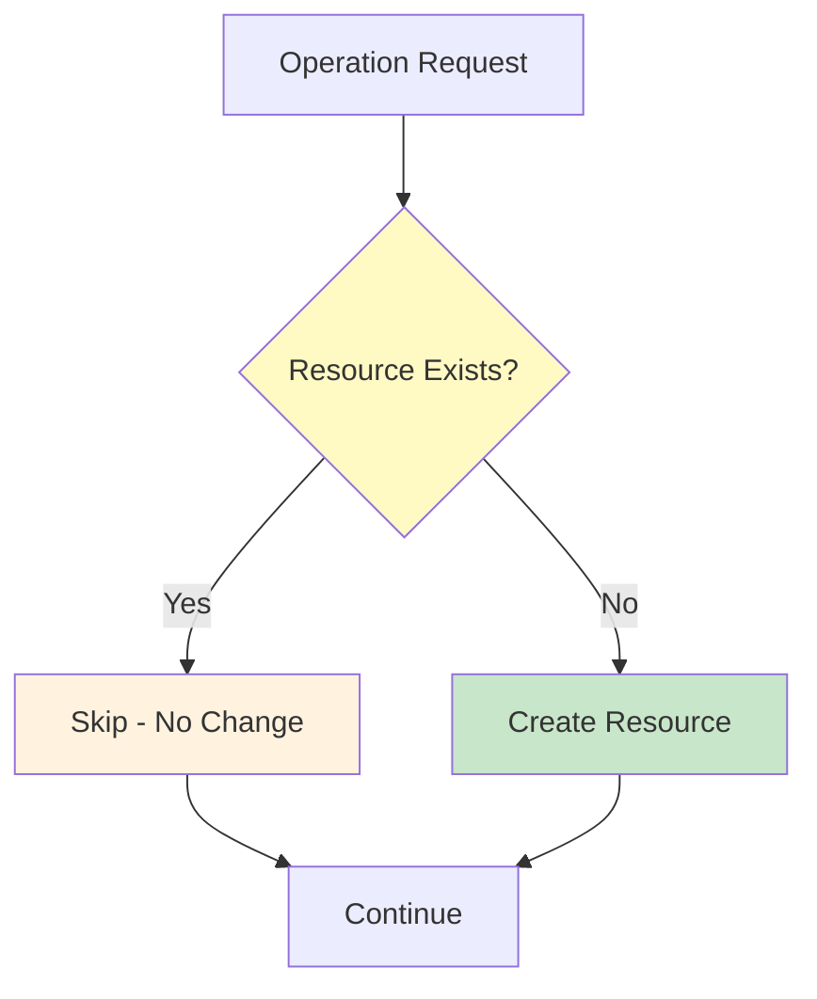
```mermaid
flowchart TD
    A[Operation Request] --> B{Resource Exists?}
    B -->|Yes| C[Skip - No Change]
    B -->|No| D[Create Resource]

    C --> E[Continue]
    D --> E

    style B fill:#fff9c4
    style C fill:#fff3e0
    style D fill:#c8e6c9
```

**Implementation:**
- Check existence before creation
- Safe to retry
- No side effects on re-run

### Pattern 3: Convention over Configuration

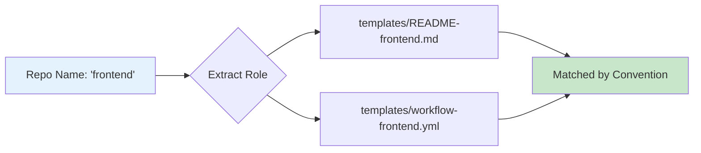
```mermaid
flowchart LR
    A[Repo Name: 'frontend'] --> B{Extract Role}
    B --> C[templates/README-frontend.md]
    B --> D[templates/workflow-frontend.yml]

    C --> E[Matched by Convention]
    D --> E

    style A fill:#e3f2fd
    style E fill:#c8e6c9
```

**Convention Rules:**
- Repo role → Template filename
- `project-{name}-{role}` naming
- Automatic template selection

### Pattern 4: Progressive Enhancement

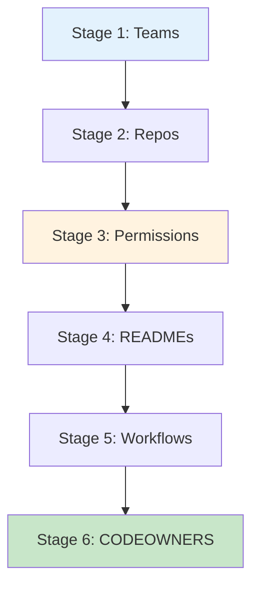
```mermaid
flowchart TD
    A[Stage 1: Teams] --> B[Stage 2: Repos]
    B --> C[Stage 3: Permissions]
    C --> D[Stage 4: READMEs]
    D --> E[Stage 5: Workflows]
    E --> F[Stage 6: CODEOWNERS]

    style A fill:#e3f2fd
    style C fill:#fff3e0
    style F fill:#c8e6c9
```

**Benefits:**
- Clear progression
- Easy to debug
- Can run stages individually
- Fail at any stage, recover easily

---

## Usage Examples

### Example 1: GitHub Setup (Cloud)

**Configuration (.env):**
```bash
# GitHub organization
ORG=my-company
BACKEND=github  # or omit (default)
```

**Execution:**
```bash
# Check prerequisites
./src/main/cli/gh-org check
# Output: ✓ GitHub CLI (gh) installed
#         ✓ Authenticated with GitHub
#         ✓ Configuration valid

# Create teams
./src/main/cli/gh-org teams create
# Output: Creating GitHub teams
#         ℹ Creating team: frontend-team
#         ✓ Team created: frontend-team
#         ℹ Creating team: backend-team
#         ✓ Team created: backend-team

# Create repositories
./src/main/cli/gh-org repos create
# Output: Creating repositories
#         ℹ Processing: project-alpha-frontend
#         ✓ Repository created: project-alpha-frontend
#         ✓ Team assigned: frontend-team -> project-alpha-frontend

# Complete setup (all operations)
./src/main/cli/gh-org setup
```

### Example 2: Gitea Setup (Self-Hosted)

**Configuration (.env):**
```bash
# Gitea organization (self-hosted)
ORG=my-team
BACKEND=gitea
```

**Prerequisites:**
```bash
# Install tea CLI
wget https://dl.gitea.com/tea/0.9.2/tea-0.9.2-linux-amd64 -O tea
chmod +x tea
sudo mv tea /usr/local/bin/

# Authenticate with Gitea
tea login add
# URL: https://gitea.mycompany.com
# Username: admin
# Token: (create in Settings → Applications)
```

**Execution:**
```bash
# Check prerequisites
./src/main/cli/gh-org check
# Output: ✓ tea CLI installed
#         ✓ Authenticated with Gitea
#         ✓ Configuration valid

# Create teams
./src/main/cli/gh-org teams create
# Output: Creating Gitea teams
#         ℹ Creating team: frontend-team
#         ✓ Team created: frontend-team
#         ℹ Creating team: backend-team
#         ✓ Team created: backend-team

# Same commands as GitHub!
./src/main/cli/gh-org repos create
./src/main/cli/gh-org files readme
./src/main/cli/gh-org setup
```

### Example 3: Multi-Platform Configuration

**Scenario:** Maintain identical structure on both platforms.

**Setup:**
```bash
# Create separate environment files
cp .env .env.github
cp .env .env.gitea

# Configure for GitHub
echo "ORG=my-github-org" > .env.github
echo "BACKEND=github" >> .env.github

# Configure for Gitea
echo "ORG=my-gitea-org" > .env.gitea
echo "BACKEND=gitea" >> .env.gitea

# Same project-config.json for both!
```

**Deploy to GitHub:**
```bash
cp .env.github .env
./src/main/cli/gh-org setup
# Creates structure on GitHub
```

**Deploy to Gitea:**
```bash
cp .env.gitea .env
./src/main/cli/gh-org setup
# Creates identical structure on Gitea
```

### Example 4: Dry-Run Mode (Preview Changes)

```bash
# Preview what would happen without executing
./src/main/cli/gh-org teams create --dry-run
# Output: [DRY RUN] Would create team: frontend-team
#         [DRY RUN] Would create team: backend-team

./src/main/cli/gh-org repos create --dry-run
# Output: [DRY RUN] Would create repository: project-alpha-frontend
#         [DRY RUN] Would assign team 'frontend-team' with 'push' permission

./src/main/cli/gh-org setup --dry-run
# Preview complete setup without changes
```

### Example 5: Incremental Operations

```bash
# Add new team to existing organization
# 1. Update project-config.json
echo '{"teams": ["frontend-team", "backend-team", "infra-team"]}' | jq

# 2. Create only the new team
./src/main/cli/gh-org teams create
# Output: ✓ Team already exists: frontend-team
#         ✓ Team already exists: backend-team
#         ℹ Creating team: infra-team
#         ✓ Team created: infra-team

# 3. Add repository for new team
# Update project-config.json with new repo

./src/main/cli/gh-org repos create
# Output: ✓ Repository already exists: project-alpha-frontend
#         ℹ Creating repository: project-alpha-infra
#         ✓ Repository created: project-alpha-infra
```

### Example 6: Permission Mapping (Gitea)

**Configuration:**
```json
{
  "projects": [{
    "name": "alpha",
    "repos": [
      {"name": "frontend", "team": "frontend-team", "permission": "pull"},
      {"name": "backend", "team": "backend-team", "permission": "push"},
      {"name": "infra", "team": "infra-team", "permission": "admin"}
    ]
  }]
}
```

**GitHub Execution:**
```bash
BACKEND=github ./src/main/cli/gh-org repos create
# Permissions applied as-is:
# - frontend-team: pull (read-only)
# - backend-team: push (read + write)
# - infra-team: admin (full control)
```

**Gitea Execution:**
```bash
BACKEND=gitea ./src/main/cli/gh-org repos create
# Permissions automatically mapped:
# - frontend-team: read (mapped from pull)
# - backend-team: write (mapped from push)
# - infra-team: admin (no mapping needed)
```

### Example 7: Makefile Interface (Legacy)

The original Makefile interface still works:

```bash
# Using Makefile (GitHub only currently)
cd src/main
make all

# Individual operations
make teams
make repos
make readmes

# Dry-run
make all DRY_RUN=1

# Clean temporary files
make clean
```

**Note:** For Gitea support, use the CLI tool (`gh-org`) instead.

### Example 8: CI/CD Integration

**GitHub Actions:**
```yaml
name: Setup Organization

on:
  push:
    paths:
      - 'project-config.json'

jobs:
  setup:
    runs-on: ubuntu-latest
    steps:
      - uses: actions/checkout@v3

      - name: Setup gh CLI
        run: |
          gh auth login --with-token <<< "${{ secrets.GH_TOKEN }}"

      - name: Run automation
        run: |
          ./src/main/cli/gh-org check
          ./src/main/cli/gh-org setup
        env:
          ORG: ${{ secrets.ORG_NAME }}
          BACKEND: github
```

**GitLab CI (for Gitea):**
```yaml
setup_gitea:
  image: alpine:latest
  before_script:
    - apk add --no-cache git jq bash
    - wget https://dl.gitea.com/tea/0.9.2/tea-0.9.2-linux-amd64 -O /usr/local/bin/tea
    - chmod +x /usr/local/bin/tea
    - echo "$GITEA_TOKEN" | tea login add --url $GITEA_URL --token -
  script:
    - ./src/main/cli/gh-org setup
  variables:
    ORG: "my-org"
    BACKEND: "gitea"
  only:
    - main
```

---

## Deployment Architecture

### Local Execution Environment

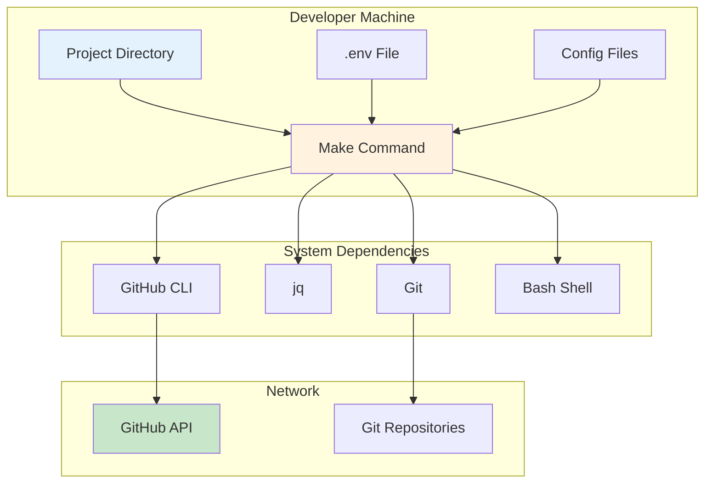
```mermaid
graph TB
    subgraph "Developer Machine"
        DIR[Project Directory]
        ENV[.env File]
        CONFIG[Config Files]
        MAKE[Make Command]
    end

    subgraph "System Dependencies"
        GH[GitHub CLI]
        JQ[jq]
        GIT[Git]
        BASH[Bash Shell]
    end

    subgraph "Network"
        API[GitHub API]
        REPOS[Git Repositories]
    end

    DIR --> MAKE
    ENV --> MAKE
    CONFIG --> MAKE

    MAKE --> GH
    MAKE --> JQ
    MAKE --> GIT
    MAKE --> BASH

    GH --> API
    GIT --> REPOS

    style DIR fill:#e3f2fd
    style MAKE fill:#fff3e0
    style API fill:#c8e6c9
```

### CI/CD Execution

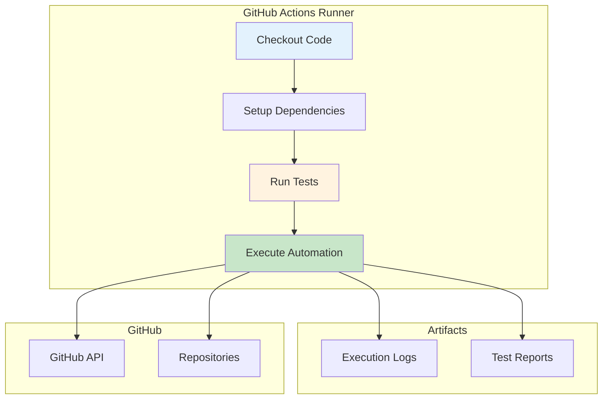
```mermaid
graph TB
    subgraph "GitHub Actions Runner"
        CHECKOUT[Checkout Code]
        SETUP[Setup Dependencies]
        TEST[Run Tests]
        EXECUTE[Execute Automation]
    end

    subgraph "Artifacts"
        LOGS[Execution Logs]
        REPORTS[Test Reports]
    end

    subgraph "GitHub"
        API[GitHub API]
        REPOS[Repositories]
    end

    CHECKOUT --> SETUP
    SETUP --> TEST
    TEST --> EXECUTE

    EXECUTE --> LOGS
    EXECUTE --> REPORTS

    EXECUTE --> API
    EXECUTE --> REPOS

    style CHECKOUT fill:#e3f2fd
    style TEST fill:#fff3e0
    style EXECUTE fill:#c8e6c9
```

---

## Scalability

### Horizontal Scalability

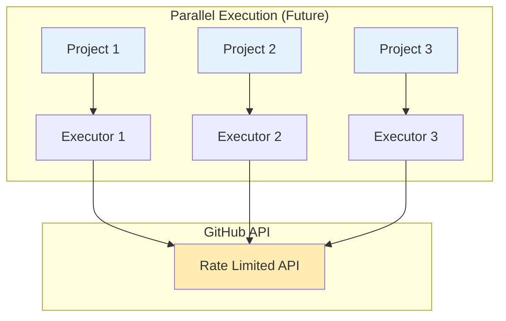
```mermaid
graph TB
    subgraph "Parallel Execution (Future)"
        A[Project 1] --> E1[Executor 1]
        B[Project 2] --> E2[Executor 2]
        C[Project 3] --> E3[Executor 3]
    end

    subgraph "GitHub API"
        API[Rate Limited API]
    end

    E1 --> API
    E2 --> API
    E3 --> API

    style A fill:#e3f2fd
    style B fill:#e3f2fd
    style C fill:#e3f2fd
    style API fill:#ffecb3
```

**Current Limitations:**
- Sequential execution
- No parallelization
- API rate limits (5,000 requests/hour)

**Scale Targets:**
- ✅ 1-10 projects: Excellent performance
- ✅ 10-50 projects: Good performance (~5-10 min)
- ⚠️ 50-100 projects: Acceptable (~15-30 min)
- ❌ 100+ projects: Consider batching

### Performance Optimization

| Operation | Current | Optimized (Future) |
|-----------|---------|-------------------|
| Team creation | Sequential | Parallel |
| Repo creation | Sequential | Parallel |
| File commits | Clone per repo | Sparse checkout |
| API calls | Individual | Batch where possible |

---

## Security Architecture

### Security Layers

```mermaid
graph TB
    subgraph "Authentication"
        A1[GitHub OAuth Token]
        A2[gh CLI Auth]
    end

    subgraph "Authorization"
        B1[Organization Admin]
        B2[Team Permissions]
        B3[Repository Access]
    end

    subgraph "Data Security"
        C1[.env Gitignored]
        C2[No Secrets in Logs]
        C3[HTTPS Only]
    end

    subgraph "API Security"
        D1[Rate Limiting]
        D2[Token Scopes]
        D3[Audit Logs]
    end

    A1 --> A2
    A2 --> B1
    B1 --> B2
    B2 --> B3

    A1 -.-> C1
    B3 -.-> C3
    A1 -.-> D2

    style A1 fill:#ffcdd2
    style C1 fill:#fff9c4
    style D2 fill:#c8e6c9
```

### Security Considerations

**Authentication:**
- ✅ GitHub OAuth via `gh auth login`
- ✅ Token stored securely by gh CLI
- ✅ No hardcoded credentials

**Authorization:**
- ⚠️ Requires Organization admin/owner role
- ✅ Minimum required permissions checked
- ✅ Team permissions configurable

**Data Protection:**
- ✅ `.env` file gitignored
- ✅ No secrets in logs or output
- ✅ All API calls via HTTPS
- ✅ Repository access controlled

**Audit Trail:**
- ✅ GitHub audit logs track all operations
- ✅ Git commits show all changes
- ✅ Make output shows all operations

---

## Architecture Decisions

### ADR-001: Makefile as Orchestration Engine

**Status:** Accepted

**Context:** Need simple, reliable orchestration for automation tasks.

**Decision:** Use GNU Make as the orchestration engine.

**Rationale:**
- Universal availability (pre-installed on most systems)
- Declarative target dependencies
- Built-in dry-run support (`make -n`)
- Simple syntax, easy to read and maintain
- No additional runtime dependencies

**Consequences:**
- ✅ Simple deployment (just clone and run)
- ✅ Easy to understand for most developers
- ❌ Limited to sequential execution
- ❌ Bash scripting limitations

---

### ADR-002: GitHub CLI for API Integration

**Status:** Accepted

**Context:** Need to interact with GitHub API for teams and repos.

**Decision:** Use GitHub CLI (`gh`) as the primary API interface.

**Rationale:**
- Official GitHub tool
- Handles authentication automatically
- Simpler than raw REST API calls
- Well-maintained and documented
- Built-in JSON formatting

**Consequences:**
- ✅ Simplified authentication flow
- ✅ Less code to maintain
- ✅ Future API changes handled by gh team
- ❌ Dependency on external tool
- ❌ Must follow gh CLI release cycle

---

### ADR-003: JSON for Configuration

**Status:** Accepted

**Context:** Need human-readable, machine-parseable configuration format.

**Decision:** Use JSON for `project-config.json`.

**Rationale:**
- Standard format with wide support
- Easy to validate (schema validation possible)
- Excellent IDE support (autocomplete, validation)
- Native GitHub support (syntax highlighting)
- `jq` is powerful and widely available

**Consequences:**
- ✅ Easy to validate and parse
- ✅ Good tooling support
- ❌ No comments support
- ❌ Strict syntax (trailing commas not allowed)

---

### ADR-004: Idempotent Operations

**Status:** Accepted

**Context:** Users may need to run automation multiple times.

**Decision:** All operations must be idempotent (safe to retry).

**Rationale:**
- Recovery from failures
- Ability to add new resources to existing setup
- No fear of re-running automation
- Consistent state regardless of how many times run

**Consequences:**
- ✅ Safe to retry on failure
- ✅ Easy to add resources incrementally
- ✅ Predictable behavior
- ❌ Requires existence checks before creation
- ❌ Slightly slower due to checks

---

### ADR-005: Template Matching by Convention

**Status:** Accepted

**Context:** Need to apply correct template to each repository.

**Decision:** Match templates by repository role name (convention).

**Rationale:**
- Simple, predictable matching
- No additional configuration needed
- Easy to understand and debug
- Scales well with new templates

**Consequences:**
- ✅ Zero configuration for template matching
- ✅ Predictable behavior
- ✅ Easy to add new templates
- ❌ Template files must follow naming convention
- ❌ Less flexible than explicit mapping

---

### ADR-006: Backend Abstraction Layer

**Status:** Accepted

**Context:** Need to support both GitHub and self-hosted Gitea with minimal code duplication and identical user experience.

**Decision:** Implement backend abstraction layer using router pattern with separate implementations for GitHub (gh CLI) and Gitea (tea CLI).

**Rationale:**
- Same configuration works for both platforms
- Backend selection via environment variable (BACKEND=github/gitea)
- Platform-specific logic isolated in separate modules
- Commands remain identical regardless of backend
- Permission mapping handled transparently
- Easy to add new backends in future

**Architecture:**
```
Commands → Backend Router → [GitHub Implementation | Gitea Implementation]
                                        ↓                      ↓
                                    gh CLI                 tea CLI
```

**Consequences:**
- ✅ Platform-agnostic configuration (project-config.json)
- ✅ Identical commands for GitHub and Gitea
- ✅ Automatic permission mapping (5 GitHub levels → 3 Gitea levels)
- ✅ Easy to test (switch backend via env var)
- ✅ Future-proof (can add GitLab, Bitbucket, etc.)
- ❌ Requires both gh and tea CLI if using both platforms
- ❌ Slight complexity in router layer
- ❌ Must maintain two implementations

**Implementation Files:**
- `pkg/backend.sh` - Router that dispatches to correct backend
- `pkg/github.sh` - GitHub API operations using gh CLI
- `pkg/gitea.sh` - Gitea API operations using tea CLI
- `pkg/config.sh` - Backend detection and configuration
- `internal/validation.sh` - Backend-specific prerequisite checks

---

### ADR-007: CLI Tool as Primary Interface

**Status:** Accepted

**Context:** Makefile interface lacks structure for multi-backend support and complex logic.

**Decision:** Create dedicated CLI tool (gh-org) following GitHub CLI design patterns.

**Rationale:**
- Modular structure (cmd/, pkg/, internal/)
- Better separation of concerns
- Easier to test individual components
- Natural place for backend abstraction
- Subcommand architecture scales better
- Consistent with modern CLI conventions

**Architecture:**
```
gh-org (entry point)
├── cmd/          Command handlers (teams, repos, files, setup, check)
├── pkg/          Core logic (backend, github, gitea, config, templates)
└── internal/     Utilities (output, validation)
```

**Consequences:**
- ✅ Clean modular architecture
- ✅ Easy to add new commands
- ✅ Better error handling and output
- ✅ Testable components
- ✅ Follows industry conventions
- ❌ Makefile becomes legacy (but still supported)
- ❌ More files to maintain
- ❌ Learning curve for contributors

**Commands:**
- `gh-org check` - Validate prerequisites
- `gh-org teams create` - Create teams
- `gh-org repos create` - Create repositories
- `gh-org files {readme|workflow|codeowners}` - Apply templates
- `gh-org setup` - Complete automation

---

## Future Architecture Enhancements

### Planned Improvements

1. **Parallel Execution**
   - Execute multiple projects concurrently
   - Reduce total execution time
   - Respect API rate limits

2. **Caching Layer**
   - Cache GitHub API responses
   - Reduce redundant API calls
   - Improve performance

3. **State Management**
   - Track what has been created
   - Enable rollback functionality
   - Support diff operations

4. **Plugin System**
   - Custom template processors
   - Extensible validation
   - Custom workflow hooks

5. **Web UI (Optional)**
   - Visual configuration builder
   - Real-time progress monitoring
   - Historical execution logs

---

## References

- **GitHub API:** https://docs.github.com/en/rest
- **GitHub CLI:** https://cli.github.com/manual/
- **GNU Make:** https://www.gnu.org/software/make/manual/
- **jq Manual:** https://stedolan.github.io/jq/manual/
- **C4 Model:** https://c4model.com/

---

*Last Updated: 2025-10-27*
*Version: 2.1.0*
