# Architecture Design - GitHub Organization Automation

**Date:** 2025-10-27
**Version:** 2.0.0

## TL;DR

**Architecture**: Makefile-based automation orchestrating GitHub CLI operations with template processing. **Key patterns**: Configuration-driven → Idempotent operations → Template matching by convention → Progressive execution (teams → repos → files). **Critical design**: Stateless execution, no database, relies entirely on GitHub API as source of truth.

---

## Table of Contents

- [Overview](#overview)
- [System Architecture](#system-architecture)
- [Component Architecture](#component-architecture)
- [Data Flow](#data-flow)
- [Technology Stack](#technology-stack)
- [Design Patterns](#design-patterns)
- [Deployment Architecture](#deployment-architecture)
- [Scalability](#scalability)
- [Security Architecture](#security-architecture)

---

## Overview

### System Purpose

Automate the creation and configuration of GitHub teams, repositories, and standard files across multiple projects within a GitHub Organization.

### Architecture Goals

1. **Simplicity** - Single Makefile, no complex dependencies
2. **Idempotency** - Safe to run multiple times
3. **Transparency** - Clear, readable automation steps
4. **Flexibility** - Configuration-driven, easy to customize
5. **Reliability** - Fail-fast with clear error messages

### Architecture Principles

- **Configuration over Code** - JSON config drives all operations
- **Convention over Configuration** - Template matching by naming
- **Stateless Operation** - GitHub API is source of truth
- **Progressive Enhancement** - Build incrementally (teams → repos → files)
- **Fail-Fast** - Validate early, exit on error

---

## System Architecture

### High-Level Architecture

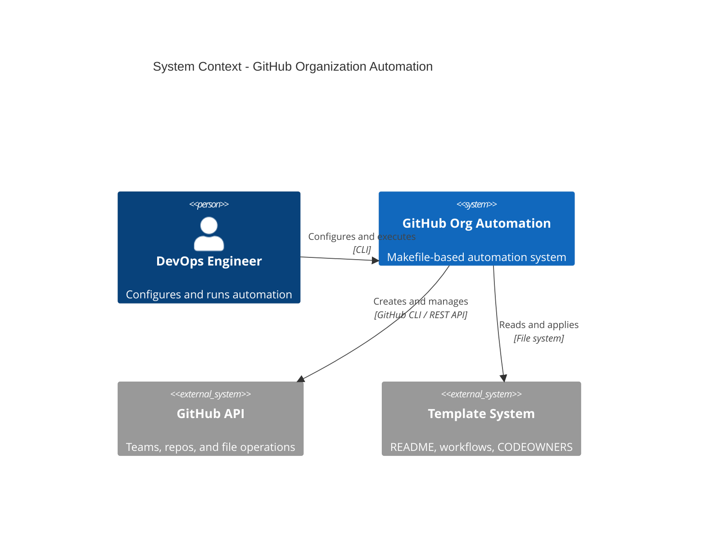

### Layered Architecture

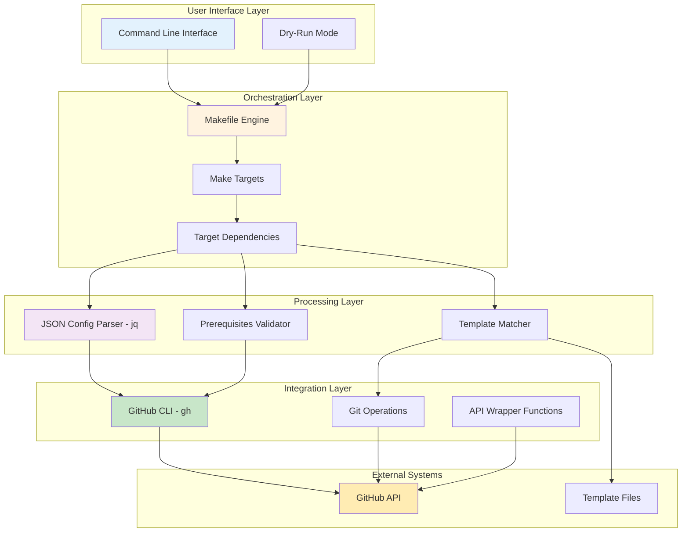

---

## Component Architecture

### Component Diagram

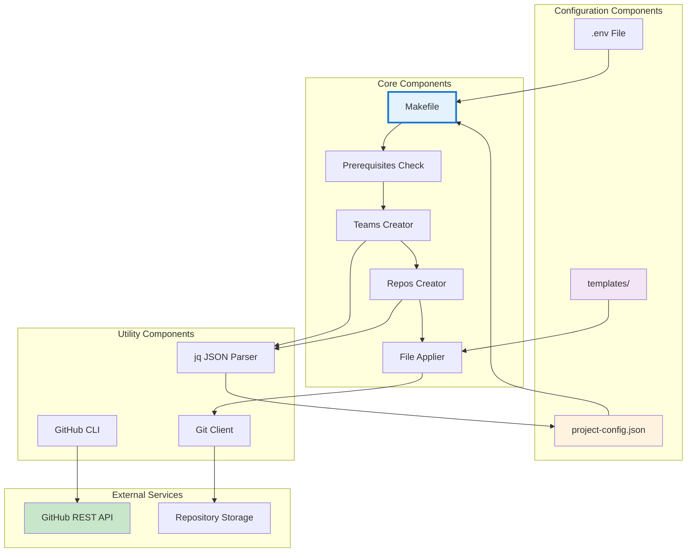

### Component Responsibilities

| Component | Responsibility | Technology |
|-----------|---------------|------------|
| **Makefile** | Orchestration, workflow control | GNU Make 4.x |
| **Prerequisites Check** | Validate tools, files, auth | Bash + gh CLI |
| **Teams Creator** | Create/verify GitHub teams | gh api + jq |
| **Repos Creator** | Create repos, assign teams | gh repo + gh api |
| **File Applier** | Clone, commit, push templates | git + bash |
| **JSON Parser** | Extract config values | jq 1.6+ |
| **GitHub CLI** | API abstraction | gh CLI 2.x |
| **Git Client** | Repository operations | git 2.x |

---

## Data Flow

### Overall Data Flow

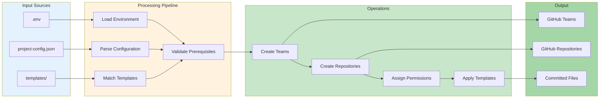

### Configuration Data Flow

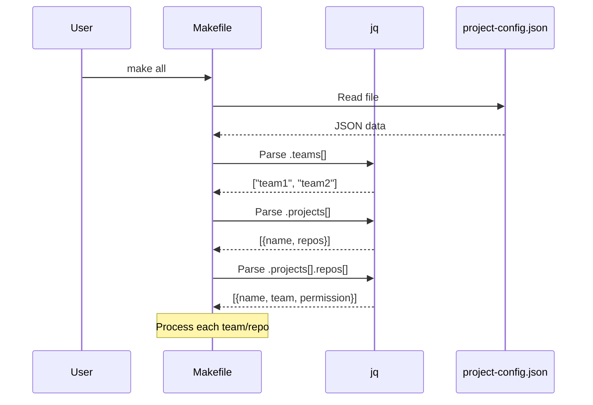

---

## Technology Stack

### Core Technologies

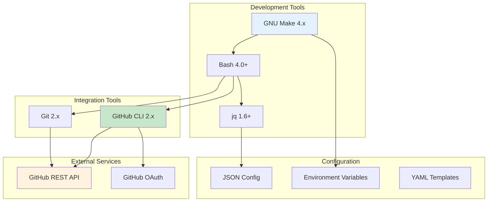

### Technology Decisions

| Technology | Chosen | Rationale |
|------------|--------|-----------|
| **Orchestration** | Makefile | Universal, declarative, built-in dependencies |
| **Shell** | Bash | Ubiquitous, powerful, readable |
| **JSON Parser** | jq | Industry standard, powerful queries |
| **GitHub Integration** | gh CLI | Official, well-maintained, auth handled |
| **VCS** | Git | Required for repo operations |
| **Config Format** | JSON | Standard, validated, IDE support |
| **Templates** | Plain text files | Simple, flexible, version controlled |

---

## Design Patterns

### Pattern 1: Configuration-Driven Execution

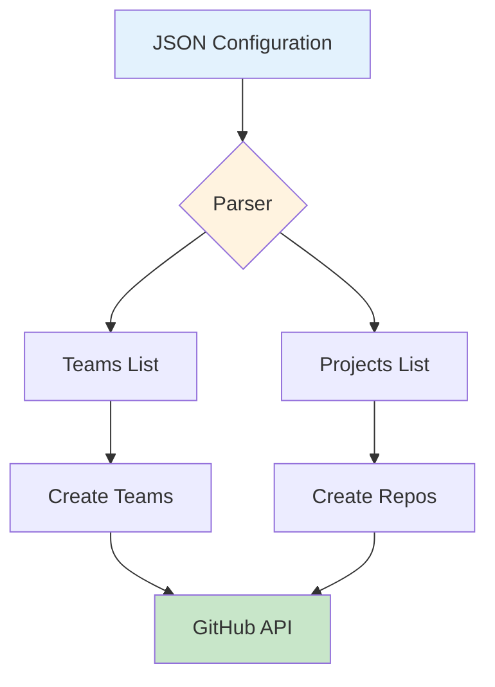

**Benefits:**
- Single source of truth
- Easy to version control
- Declarative intent
- No code changes needed

### Pattern 2: Idempotent Operations

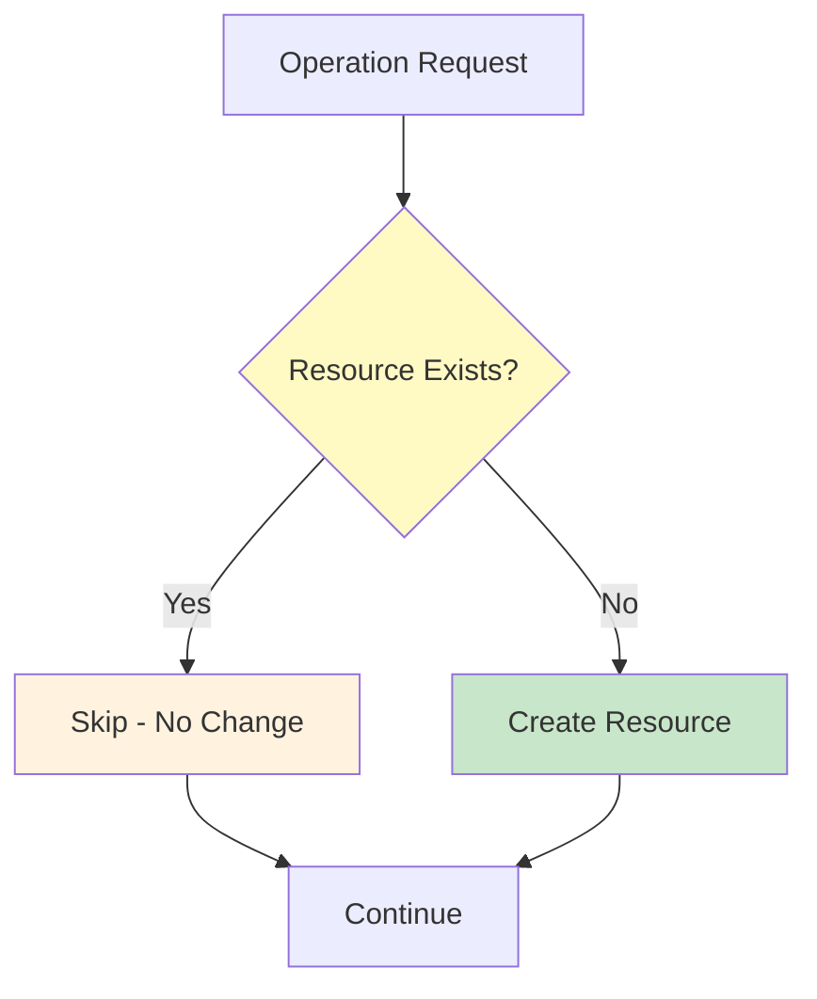

**Implementation:**
- Check existence before creation
- Safe to retry
- No side effects on re-run

### Pattern 3: Convention over Configuration

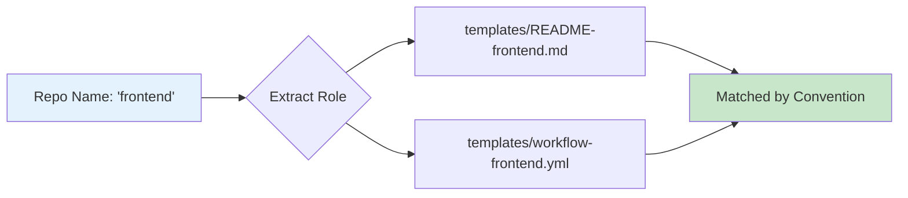

**Convention Rules:**
- Repo role → Template filename
- `project-{name}-{role}` naming
- Automatic template selection

### Pattern 4: Progressive Enhancement

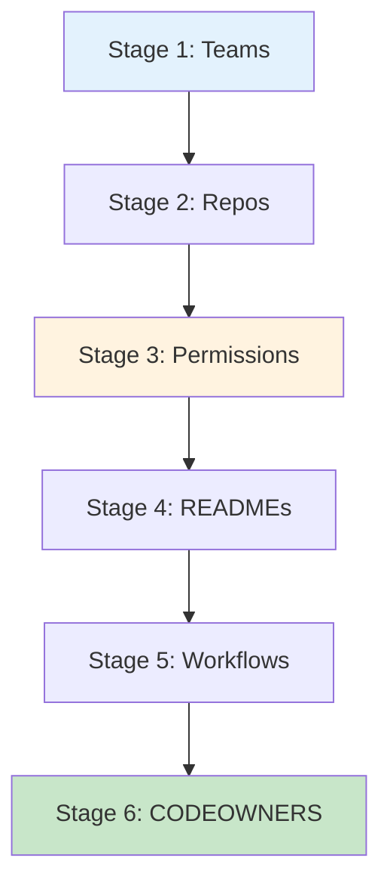

**Benefits:**
- Clear progression
- Easy to debug
- Can run stages individually
- Fail at any stage, recover easily

---

## Deployment Architecture

### Local Execution Environment

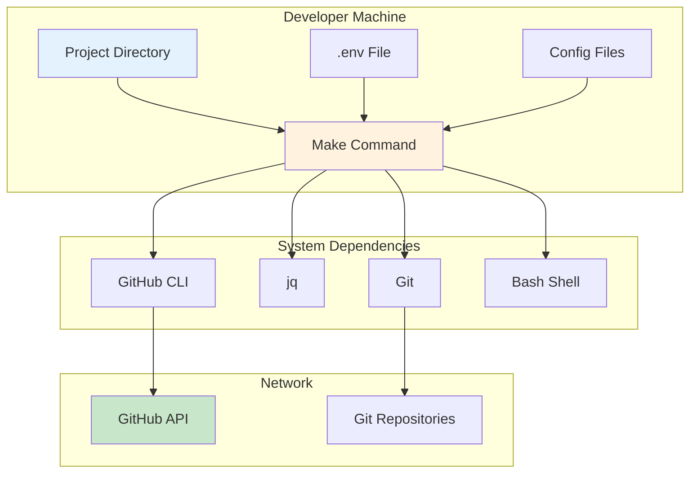

### CI/CD Execution

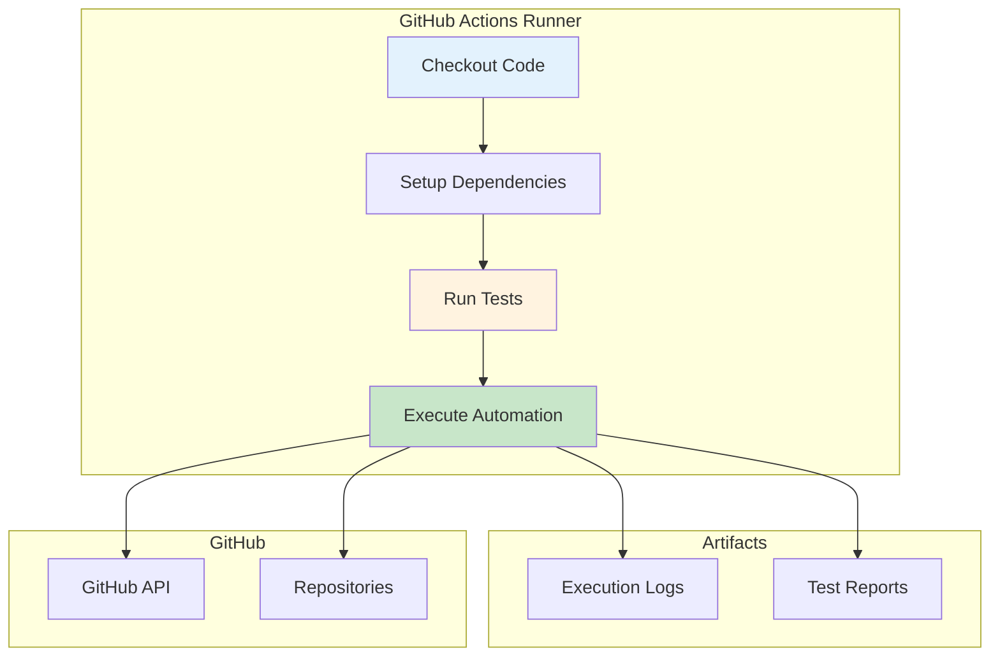

---

## Scalability

### Horizontal Scalability

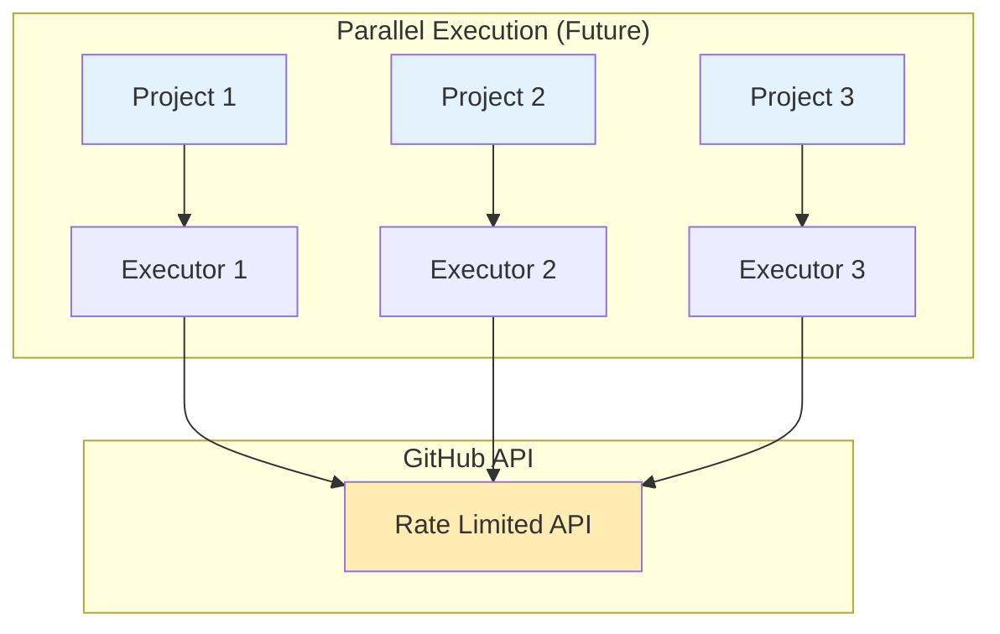

**Current Limitations:**
- Sequential execution
- No parallelization
- API rate limits (5,000 requests/hour)

**Scale Targets:**
- ✅ 1-10 projects: Excellent performance
- ✅ 10-50 projects: Good performance (~5-10 min)
- ⚠️ 50-100 projects: Acceptable (~15-30 min)
- ❌ 100+ projects: Consider batching

### Performance Optimization

| Operation | Current | Optimized (Future) |
|-----------|---------|-------------------|
| Team creation | Sequential | Parallel |
| Repo creation | Sequential | Parallel |
| File commits | Clone per repo | Sparse checkout |
| API calls | Individual | Batch where possible |

---

## Security Architecture

### Security Layers

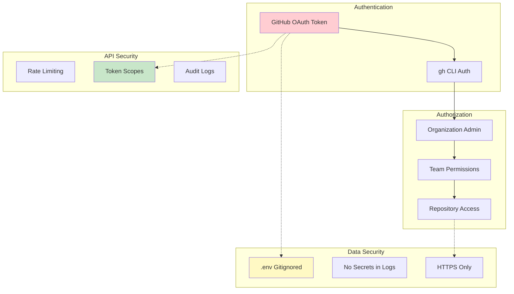

### Security Considerations

**Authentication:**
- ✅ GitHub OAuth via `gh auth login`
- ✅ Token stored securely by gh CLI
- ✅ No hardcoded credentials

**Authorization:**
- ⚠️ Requires Organization admin/owner role
- ✅ Minimum required permissions checked
- ✅ Team permissions configurable

**Data Protection:**
- ✅ `.env` file gitignored
- ✅ No secrets in logs or output
- ✅ All API calls via HTTPS
- ✅ Repository access controlled

**Audit Trail:**
- ✅ GitHub audit logs track all operations
- ✅ Git commits show all changes
- ✅ Make output shows all operations

---

## Architecture Decisions

### ADR-001: Makefile as Orchestration Engine

**Status:** Accepted

**Context:** Need simple, reliable orchestration for automation tasks.

**Decision:** Use GNU Make as the orchestration engine.

**Rationale:**
- Universal availability (pre-installed on most systems)
- Declarative target dependencies
- Built-in dry-run support (`make -n`)
- Simple syntax, easy to read and maintain
- No additional runtime dependencies

**Consequences:**
- ✅ Simple deployment (just clone and run)
- ✅ Easy to understand for most developers
- ❌ Limited to sequential execution
- ❌ Bash scripting limitations

---

### ADR-002: GitHub CLI for API Integration

**Status:** Accepted

**Context:** Need to interact with GitHub API for teams and repos.

**Decision:** Use GitHub CLI (`gh`) as the primary API interface.

**Rationale:**
- Official GitHub tool
- Handles authentication automatically
- Simpler than raw REST API calls
- Well-maintained and documented
- Built-in JSON formatting

**Consequences:**
- ✅ Simplified authentication flow
- ✅ Less code to maintain
- ✅ Future API changes handled by gh team
- ❌ Dependency on external tool
- ❌ Must follow gh CLI release cycle

---

### ADR-003: JSON for Configuration

**Status:** Accepted

**Context:** Need human-readable, machine-parseable configuration format.

**Decision:** Use JSON for `project-config.json`.

**Rationale:**
- Standard format with wide support
- Easy to validate (schema validation possible)
- Excellent IDE support (autocomplete, validation)
- Native GitHub support (syntax highlighting)
- `jq` is powerful and widely available

**Consequences:**
- ✅ Easy to validate and parse
- ✅ Good tooling support
- ❌ No comments support
- ❌ Strict syntax (trailing commas not allowed)

---

### ADR-004: Idempotent Operations

**Status:** Accepted

**Context:** Users may need to run automation multiple times.

**Decision:** All operations must be idempotent (safe to retry).

**Rationale:**
- Recovery from failures
- Ability to add new resources to existing setup
- No fear of re-running automation
- Consistent state regardless of how many times run

**Consequences:**
- ✅ Safe to retry on failure
- ✅ Easy to add resources incrementally
- ✅ Predictable behavior
- ❌ Requires existence checks before creation
- ❌ Slightly slower due to checks

---

### ADR-005: Template Matching by Convention

**Status:** Accepted

**Context:** Need to apply correct template to each repository.

**Decision:** Match templates by repository role name (convention).

**Rationale:**
- Simple, predictable matching
- No additional configuration needed
- Easy to understand and debug
- Scales well with new templates

**Consequences:**
- ✅ Zero configuration for template matching
- ✅ Predictable behavior
- ✅ Easy to add new templates
- ❌ Template files must follow naming convention
- ❌ Less flexible than explicit mapping

---

## Future Architecture Enhancements

### Planned Improvements

1. **Parallel Execution**
   - Execute multiple projects concurrently
   - Reduce total execution time
   - Respect API rate limits

2. **Caching Layer**
   - Cache GitHub API responses
   - Reduce redundant API calls
   - Improve performance

3. **State Management**
   - Track what has been created
   - Enable rollback functionality
   - Support diff operations

4. **Plugin System**
   - Custom template processors
   - Extensible validation
   - Custom workflow hooks

5. **Web UI (Optional)**
   - Visual configuration builder
   - Real-time progress monitoring
   - Historical execution logs

---

## References

- **GitHub API:** https://docs.github.com/en/rest
- **GitHub CLI:** https://cli.github.com/manual/
- **GNU Make:** https://www.gnu.org/software/make/manual/
- **jq Manual:** https://stedolan.github.io/jq/manual/
- **C4 Model:** https://c4model.com/

---

*Last Updated: 2025-10-27*
*Version: 2.0.0*
