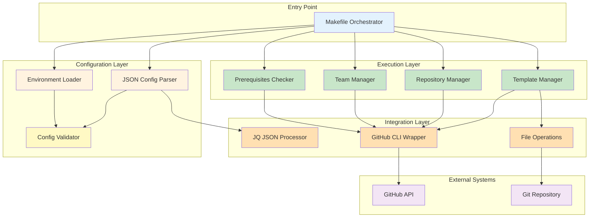
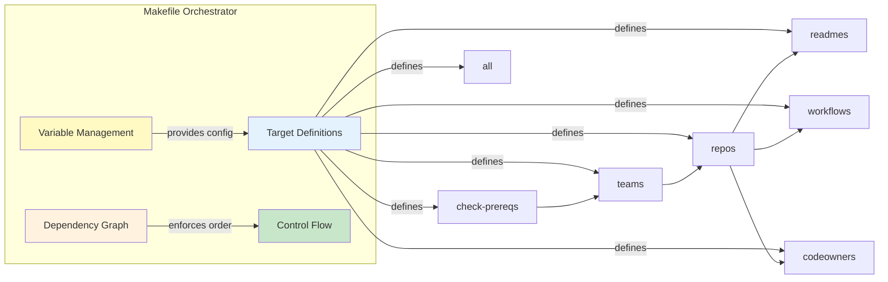
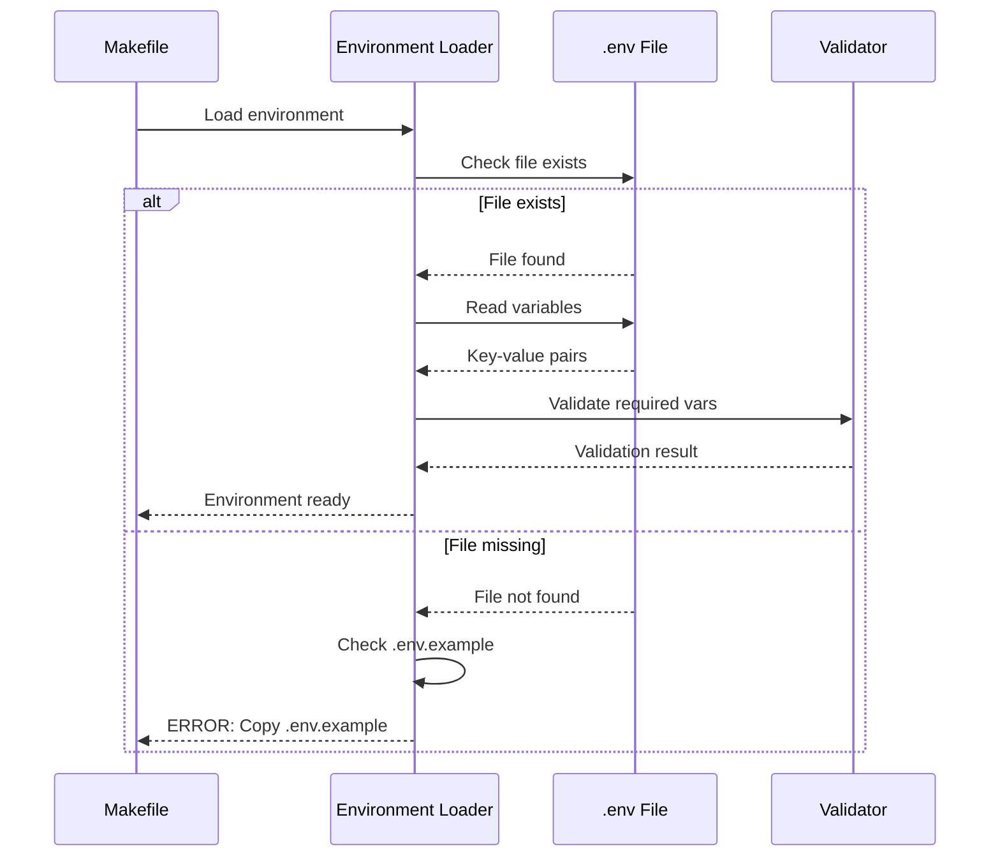
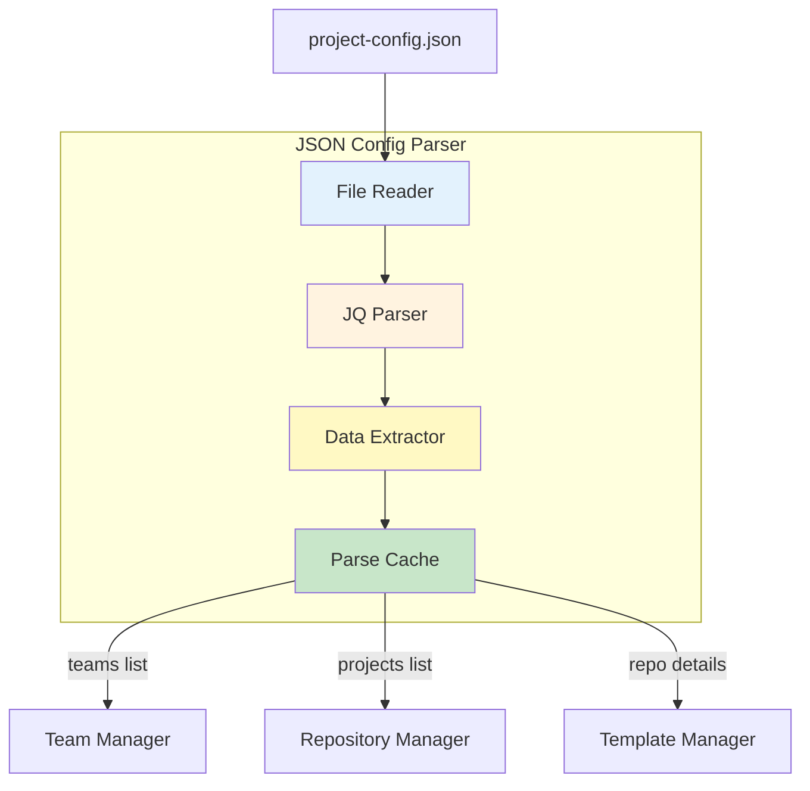
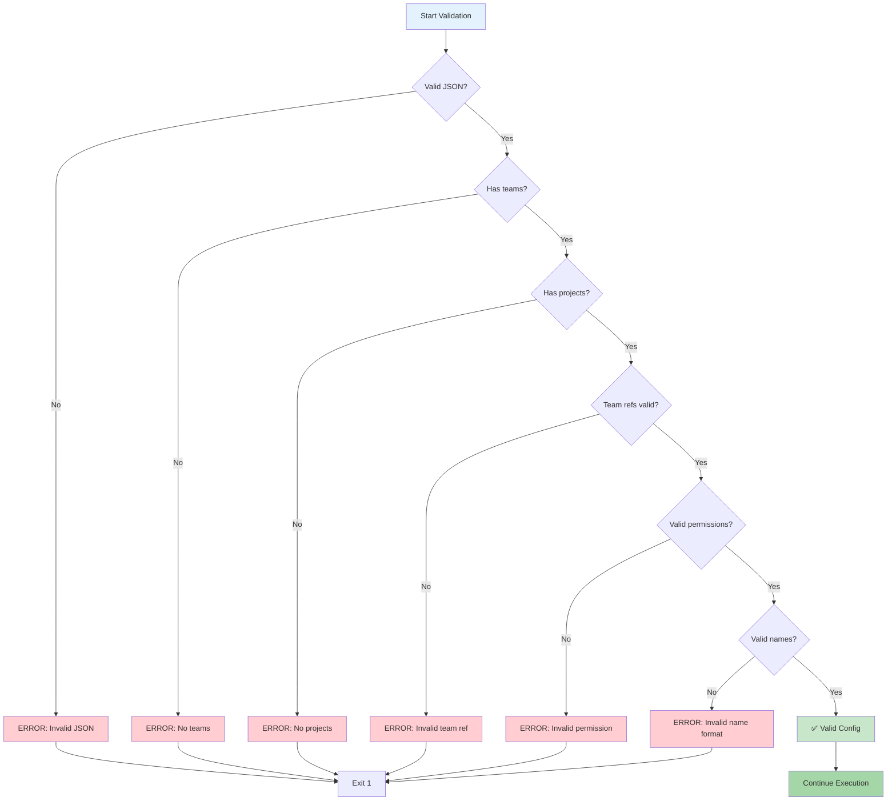
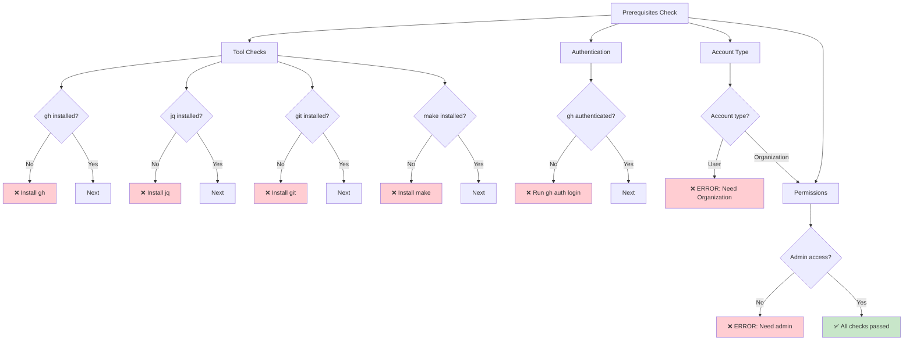
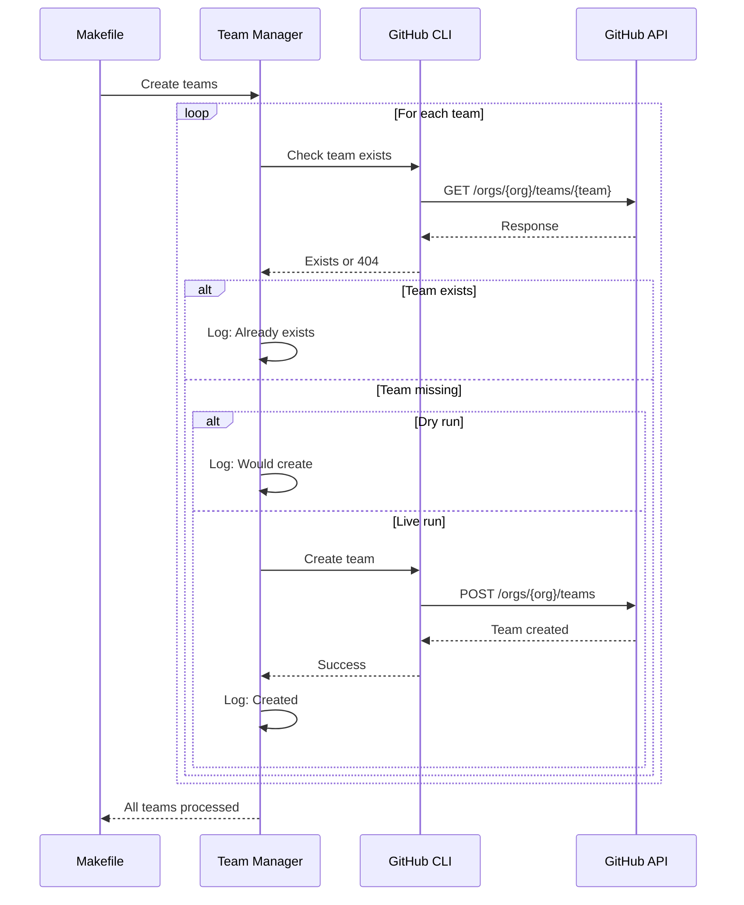
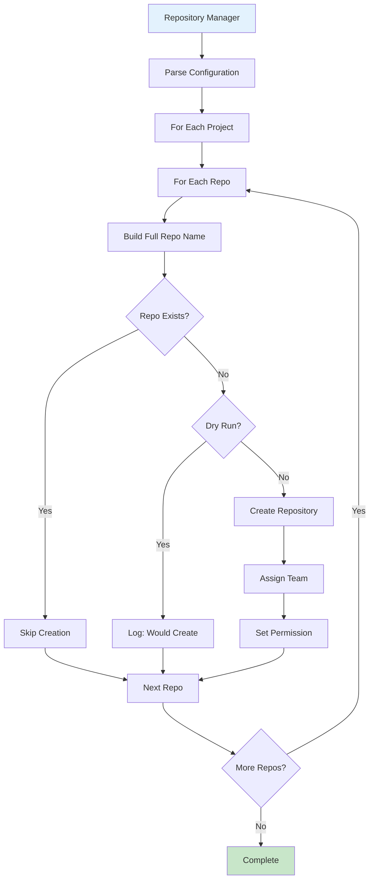
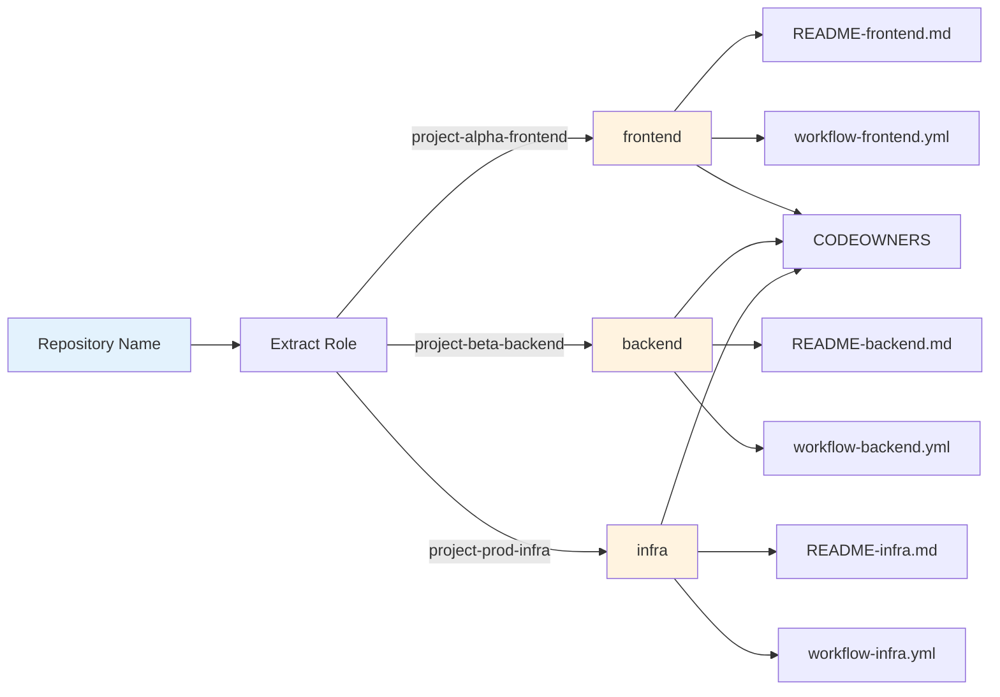
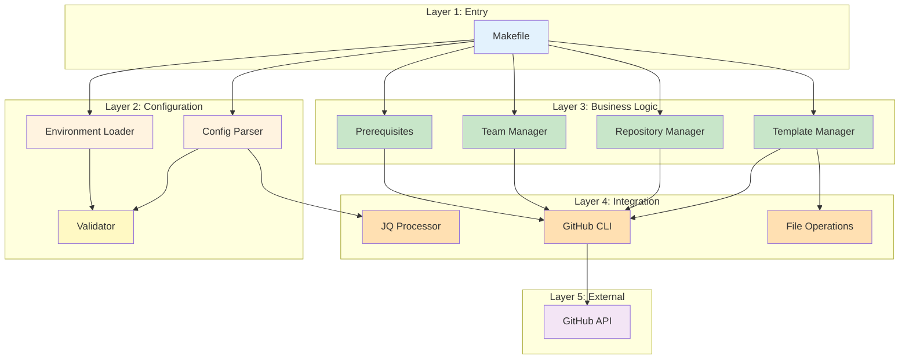

# Component Specifications - GitHub Organization Automation

**Date:** 2025-10-27
**Version:** 1.0

---

## Overview

This document provides detailed specifications for all components in the GitHub Organization Automation system. Each component is specified with its responsibilities, interfaces, dependencies, error handling, and implementation details.

---

## Component Architecture



---

## Component Catalog

| Component | Type | Dependencies | Lines of Code | Complexity |
|-----------|------|--------------|---------------|------------|
| Makefile Orchestrator | Orchestration | bash, make | ~300 | Medium |
| Environment Loader | Configuration | bash | ~50 | Low |
| JSON Config Parser | Configuration | jq | ~30 | Low |
| Config Validator | Validation | jq, bash | ~80 | Medium |
| Prerequisites Checker | Validation | gh, jq, git | ~100 | Low |
| Team Manager | Business Logic | gh API | ~120 | Medium |
| Repository Manager | Business Logic | gh API | ~150 | High |
| Template Manager | Business Logic | gh, git | ~200 | High |
| GitHub CLI Wrapper | Integration | gh | ~80 | Medium |
| JQ JSON Processor | Integration | jq | ~40 | Low |
| File Operations | Integration | git, bash | ~60 | Low |

---

## 1. Makefile Orchestrator

### Responsibility
Central orchestration component that coordinates all automation tasks, manages dependencies, and controls execution flow.

### Component Diagram



### Interface Specification

**Inputs:**
- `.env` file (environment variables)
- `project-config.json` (configuration)
- `DRY_RUN` environment variable
- `VERBOSE` environment variable

**Outputs:**
- Exit code (0 = success, 1 = failure)
- Console output (colored, structured)
- API operations on GitHub

**Public Targets:**
```makefile
.PHONY: all check-prereqs teams repos readmes workflows codeowners clean help
```

### Variables

```makefile
# Configuration
ORG ?=
CONFIG ?= project-config.json
DEFAULT_BRANCH ?= main
DRY_RUN ?= 0
VERBOSE ?= 0

# Derived variables
TEAMS := $(shell jq -r '.teams[]' $(CONFIG))
PROJECTS := $(shell jq -r '.projects[].name' $(CONFIG))
```

### Target Specifications

#### Target: `check-prereqs`
**Purpose:** Validate all prerequisites before execution
**Dependencies:** None
**Execution:** Sequential checks
**Exit Codes:** 0 = all checks pass, 1 = any check fails

**Checks:**
1. Environment variables set (.env loaded)
2. GitHub CLI installed and authenticated
3. jq installed and working
4. Configuration file exists and valid JSON
5. Account type is Organization (not User)
6. User has admin permissions

**Output Format:**
```
✅ Prerequisite: description
❌ Prerequisite: description [ERROR: details]
```

#### Target: `teams`
**Purpose:** Create all teams defined in configuration
**Dependencies:** `check-prereqs`
**Idempotency:** Yes (checks existence before creation)
**API Calls:** `gh api /orgs/{ORG}/teams` (per team)

**Algorithm:**
```bash
for team in $(TEAMS); do
    if gh api /orgs/$(ORG)/teams/$(team) >/dev/null 2>&1; then
        echo "✅ Team already exists: $(team)"
    else
        if [ "$(DRY_RUN)" = "1" ]; then
            echo "🔍 Would create team: $(team)"
        else
            gh api /orgs/$(ORG)/teams -f name="$(team)" -f privacy="closed"
            echo "✅ Created team: $(team)"
        fi
    fi
done
```

#### Target: `repos`
**Purpose:** Create all repositories with team assignments
**Dependencies:** `teams`
**Idempotency:** Yes (checks existence)
**Naming Convention:** `project-{PROJECT_NAME}-{REPO_NAME}`

**Algorithm:**
```bash
for project in $(PROJECTS); do
    REPOS=$(jq -r ".projects[] | select(.name==\"$project\") | .repos[].name" $(CONFIG))
    for repo in $REPOS; do
        REPO_FULL="project-${project}-${repo}"
        TEAM=$(jq -r ".projects[] | select(.name==\"$project\") | .repos[] | select(.name==\"$repo\") | .team" $(CONFIG))
        PERMISSION=$(jq -r ".projects[] | select(.name==\"$project\") | .repos[] | select(.name==\"$repo\") | .permission" $(CONFIG))

        # Create repo if doesn't exist
        # Assign team with permission
    done
done
```

#### Target: `readmes`
**Purpose:** Add README files from templates
**Dependencies:** `repos`
**Template Matching:** `{repo_name}` → `templates/README-{repo_name}.md`
**Method:** GitHub API file creation

#### Target: `workflows`
**Purpose:** Add GitHub Actions workflows from templates
**Dependencies:** `repos`
**Template Matching:** `{repo_name}` → `templates/workflow-{repo_name}.yml`
**Target Path:** `.github/workflows/ci.yml`

#### Target: `codeowners`
**Purpose:** Add CODEOWNERS files from template
**Dependencies:** `repos`
**Template:** `templates/CODEOWNERS`
**Target Path:** `.github/CODEOWNERS`

#### Target: `all`
**Purpose:** Execute complete automation workflow
**Dependencies:** `readmes workflows codeowners`
**Execution:** Sequential through dependency chain

#### Target: `clean`
**Purpose:** Remove temporary files
**Dependencies:** None

### Error Handling

**Strategy:** Fail-fast on critical errors, continue on non-critical

**Critical Errors (exit immediately):**
- Missing .env file
- Invalid JSON in config
- GitHub authentication failure
- User account instead of Organization
- Missing admin permissions

**Non-Critical Errors (log and continue):**
- Team already exists
- Repository already exists
- File already exists in repository

**Error Output Format:**
```bash
echo "❌ ERROR: $(component): $(description)" >&2
echo "   Details: $(error_message)" >&2
exit 1
```

### Configuration

**Required Environment Variables:**
```bash
ORG=your-org-name          # GitHub organization name
CONFIG=project-config.json  # Path to configuration file
```

**Optional Environment Variables:**
```bash
DEFAULT_BRANCH=main        # Default: main
DRY_RUN=0                  # 1 = preview only, 0 = execute
VERBOSE=0                  # 1 = detailed output, 0 = normal
```

---

## 2. Environment Loader

### Responsibility
Load and validate environment variables from `.env` file.

### Component Diagram



### Interface Specification

**Inputs:**
- `.env` file (key=value format)
- `.env.example` (template file)

**Outputs:**
- Environment variables exported to shell
- Error message if file missing

**Required Variables:**
- `ORG` - GitHub organization name
- `CONFIG` - Path to configuration file

**Optional Variables:**
- `DEFAULT_BRANCH` (default: main)
- `DRY_RUN` (default: 0)
- `VERBOSE` (default: 0)

### Implementation

```bash
# Load .env file
ifneq (,$(wildcard .env))
    include .env
    export
else
    $(error .env file not found. Copy .env.example to .env and configure it.)
endif
```

### Validation Rules

1. **ORG not empty**
   - Error: "ORG variable not set in .env"
   - Action: Exit with code 1

2. **CONFIG file exists**
   - Error: "Configuration file $(CONFIG) not found"
   - Action: Exit with code 1

3. **DRY_RUN is 0 or 1**
   - Default: 0 if not set
   - Warning if invalid value

### Error Handling

**Missing .env:**
```
❌ ERROR: .env file not found
   Copy .env.example to .env and configure it:
   cp .env.example .env
   nano .env
```

**Empty ORG:**
```
❌ ERROR: ORG variable not set in .env
   Edit .env and set ORG=your-github-org-name
```

---

## 3. JSON Config Parser

### Responsibility
Parse and extract data from `project-config.json` configuration file.

### Component Diagram



### Interface Specification

**Input:**
- `project-config.json` file

**Output:**
- Teams array
- Projects array
- Repository details (per project)
- Team assignments
- Permission levels

**JQ Query Examples:**

```bash
# Extract all teams
jq -r '.teams[]' project-config.json

# Extract all project names
jq -r '.projects[].name' project-config.json

# Extract repos for specific project
jq -r '.projects[] | select(.name=="alpha") | .repos[].name' project-config.json

# Extract team for specific repo
jq -r '.projects[] | select(.name=="alpha") | .repos[] | select(.name=="frontend") | .team' project-config.json

# Extract permission for specific repo
jq -r '.projects[] | select(.name=="alpha") | .repos[] | select(.name=="frontend") | .permission' project-config.json
```

### Configuration Schema

```json
{
  "$schema": "http://json-schema.org/draft-07/schema#",
  "type": "object",
  "required": ["teams", "projects"],
  "properties": {
    "teams": {
      "type": "array",
      "items": {"type": "string"},
      "minItems": 1,
      "description": "List of team names to create"
    },
    "projects": {
      "type": "array",
      "items": {
        "type": "object",
        "required": ["name", "repos"],
        "properties": {
          "name": {
            "type": "string",
            "pattern": "^[a-z0-9-]+$",
            "description": "Project name (kebab-case)"
          },
          "repos": {
            "type": "array",
            "items": {
              "type": "object",
              "required": ["name", "team", "permission"],
              "properties": {
                "name": {
                  "type": "string",
                  "pattern": "^[a-z0-9-]+$",
                  "description": "Repository role (frontend/backend/infra/etc)"
                },
                "team": {
                  "type": "string",
                  "description": "Team name (must exist in teams array)"
                },
                "permission": {
                  "type": "string",
                  "enum": ["pull", "push", "maintain", "triage", "admin"],
                  "description": "Permission level for team"
                }
              }
            }
          }
        }
      }
    }
  }
}
```

### Error Handling

**Invalid JSON:**
```bash
if ! jq . "$CONFIG" >/dev/null 2>&1; then
    echo "❌ ERROR: Invalid JSON in $CONFIG" >&2
    jq . "$CONFIG" 2>&1 | head -n 5 >&2
    exit 1
fi
```

**Missing Required Fields:**
```bash
if [ -z "$(jq -r '.teams' "$CONFIG")" ]; then
    echo "❌ ERROR: No teams defined in $CONFIG" >&2
    exit 1
fi
```

**Team Reference Validation:**
```bash
# Verify all repo teams exist in teams array
DEFINED_TEAMS=$(jq -r '.teams[]' "$CONFIG")
REFERENCED_TEAMS=$(jq -r '.projects[].repos[].team' "$CONFIG" | sort -u)

for team in $REFERENCED_TEAMS; do
    if ! echo "$DEFINED_TEAMS" | grep -qx "$team"; then
        echo "❌ ERROR: Team '$team' referenced but not defined in teams array" >&2
        exit 1
    fi
done
```

---

## 4. Config Validator

### Responsibility
Validate configuration file structure, references, and constraints.

### Validation Rules



### Validation Checks

#### 1. JSON Syntax Validation
```bash
jq . "$CONFIG" >/dev/null 2>&1
```

#### 2. Required Fields
- `teams` array exists and not empty
- `projects` array exists and not empty
- Each project has `name` and `repos`
- Each repo has `name`, `team`, `permission`

#### 3. Team Reference Validation
- All `repo.team` values exist in `teams` array
- No orphaned team references

#### 4. Permission Values
- Valid values: `pull`, `push`, `maintain`, `triage`, `admin`
- Case-sensitive validation

#### 5. Naming Conventions
- Project names: kebab-case, lowercase, alphanumeric with hyphens
- Repo names: kebab-case, lowercase, alphanumeric with hyphens
- Team names: kebab-case, lowercase, alphanumeric with hyphens

#### 6. Template Availability
- For each repo name, check if matching template exists
- Warning (not error) if template missing

### Implementation

```bash
validate_config() {
    local config="$1"

    # 1. JSON syntax
    if ! jq . "$config" >/dev/null 2>&1; then
        echo "❌ Invalid JSON in $config" >&2
        return 1
    fi

    # 2. Required fields
    if [ "$(jq -r '.teams | length' "$config")" -eq 0 ]; then
        echo "❌ No teams defined in $config" >&2
        return 1
    fi

    if [ "$(jq -r '.projects | length' "$config")" -eq 0 ]; then
        echo "❌ No projects defined in $config" >&2
        return 1
    fi

    # 3. Team references
    local defined_teams=$(jq -r '.teams[]' "$config" | sort)
    local referenced_teams=$(jq -r '.projects[].repos[].team' "$config" | sort -u)

    for team in $referenced_teams; do
        if ! echo "$defined_teams" | grep -qx "$team"; then
            echo "❌ Team '$team' referenced but not defined" >&2
            return 1
        fi
    done

    # 4. Permission values
    local valid_perms="pull push maintain triage admin"
    local repo_perms=$(jq -r '.projects[].repos[].permission' "$config")

    for perm in $repo_perms; do
        if ! echo "$valid_perms" | grep -qw "$perm"; then
            echo "❌ Invalid permission: $perm" >&2
            echo "   Valid values: $valid_perms" >&2
            return 1
        fi
    done

    # 5. Naming conventions
    local all_names=$(jq -r '.teams[], .projects[].name, .projects[].repos[].name' "$config")
    for name in $all_names; do
        if ! echo "$name" | grep -qE '^[a-z0-9-]+$'; then
            echo "❌ Invalid name format: $name (use kebab-case)" >&2
            return 1
        fi
    done

    echo "✅ Configuration valid"
    return 0
}
```

---

## 5. Prerequisites Checker

### Responsibility
Verify all system prerequisites before automation execution.

### Component Diagram



### Checks Performed

#### 1. Tool Installation Checks

```bash
# GitHub CLI
if ! command -v gh &> /dev/null; then
    echo "❌ GitHub CLI (gh) not installed"
    echo "   Install: https://cli.github.com/"
    exit 1
fi
echo "✅ GitHub CLI installed ($(gh --version | head -n1))"

# jq
if ! command -v jq &> /dev/null; then
    echo "❌ jq not installed"
    echo "   Install: sudo apt install jq"
    exit 1
fi
echo "✅ jq installed ($(jq --version))"

# git
if ! command -v git &> /dev/null; then
    echo "❌ git not installed"
    echo "   Install: sudo apt install git"
    exit 1
fi
echo "✅ git installed ($(git --version))"

# make
if ! command -v make &> /dev/null; then
    echo "❌ make not installed"
    echo "   Install: sudo apt install make"
    exit 1
fi
echo "✅ make installed ($(make --version | head -n1))"
```

#### 2. GitHub Authentication

```bash
if ! gh auth status &> /dev/null; then
    echo "❌ Not authenticated with GitHub"
    echo "   Run: gh auth login"
    exit 1
fi
echo "✅ Authenticated with GitHub"
```

#### 3. Account Type Validation

```bash
ACCOUNT_TYPE=$(gh api /users/$(ORG) | jq -r '.type')
if [ "$ACCOUNT_TYPE" != "Organization" ]; then
    echo "❌ ERROR: $(ORG) is a $ACCOUNT_TYPE account, not an Organization"
    echo "   This tool requires a GitHub Organization account"
    echo "   User accounts cannot create teams"
    exit 1
fi
echo "✅ $(ORG) is an Organization account"
```

#### 4. Permission Verification

```bash
USERNAME=$(gh api /user | jq -r '.login')
ROLE=$(gh api /orgs/$(ORG)/memberships/$USERNAME | jq -r '.role')

if [ "$ROLE" != "admin" ] && [ "$ROLE" != "owner" ]; then
    echo "❌ ERROR: Insufficient permissions"
    echo "   You have role: $ROLE"
    echo "   Required: admin or owner"
    exit 1
fi
echo "✅ User has $ROLE role in $(ORG)"
```

#### 5. Configuration File Checks

```bash
# .env exists
if [ ! -f .env ]; then
    echo "❌ .env file not found"
    echo "   Copy .env.example to .env and configure"
    exit 1
fi
echo "✅ .env file exists"

# CONFIG file exists
if [ ! -f "$CONFIG" ]; then
    echo "❌ Configuration file not found: $CONFIG"
    exit 1
fi
echo "✅ Configuration file exists: $CONFIG"

# CONFIG is valid JSON
if ! jq . "$CONFIG" >/dev/null 2>&1; then
    echo "❌ Invalid JSON in $CONFIG"
    exit 1
fi
echo "✅ Configuration is valid JSON"
```

### Error Output Example

```
Prerequisites Check
━━━━━━━━━━━━━━━━━━━━━━━━━━━━━━━━━━━━━━━━━━━

Tool Installation
✅ GitHub CLI installed (gh version 2.40.0)
✅ jq installed (jq-1.6)
✅ git installed (git version 2.34.1)
✅ make installed (GNU Make 4.3)

Authentication
✅ Authenticated with GitHub
✅ Logged in to github.com as username (oauth_token)

Account Type
❌ ERROR: phdsystems is a User account, not an Organization
   This tool requires a GitHub Organization account
   User accounts cannot create teams

   To use this tool, you need to:
   1. Create a GitHub Organization account
   2. Update ORG in .env to your organization name
   3. Ensure you have admin/owner role in the organization

━━━━━━━━━━━━━━━━━━━━━━━━━━━━━━━━━━━━━━━━━━━
❌ Prerequisites check failed
```

---

## 6. Team Manager

### Responsibility
Create and manage GitHub organization teams.

### Component Diagram



### Interface Specification

**Inputs:**
- Team names from configuration
- `ORG` environment variable
- `DRY_RUN` flag

**Outputs:**
- Teams created in GitHub organization
- Console log messages
- Exit code

**GitHub API Endpoint:**
```
POST /orgs/{org}/teams
{
  "name": "team-name",
  "privacy": "closed"
}
```

### Implementation

```bash
create_teams() {
    local teams="$1"
    local org="$2"
    local dry_run="$3"

    echo "Creating Teams"
    echo "━━━━━━━━━━━━━━━━━━━━━━━━━━━━━━━━━━━━━━━━━━━"

    for team in $teams; do
        # Check if team exists
        if gh api "/orgs/$org/teams/$team" >/dev/null 2>&1; then
            echo "✅ Team already exists: $team"
            continue
        fi

        # Create team
        if [ "$dry_run" = "1" ]; then
            echo "🔍 Would create team: $team"
        else
            if gh api "/orgs/$org/teams" \
                -f name="$team" \
                -f privacy="closed" \
                >/dev/null 2>&1; then
                echo "✅ Created team: $team"
            else
                echo "❌ Failed to create team: $team" >&2
                return 1
            fi
        fi
    done

    echo ""
    return 0
}
```

### Idempotency

**Check before create:**
```bash
if gh api "/orgs/$org/teams/$team" >/dev/null 2>&1; then
    # Team exists, skip creation
else
    # Team missing, create it
fi
```

**Result:** Safe to run multiple times

### Error Handling

**Possible Errors:**

1. **404 Not Found**
   - Cause: Organization doesn't exist or user account
   - Action: Check account type in prerequisites

2. **403 Forbidden**
   - Cause: Insufficient permissions
   - Action: Verify admin/owner role

3. **422 Validation Failed**
   - Cause: Team name already exists or invalid format
   - Action: Check team naming conventions

**Error Response Example:**
```json
{
  "message": "Not Found",
  "documentation_url": "https://docs.github.com/rest/teams/teams#create-a-team"
}
```

### Configuration

**Team Privacy Levels:**
- `closed` - Visible to organization members, join requires invitation (default)
- `secret` - Only visible to team members

**Current Implementation:** Always uses `closed`

---

## 7. Repository Manager

### Responsibility
Create GitHub repositories and assign teams with appropriate permissions.

### Component Diagram



### Interface Specification

**Inputs:**
- Project name
- Repository role name
- Team assignment
- Permission level

**Outputs:**
- Repository created with pattern: `project-{project}-{repo}`
- Team assigned with specified permission
- Default branch configured

**GitHub API Endpoints:**
```
# Create repository
POST /orgs/{org}/repos
{
  "name": "repo-name",
  "private": false,
  "auto_init": true,
  "default_branch": "main"
}

# Add team to repository
PUT /orgs/{org}/teams/{team}/repos/{org}/{repo}
{
  "permission": "push"
}
```

### Implementation

```bash
create_repositories() {
    local config="$1"
    local org="$2"
    local dry_run="$3"

    echo "Creating Repositories"
    echo "━━━━━━━━━━━━━━━━━━━━━━━━━━━━━━━━━━━━━━━━━━━"

    # Get all projects
    local projects=$(jq -r '.projects[].name' "$config")

    for project in $projects; do
        echo ""
        echo "Project: $project"
        echo "─────────────────────────────"

        # Get repos for this project
        local repos=$(jq -r ".projects[] | select(.name==\"$project\") | .repos[].name" "$config")

        for repo in $repos; do
            local repo_full="project-${project}-${repo}"
            local team=$(jq -r ".projects[] | select(.name==\"$project\") | .repos[] | select(.name==\"$repo\") | .team" "$config")
            local permission=$(jq -r ".projects[] | select(.name==\"$project\") | .repos[] | select(.name==\"$repo\") | .permission" "$config")

            # Check if repo exists
            if gh repo view "$org/$repo_full" >/dev/null 2>&1; then
                echo "✅ Repository already exists: $repo_full"
                continue
            fi

            # Create repository
            if [ "$dry_run" = "1" ]; then
                echo "🔍 Would create: $repo_full"
                echo "   Team: $team ($permission)"
            else
                # Create repo
                if gh repo create "$org/$repo_full" \
                    --public \
                    --enable-issues \
                    --enable-wiki=false \
                    >/dev/null 2>&1; then
                    echo "✅ Created: $repo_full"

                    # Assign team
                    if gh api -X PUT "/orgs/$org/teams/$team/repos/$org/$repo_full" \
                        -f permission="$permission" \
                        >/dev/null 2>&1; then
                        echo "   ✅ Assigned team: $team ($permission)"
                    else
                        echo "   ❌ Failed to assign team: $team" >&2
                    fi
                else
                    echo "❌ Failed to create: $repo_full" >&2
                    return 1
                fi
            fi
        done
    done

    echo ""
    return 0
}
```

### Repository Naming Convention

**Pattern:** `project-{PROJECT_NAME}-{REPO_NAME}`

**Examples:**
- Project: `alpha`, Repo: `frontend` → `project-alpha-frontend`
- Project: `beta`, Repo: `backend` → `project-beta-backend`
- Project: `prod`, Repo: `infra` → `project-prod-infra`

**Rationale:**
- Clear project affiliation
- Consistent structure
- Sortable alphabetically by project
- Template matching uses repo role name

### Permission Levels

| Permission | Access Rights |
|------------|---------------|
| `pull` | Read-only access (clone, pull) |
| `push` | Read + write (push commits) |
| `triage` | Manage issues and PRs (no code access) |
| `maintain` | Push + manage issues/PRs (no admin) |
| `admin` | Full repository access |

### Error Handling

**Repository Already Exists:**
- Check using `gh repo view`
- Skip creation, log message
- Non-fatal (continue processing)

**Team Assignment Failure:**
- Repository created successfully
- Team assignment fails
- Log error but continue
- Manual assignment required

**Rate Limiting:**
- GitHub API has rate limits
- Primary limit: 5000 requests/hour
- Secondary limit: 30 repos created/hour
- Handle 429 response codes

---

*Continuing in next section...*

(Continued from Component Specifications)

## 8. Template Manager

### Responsibility
Apply README files, GitHub Actions workflows, and CODEOWNERS files from templates to repositories.

### Component Diagram

```mermaid
graph TB
    Start[Template Manager] --> Type{Template Type}

    Type -->|README| ReadmeFlow[README Flow]
    Type -->|Workflow| WorkflowFlow[Workflow Flow]
    Type -->|CODEOWNERS| OwnersFlow[CODEOWNERS Flow]

    ReadmeFlow --> Match1[Match Template]
    Match1 --> |templates/README-{role}.md| ReadFile1[Read Template]
    ReadFile1 --> Apply1[Apply to Repo]

    WorkflowFlow --> Match2[Match Template]
    Match2 --> |templates/workflow-{role}.yml| ReadFile2[Read Template]
    ReadFile2 --> Apply2[Apply to .github/workflows/]

    OwnersFlow --> Match3[Use Template]
    Match3 --> |templates/CODEOWNERS| ReadFile3[Read Template]
    ReadFile3 --> Apply3[Apply to .github/]

    Apply1 --> GitAPI1[GitHub API File Create]
    Apply2 --> GitAPI2[GitHub API File Create]
    Apply3 --> GitAPI3[GitHub API File Create]

    GitAPI1 --> Done
    GitAPI2 --> Done
    GitAPI3 --> Done

    style Start fill:#e3f2fd
    style Done fill:#c8e6c9
```

### Template Matching Logic



### Interface Specification

**Inputs:**
- Repository full name (project-{project}-{role})
- Template directory path
- File type (readme/workflow/codeowners)

**Outputs:**
- Files created in repository
- Commit messages

**GitHub API Endpoint:**
```
PUT /repos/{owner}/{repo}/contents/{path}
{
  "message": "Add {file} from template",
  "content": "base64_encoded_content",
  "branch": "main"
}
```

### Implementation

#### README Template Application

```bash
apply_readmes() {
    local config="$1"
    local org="$2"
    local dry_run="$3"

    echo "Adding README Files"
    echo "━━━━━━━━━━━━━━━━━━━━━━━━━━━━━━━━━━━━━━━━━━━"

    local projects=$(jq -r '.projects[].name' "$config")

    for project in $projects; do
        local repos=$(jq -r ".projects[] | select(.name==\"$project\") | .repos[].name" "$config")

        for repo in $repos; do
            local repo_full="project-${project}-${repo}"
            local template="templates/README-${repo}.md"

            # Check if template exists
            if [ ! -f "$template" ]; then
                echo "⚠️  No template for: $repo_full (expected: $template)"
                continue
            fi

            # Check if README already exists
            if gh api "/repos/$org/$repo_full/contents/README.md" >/dev/null 2>&1; then
                echo "✅ README exists: $repo_full"
                continue
            fi

            if [ "$dry_run" = "1" ]; then
                echo "🔍 Would add README to: $repo_full"
                echo "   Template: $template"
            else
                # Read template and base64 encode
                local content=$(base64 -w 0 < "$template")

                # Create file via API
                if gh api -X PUT "/repos/$org/$repo_full/contents/README.md" \
                    -f message="docs: add README from template" \
                    -f content="$content" \
                    -f branch="main" \
                    >/dev/null 2>&1; then
                    echo "✅ Added README to: $repo_full"
                else
                    echo "❌ Failed to add README to: $repo_full" >&2
                fi
            fi
        done
    done

    echo ""
    return 0
}
```

#### Workflow Template Application

```bash
apply_workflows() {
    local config="$1"
    local org="$2"
    local dry_run="$3"

    echo "Adding GitHub Actions Workflows"
    echo "━━━━━━━━━━━━━━━━━━━━━━━━━━━━━━━━━━━━━━━━━━━"

    local projects=$(jq -r '.projects[].name' "$config")

    for project in $projects; do
        local repos=$(jq -r ".projects[] | select(.name==\"$project\") | .repos[].name" "$config")

        for repo in $repos; do
            local repo_full="project-${project}-${repo}"
            local template="templates/workflow-${repo}.yml"
            local target_path=".github/workflows/ci.yml"

            # Check if template exists
            if [ ! -f "$template" ]; then
                echo "⚠️  No workflow template for: $repo_full"
                continue
            fi

            # Check if workflow already exists
            if gh api "/repos/$org/$repo_full/contents/$target_path" >/dev/null 2>&1; then
                echo "✅ Workflow exists: $repo_full"
                continue
            fi

            if [ "$dry_run" = "1" ]; then
                echo "🔍 Would add workflow to: $repo_full"
                echo "   Template: $template"
                echo "   Target: $target_path"
            else
                # Read template and base64 encode
                local content=$(base64 -w 0 < "$template")

                # Create file via API
                if gh api -X PUT "/repos/$org/$repo_full/contents/$target_path" \
                    -f message="ci: add GitHub Actions workflow from template" \
                    -f content="$content" \
                    -f branch="main" \
                    >/dev/null 2>&1; then
                    echo "✅ Added workflow to: $repo_full"
                else
                    echo "❌ Failed to add workflow to: $repo_full" >&2
                fi
            fi
        done
    done

    echo ""
    return 0
}
```

#### CODEOWNERS Template Application

```bash
apply_codeowners() {
    local config="$1"
    local org="$2"
    local dry_run="$3"

    echo "Adding CODEOWNERS Files"
    echo "━━━━━━━━━━━━━━━━━━━━━━━━━━━━━━━━━━━━━━━━━━━"

    local template="templates/CODEOWNERS"
    local target_path=".github/CODEOWNERS"

    if [ ! -f "$template" ]; then
        echo "❌ CODEOWNERS template not found: $template" >&2
        return 1
    fi

    local projects=$(jq -r '.projects[].name' "$config")

    for project in $projects; do
        local repos=$(jq -r ".projects[] | select(.name==\"$project\") | .repos[].name" "$config")

        for repo in $repos; do
            local repo_full="project-${project}-${repo}"

            # Check if CODEOWNERS already exists
            if gh api "/repos/$org/$repo_full/contents/$target_path" >/dev/null 2>&1; then
                echo "✅ CODEOWNERS exists: $repo_full"
                continue
            fi

            if [ "$dry_run" = "1" ]; then
                echo "🔍 Would add CODEOWNERS to: $repo_full"
            else
                # Read template and base64 encode
                local content=$(base64 -w 0 < "$template")

                # Create file via API
                if gh api -X PUT "/repos/$org/$repo_full/contents/$target_path" \
                    -f message="chore: add CODEOWNERS from template" \
                    -f content="$content" \
                    -f branch="main" \
                    >/dev/null 2>&1; then
                    echo "✅ Added CODEOWNERS to: $repo_full"
                else
                    echo "❌ Failed to add CODEOWNERS to: $repo_full" >&2
                fi
            fi
        done
    done

    echo ""
    return 0
}
```

### Template Customization

**Variables Available in Templates:**

Templates are static files. For dynamic customization, consider:

1. **Post-processing with placeholders:**
```bash
# Replace placeholders before upload
sed -i "s/{{PROJECT_NAME}}/$project/g" "$template"
sed -i "s/{{REPO_NAME}}/$repo/g" "$template"
```

2. **Template variants:**
```
templates/README-frontend-react.md
templates/README-frontend-vue.md
templates/README-backend-node.md
templates/README-backend-python.md
```

3. **Configuration-driven templates:**
```json
{
  "repos": [{
    "name": "frontend",
    "template_variant": "react"
  }]
}
```

### Error Handling

**Missing Template:**
- Log warning (not error)
- Continue processing other repos
- Non-fatal

**File Already Exists:**
- Check before creation
- Skip if exists
- Log message
- Non-fatal

**API Failure:**
- Log error with details
- Continue processing other repos
- Return non-zero exit code at end

**Base64 Encoding Issues:**
```bash
# Ensure proper encoding
if ! base64 -w 0 < "$template" >/dev/null 2>&1; then
    echo "❌ Failed to encode template: $template" >&2
    return 1
fi
```

---

## 9. GitHub CLI Wrapper

### Responsibility
Provide consistent interface for GitHub CLI operations with error handling.

### Interface Specification

```bash
# Check if resource exists
gh_exists() {
    local endpoint="$1"
    gh api "$endpoint" >/dev/null 2>&1
    return $?
}

# Create resource
gh_create() {
    local endpoint="$1"
    shift
    gh api -X POST "$endpoint" "$@"
}

# Update resource
gh_update() {
    local endpoint="$1"
    shift
    gh api -X PUT "$endpoint" "$@"
}

# Delete resource
gh_delete() {
    local endpoint="$1"
    gh api -X DELETE "$endpoint"
}

# Get resource
gh_get() {
    local endpoint="$1"
    gh api "$endpoint"
}
```

### Error Handling

**Common HTTP Status Codes:**

| Code | Meaning | Action |
|------|---------|--------|
| 200 | OK | Success |
| 201 | Created | Success |
| 204 | No Content | Success (delete) |
| 304 | Not Modified | Resource unchanged |
| 400 | Bad Request | Invalid parameters |
| 401 | Unauthorized | Check authentication |
| 403 | Forbidden | Check permissions |
| 404 | Not Found | Resource doesn't exist |
| 422 | Unprocessable Entity | Validation failed |
| 429 | Too Many Requests | Rate limit exceeded |
| 500 | Internal Server Error | GitHub API issue |

**Error Response Parsing:**
```bash
gh_api_call() {
    local endpoint="$1"
    shift

    local response
    local exit_code

    response=$(gh api "$endpoint" "$@" 2>&1)
    exit_code=$?

    if [ $exit_code -ne 0 ]; then
        # Parse error message
        local error_msg=$(echo "$response" | jq -r '.message // "Unknown error"' 2>/dev/null)
        echo "❌ API Error: $error_msg" >&2
        echo "   Endpoint: $endpoint" >&2
        return $exit_code
    fi

    echo "$response"
    return 0
}
```

### Rate Limiting

**GitHub API Rate Limits:**
- **Authenticated requests:** 5,000 per hour
- **Repository creation:** 30 per hour (secondary limit)
- **Search API:** 30 per minute

**Check rate limit:**
```bash
gh api /rate_limit | jq '.rate'
```

**Response:**
```json
{
  "limit": 5000,
  "remaining": 4999,
  "reset": 1625097600,
  "used": 1
}
```

**Handle rate limiting:**
```bash
check_rate_limit() {
    local remaining=$(gh api /rate_limit | jq -r '.rate.remaining')
    local reset=$(gh api /rate_limit | jq -r '.rate.reset')

    if [ "$remaining" -lt 100 ]; then
        echo "⚠️  WARNING: Only $remaining API calls remaining" >&2
        echo "   Rate limit resets at: $(date -d @$reset)" >&2
    fi
}
```

---

## 10. JQ JSON Processor

### Responsibility
Parse and extract data from JSON configuration files.

### Common Queries

```bash
# Extract all teams
jq -r '.teams[]' project-config.json

# Extract all project names
jq -r '.projects[].name' project-config.json

# Extract repos for specific project
jq -r '.projects[] | select(.name=="alpha") | .repos[].name' project-config.json

# Extract team for specific repo
jq -r '.projects[] | select(.name=="alpha") | .repos[] | select(.name=="frontend") | .team' project-config.json

# Count total repositories
jq '[.projects[].repos[]] | length' project-config.json

# Get unique teams referenced
jq -r '.projects[].repos[].team' project-config.json | sort -u

# Validate all required fields present
jq -e '.teams and .projects and (.projects | all(.repos))' project-config.json
```

### Error Handling

**Invalid JSON:**
```bash
if ! jq . "$config" >/dev/null 2>&1; then
    echo "❌ Invalid JSON in $config" >&2
    # Show first few lines of error
    jq . "$config" 2>&1 | head -n 5 >&2
    exit 1
fi
```

**Missing Field:**
```bash
value=$(jq -r '.path.to.field // empty' "$config")
if [ -z "$value" ]; then
    echo "❌ Missing required field: .path.to.field" >&2
    exit 1
fi
```

**Type Validation:**
```bash
# Ensure field is array
if ! jq -e '.teams | type == "array"' "$config" >/dev/null; then
    echo "❌ Field .teams must be an array" >&2
    exit 1
fi
```

---

## 11. File Operations

### Responsibility
Handle file reading, encoding, and content manipulation.

### Operations

#### Read File
```bash
read_file() {
    local file="$1"

    if [ ! -f "$file" ]; then
        echo "❌ File not found: $file" >&2
        return 1
    fi

    cat "$file"
}
```

#### Base64 Encode
```bash
encode_file() {
    local file="$1"

    if [ ! -f "$file" ]; then
        echo "❌ File not found: $file" >&2
        return 1
    fi

    base64 -w 0 < "$file"
}
```

#### Check File Exists
```bash
file_exists() {
    local file="$1"
    [ -f "$file" ]
}
```

#### List Templates
```bash
list_templates() {
    local template_dir="templates"

    if [ ! -d "$template_dir" ]; then
        echo "❌ Template directory not found: $template_dir" >&2
        return 1
    fi

    find "$template_dir" -type f -name "*.md" -o -name "*.yml"
}
```

---

## Component Dependencies



---

## Testing Strategy

### Component Testing

Each component should have:
1. **Unit tests** - Test individual functions
2. **Integration tests** - Test component interactions
3. **Mocks** - Mock external dependencies (GitHub API)

### Test Coverage

| Component | Unit Tests | Integration Tests | E2E Tests |
|-----------|------------|-------------------|-----------|
| Makefile Orchestrator | ✅ | ✅ | ✅ |
| Environment Loader | ✅ | ✅ | ❌ |
| Config Parser | ✅ | ✅ | ❌ |
| Config Validator | ✅ | ❌ | ❌ |
| Prerequisites Checker | ✅ | ✅ | ✅ |
| Team Manager | ✅ | ✅ | ✅ |
| Repository Manager | ✅ | ✅ | ✅ |
| Template Manager | ✅ | ✅ | ✅ |
| GitHub CLI Wrapper | ✅ | ✅ | ❌ |
| JQ JSON Processor | ✅ | ❌ | ❌ |
| File Operations | ✅ | ❌ | ❌ |

---

## Performance Considerations

### Execution Time

| Target | Repositories | Estimated Time |
|--------|--------------|----------------|
| check-prereqs | N/A | 2-5 seconds |
| teams | 10 teams | 10-15 seconds |
| repos | 10 repos | 30-60 seconds |
| readmes | 10 repos | 20-30 seconds |
| workflows | 10 repos | 20-30 seconds |
| codeowners | 10 repos | 20-30 seconds |
| **all** | **10 repos** | **2-3 minutes** |

### Optimization Opportunities

1. **Parallel Execution**
   - Currently sequential
   - Could parallelize repo creation
   - Could parallelize file additions
   - Trade-off: API rate limits

2. **Batch Operations**
   - GitHub GraphQL API supports batching
   - Reduce API calls
   - Complex implementation

3. **Caching**
   - Cache team/repo existence checks
   - Reduce redundant API calls
   - Memory vs. API call trade-off

---

*Last Updated: 2025-10-27*
