# Data Flow Design - GitHub Organization Automation

**Date:** 2025-10-27
**Version:** 1.0

---

## Overview

This document describes how data flows through the GitHub Organization Automation system, from configuration files to GitHub API operations. It covers configuration loading, parsing, transformation, and execution flows.

---

## High-Level Data Flow

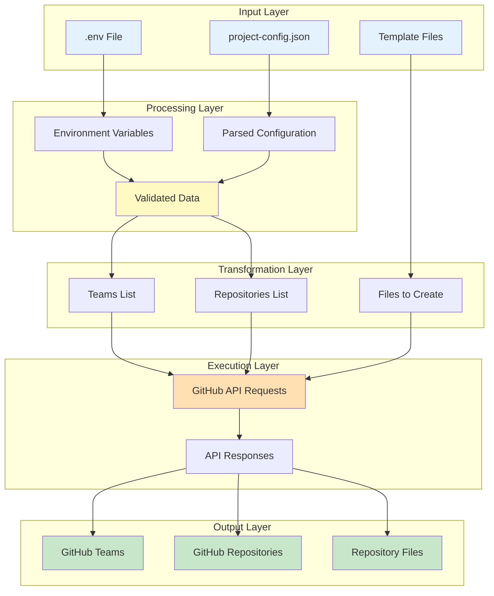

---

## 1. Configuration Data Flow

### Environment Variables Flow

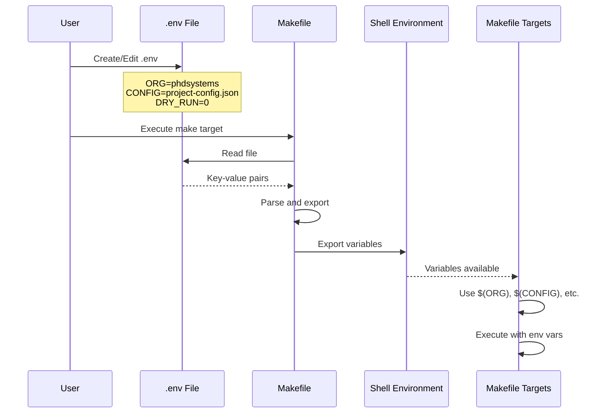

**Data Structure:**
```bash
# Input (.env file)
ORG=phdsystems
CONFIG=project-config.json
DEFAULT_BRANCH=main
DRY_RUN=0
VERBOSE=0

# Output (Environment Variables)
export ORG="phdsystems"
export CONFIG="project-config.json"
export DEFAULT_BRANCH="main"
export DRY_RUN="0"
export VERBOSE="0"
```

### JSON Configuration Flow

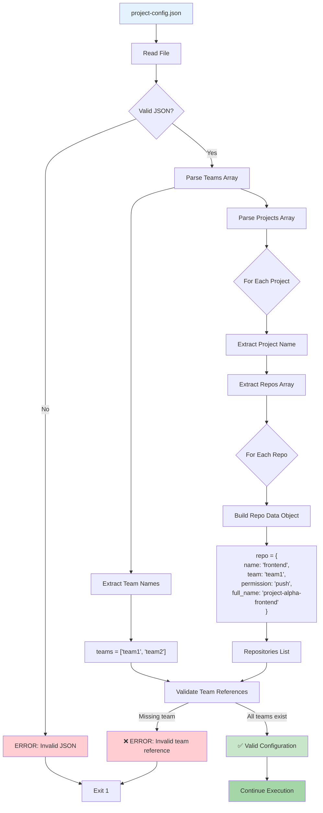

**Data Transformations:**

```json
// Input: project-config.json
{
  "teams": ["frontend-team", "backend-team"],
  "projects": [{
    "name": "alpha",
    "repos": [{
      "name": "frontend",
      "team": "frontend-team",
      "permission": "push"
    }]
  }]
}

// Output: Extracted teams list
teams = ["frontend-team", "backend-team"]

// Output: Extracted repos with computed names
repos = [{
  "project": "alpha",
  "name": "frontend",
  "full_name": "project-alpha-frontend",
  "team": "frontend-team",
  "permission": "push",
  "template_readme": "templates/README-frontend.md",
  "template_workflow": "templates/workflow-frontend.yml"
}]
```

---

## 2. Execution Data Flow

### Team Creation Flow

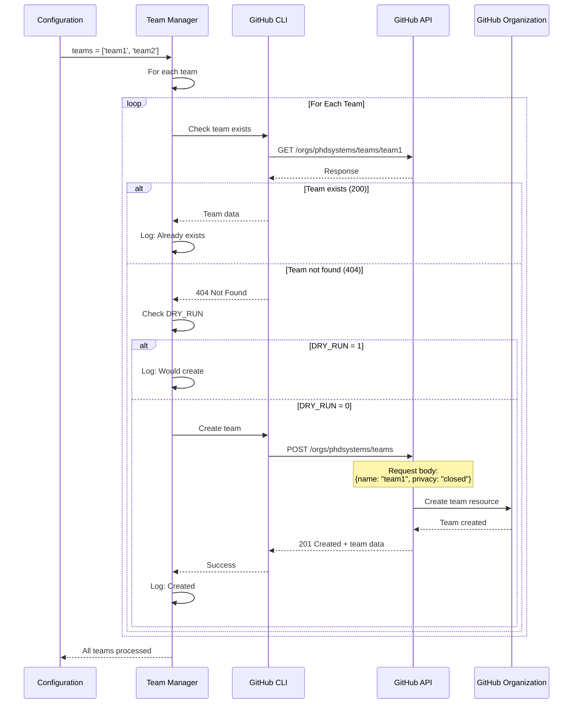

**Data at Each Stage:**

1. **Input:**
```bash
teams = ["frontend-team", "backend-team"]
ORG = "phdsystems"
DRY_RUN = "0"
```

2. **Existence Check:**
```bash
# API Request
GET /orgs/phdsystems/teams/frontend-team

# API Response (exists)
{
  "id": 12345,
  "name": "frontend-team",
  "slug": "frontend-team",
  "privacy": "closed",
  ...
}

# API Response (not exists)
{
  "message": "Not Found",
  "documentation_url": "..."
}
```

3. **Creation Request:**
```bash
# API Request
POST /orgs/phdsystems/teams
Content-Type: application/json

{
  "name": "frontend-team",
  "privacy": "closed"
}

# API Response
{
  "id": 12345,
  "name": "frontend-team",
  "slug": "frontend-team",
  "privacy": "closed",
  "created_at": "2025-10-27T10:00:00Z",
  ...
}
```

4. **Output:**
```bash
✅ Created team: frontend-team
```

### Repository Creation Flow

```mermaid
flowchart TB
    Start[Repository Data] --> Extract[Extract Properties]

    Extract --> Props["Properties:<br/>- project: alpha<br/>- name: frontend<br/>- team: frontend-team<br/>- permission: push"]

    Props --> BuildName[Build Full Repo Name]
    BuildName --> FullName["full_name = project-alpha-frontend"]

    FullName --> CheckExists{Repo Exists?}
    CheckExists -->|Yes| Skip[Skip Creation]
    CheckExists -->|No| CheckDryRun{DRY_RUN?}

    CheckDryRun -->|Yes| LogDry["Log: Would create"]
    CheckDryRun -->|No| CreateRepo[Create Repository]

    CreateRepo --> RepoPayload["Payload:<br/>{<br/>name: 'project-alpha-frontend',<br/>private: false,<br/>auto_init: true,<br/>default_branch: 'main'<br/>}"]

    RepoPayload --> APICreate[POST /orgs/{org}/repos]
    APICreate --> RepoCreated[Repository Created]

    RepoCreated --> AssignTeam[Assign Team]
    AssignTeam --> TeamPayload["Payload:<br/>{<br/>permission: 'push'<br/>}"]

    TeamPayload --> APIAssign[PUT /orgs/{org}/teams/{team}/repos/{org}/{repo}]
    APIAssign --> TeamAssigned[Team Assigned]

    Skip --> Done[Complete]
    LogDry --> Done
    TeamAssigned --> Done

    style Start fill:#e3f2fd
    style FullName fill:#fff3e0
    style RepoCreated fill:#c8e6c9
    style TeamAssigned fill:#c8e6c9
    style Done fill:#a5d6a7
```

**Data Transformation:**

```bash
# Input from config
{
  "project": "alpha",
  "name": "frontend",
  "team": "frontend-team",
  "permission": "push"
}

# Transformed data
{
  "full_name": "project-alpha-frontend",
  "org": "phdsystems",
  "team": "frontend-team",
  "permission": "push",
  "api_endpoints": {
    "create": "POST /orgs/phdsystems/repos",
    "assign": "PUT /orgs/phdsystems/teams/frontend-team/repos/phdsystems/project-alpha-frontend"
  }
}

# API Request (Create)
POST /orgs/phdsystems/repos
{
  "name": "project-alpha-frontend",
  "private": false,
  "auto_init": true,
  "default_branch": "main"
}

# API Response (Create)
{
  "id": 67890,
  "name": "project-alpha-frontend",
  "full_name": "phdsystems/project-alpha-frontend",
  "private": false,
  "html_url": "https://github.com/phdsystems/project-alpha-frontend",
  "default_branch": "main",
  ...
}

# API Request (Assign Team)
PUT /orgs/phdsystems/teams/frontend-team/repos/phdsystems/project-alpha-frontend
{
  "permission": "push"
}

# API Response (Assign Team)
204 No Content
```

### Template Application Flow

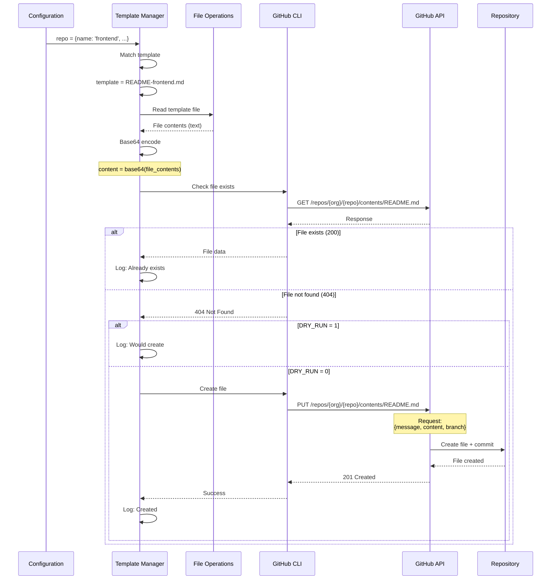

**Data Transformation:**

```bash
# Input
repo_name = "frontend"
repo_full = "project-alpha-frontend"
template_file = "templates/README-frontend.md"

# Template file content
"""
# Frontend Application

This is a React 18 + TypeScript + Vite project.

## Setup
npm install
npm run dev
"""

# Base64 encode
content = "IyBGcm9udGVuZCBBcHBsaWNhdGlvbgoKVGhpcyBpcyBhIFJlYWN0IDE4ICsgVHlwZVNjcmlwdCArIFZpdGUgcHJvamVjdC4KCiMjIFNldHVwCm5wbSBpbnN0YWxsCm5wbSBydW4gZGV2"

# API Request
PUT /repos/phdsystems/project-alpha-frontend/contents/README.md
{
  "message": "docs: add README from template",
  "content": "IyBGcm9udGVuZCBBcHBsaWNhdGlvbgoKVGhpcyBpcyBhIFJlYWN0IDE4ICsgVHlwZVNjcmlwdCArIFZpdGUgcHJvamVjdC4KCiMjIFNldHVwCm5wbSBpbnN0YWxsCm5wbSBydW4gZGV2",
  "branch": "main"
}

# API Response
{
  "content": {
    "name": "README.md",
    "path": "README.md",
    "sha": "abc123...",
    "size": 123,
    "url": "...",
    "html_url": "...",
    ...
  },
  "commit": {
    "sha": "def456...",
    "message": "docs: add README from template",
    "author": {...},
    ...
  }
}
```

---

## 3. Data State Transitions

### Configuration State Machine

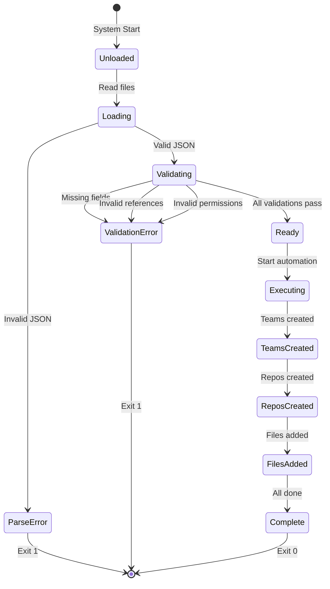

### Repository State Machine

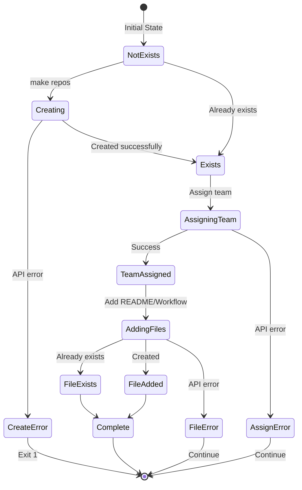

### Team State Machine

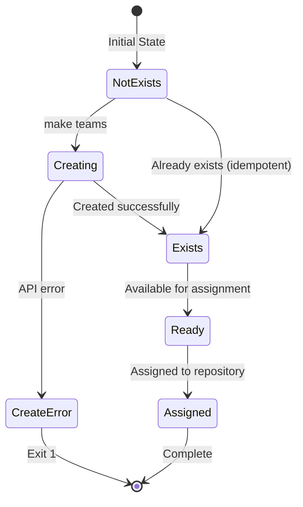

---

## 4. Data Validation Flow

```mermaid
flowchart TB
    Start[Configuration Data] --> V1{Valid JSON?}
    V1 -->|No| E1[ERROR: JSON syntax]
    V1 -->|Yes| V2{Has teams array?}

    V2 -->|No| E2[ERROR: Missing teams]
    V2 -->|Yes| V3{Teams array not empty?}

    V3 -->|No| E3[ERROR: Empty teams]
    V3 -->|Yes| V4{Has projects array?}

    V4 -->|No| E4[ERROR: Missing projects]
    V4 -->|Yes| V5{Projects array not empty?}

    V5 -->|No| E5[ERROR: Empty projects]
    V5 -->|Yes| V6{All projects have repos?}

    V6 -->|No| E6[ERROR: Missing repos]
    V6 -->|Yes| V7{All repo teams defined?}

    V7 -->|No| E7[ERROR: Invalid team ref]
    V7 -->|Yes| V8{All permissions valid?}

    V8 -->|No| E8[ERROR: Invalid permission]
    V8 -->|Yes| V9{All names valid format?}

    V9 -->|No| E9[ERROR: Invalid name]
    V9 -->|Yes| Success[✅ Valid Configuration]

    E1 --> Exit[Exit 1]
    E2 --> Exit
    E3 --> Exit
    E4 --> Exit
    E5 --> Exit
    E6 --> Exit
    E7 --> Exit
    E8 --> Exit
    E9 --> Exit

    Success --> DataReady[Data Ready for Execution]
    DataReady --> [*]

    style Start fill:#e3f2fd
    style Success fill:#c8e6c9
    style DataReady fill:#a5d6a7
    style E1 fill:#ffcdd2
    style E2 fill:#ffcdd2
    style E3 fill:#ffcdd2
    style E4 fill:#ffcdd2
    style E5 fill:#ffcdd2
    style E6 fill:#ffcdd2
    style E7 fill:#ffcdd2
    style E8 fill:#ffcdd2
    style E9 fill:#ffcdd2
```

**Validation Rules:**

| Check | Rule | Error Message |
|-------|------|---------------|
| JSON Syntax | Valid JSON | "Invalid JSON in {file}" |
| Teams Exists | `.teams` field present | "No teams defined" |
| Teams Not Empty | `length > 0` | "Empty teams array" |
| Projects Exists | `.projects` field present | "No projects defined" |
| Projects Not Empty | `length > 0` | "Empty projects array" |
| Repos Exists | Each project has `.repos` | "Missing repos in project {name}" |
| Team References | All `repo.team` in `teams[]` | "Team '{team}' not defined" |
| Permissions Valid | `permission in [pull, push, maintain, triage, admin]` | "Invalid permission: {perm}" |
| Names Format | Matches `^[a-z0-9-]+$` | "Invalid name: {name}" |

---

## 5. API Data Flow

### Request/Response Cycle

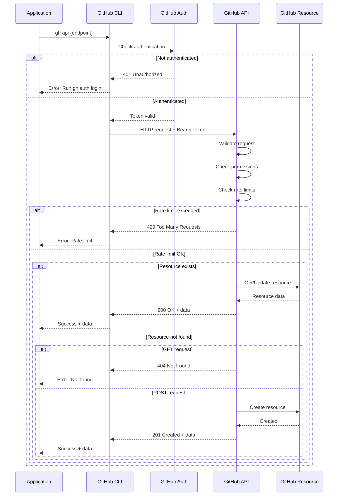

### API Data Structures

#### Team Creation
```bash
# Request
POST /orgs/phdsystems/teams
Authorization: Bearer {token}
Content-Type: application/json

{
  "name": "frontend-team",
  "privacy": "closed"
}

# Response (Success)
201 Created
{
  "id": 12345,
  "node_id": "MDQ6VGVhbTEyMzQ1",
  "url": "https://api.github.com/teams/12345",
  "html_url": "https://github.com/orgs/phdsystems/teams/frontend-team",
  "name": "frontend-team",
  "slug": "frontend-team",
  "description": "",
  "privacy": "closed",
  "permission": "pull",
  "members_url": "...",
  "repositories_url": "...",
  "created_at": "2025-10-27T10:00:00Z",
  "updated_at": "2025-10-27T10:00:00Z"
}

# Response (Error - Already Exists)
422 Unprocessable Entity
{
  "message": "Validation Failed",
  "errors": [
    {
      "resource": "Team",
      "code": "already_exists",
      "field": "name"
    }
  ]
}
```

#### Repository Creation
```bash
# Request
POST /orgs/phdsystems/repos
Authorization: Bearer {token}
Content-Type: application/json

{
  "name": "project-alpha-frontend",
  "description": "Frontend application for alpha project",
  "private": false,
  "auto_init": true,
  "default_branch": "main"
}

# Response (Success)
201 Created
{
  "id": 67890,
  "node_id": "MDEwOlJlcG9zaXRvcnk2Nzg5MA==",
  "name": "project-alpha-frontend",
  "full_name": "phdsystems/project-alpha-frontend",
  "private": false,
  "owner": {...},
  "html_url": "https://github.com/phdsystems/project-alpha-frontend",
  "description": "Frontend application for alpha project",
  "fork": false,
  "url": "https://api.github.com/repos/phdsystems/project-alpha-frontend",
  "created_at": "2025-10-27T10:00:00Z",
  "updated_at": "2025-10-27T10:00:00Z",
  "pushed_at": "2025-10-27T10:00:00Z",
  "size": 0,
  "stargazers_count": 0,
  "watchers_count": 0,
  "language": null,
  "has_issues": true,
  "has_projects": true,
  "has_downloads": true,
  "has_wiki": false,
  "has_pages": false,
  "default_branch": "main",
  ...
}
```

#### Team Assignment
```bash
# Request
PUT /orgs/phdsystems/teams/frontend-team/repos/phdsystems/project-alpha-frontend
Authorization: Bearer {token}
Content-Type: application/json

{
  "permission": "push"
}

# Response (Success)
204 No Content

# No response body for 204
```

#### File Creation
```bash
# Request
PUT /repos/phdsystems/project-alpha-frontend/contents/README.md
Authorization: Bearer {token}
Content-Type: application/json

{
  "message": "docs: add README from template",
  "content": "IyBGcm9udGVuZCBBcHBsaWNhdGlvbgo...",
  "branch": "main"
}

# Response (Success)
201 Created
{
  "content": {
    "name": "README.md",
    "path": "README.md",
    "sha": "abc123def456",
    "size": 123,
    "url": "https://api.github.com/repos/phdsystems/project-alpha-frontend/contents/README.md",
    "html_url": "https://github.com/phdsystems/project-alpha-frontend/blob/main/README.md",
    "git_url": "...",
    "download_url": "...",
    "type": "file",
    "_links": {...}
  },
  "commit": {
    "sha": "def456abc123",
    "node_id": "...",
    "url": "...",
    "html_url": "...",
    "author": {
      "name": "username",
      "email": "user@example.com",
      "date": "2025-10-27T10:00:00Z"
    },
    "committer": {...},
    "tree": {...},
    "message": "docs: add README from template",
    "parents": [...]
  }
}
```

---

## 6. Error Data Flow

```mermaid
flowchart TB
    Start[Operation Start] --> Execute[Execute Action]
    Execute --> Result{Result?}

    Result -->|Success| Log1[Log Success]
    Result -->|Error| Classify{Error Type?}

    Classify -->|404| Handle404[Handle Not Found]
    Classify -->|403| Handle403[Handle Forbidden]
    Classify -->|422| Handle422[Handle Validation]
    Classify -->|429| Handle429[Handle Rate Limit]
    Classify -->|Other| HandleOther[Handle Generic Error]

    Handle404 --> Critical404{Critical?}
    Critical404 -->|Yes| Exit1[Exit 1]
    Critical404 -->|No| Log2[Log Warning]

    Handle403 --> Exit2[Exit 1]
    Note right of Exit2: Always critical

    Handle422 --> Critical422{Critical?}
    Critical422 -->|Yes| Exit3[Exit 1]
    Critical422 -->|No| Log3[Log Warning]

    Handle429 --> Wait[Wait + Retry]
    Wait --> RetryCount{Retries left?}
    RetryCount -->|Yes| Execute
    RetryCount -->|No| Exit4[Exit 1]

    HandleOther --> Exit5[Exit 1]

    Log1 --> Continue
    Log2 --> Continue
    Log3 --> Continue
    Continue[Continue Execution]

    style Start fill:#e3f2fd
    style Log1 fill:#c8e6c9
    style Continue fill:#a5d6a7
    style Exit1 fill:#ffcdd2
    style Exit2 fill:#ffcdd2
    style Exit3 fill:#ffcdd2
    style Exit4 fill:#ffcdd2
    style Exit5 fill:#ffcdd2
```

**Error Data Structures:**

```bash
# 404 Not Found
{
  "message": "Not Found",
  "documentation_url": "https://docs.github.com/rest/..."
}

# 403 Forbidden
{
  "message": "Forbidden",
  "documentation_url": "https://docs.github.com/rest/..."
}

# 422 Validation Failed
{
  "message": "Validation Failed",
  "errors": [
    {
      "resource": "Team",
      "code": "already_exists",
      "field": "name"
    }
  ],
  "documentation_url": "https://docs.github.com/rest/..."
}

# 429 Rate Limit
{
  "message": "API rate limit exceeded",
  "documentation_url": "https://docs.github.com/rest/overview/resources-in-the-rest-api#rate-limiting"
}
```

---

## 7. Complete Execution Data Flow

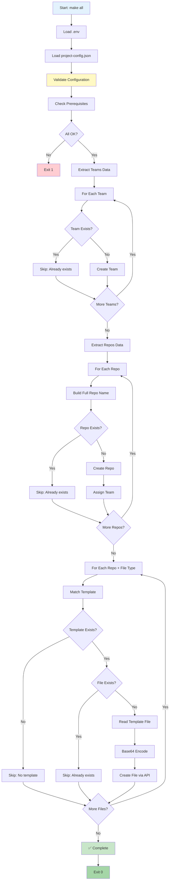

**Data at Key Points:**

```bash
# 1. After LoadEnv
ORG="phdsystems"
CONFIG="project-config.json"
DRY_RUN="0"

# 2. After LoadConfig
{
  "teams": ["frontend-team", "backend-team"],
  "projects": [{
    "name": "alpha",
    "repos": [{
      "name": "frontend",
      "team": "frontend-team",
      "permission": "push"
    }]
  }]
}

# 3. After ExtractTeams
teams=("frontend-team" "backend-team")

# 4. After ExtractRepos
repos=(
  {
    "project": "alpha",
    "name": "frontend",
    "full_name": "project-alpha-frontend",
    "team": "frontend-team",
    "permission": "push"
  }
)

# 5. After MatchTemplate
files=(
  {
    "repo": "project-alpha-frontend",
    "type": "README",
    "template": "templates/README-frontend.md",
    "target": "README.md"
  }
  {
    "repo": "project-alpha-frontend",
    "type": "workflow",
    "template": "templates/workflow-frontend.yml",
    "target": ".github/workflows/ci.yml"
  }
  {
    "repo": "project-alpha-frontend",
    "type": "codeowners",
    "template": "templates/CODEOWNERS",
    "target": ".github/CODEOWNERS"
  }
)

# 6. Final Output
Teams created: 2
Repositories created: 1
Files added: 3
Total API calls: 7
Execution time: 45 seconds
```

---

## 8. Data Caching and Optimization

### Current State (No Caching)

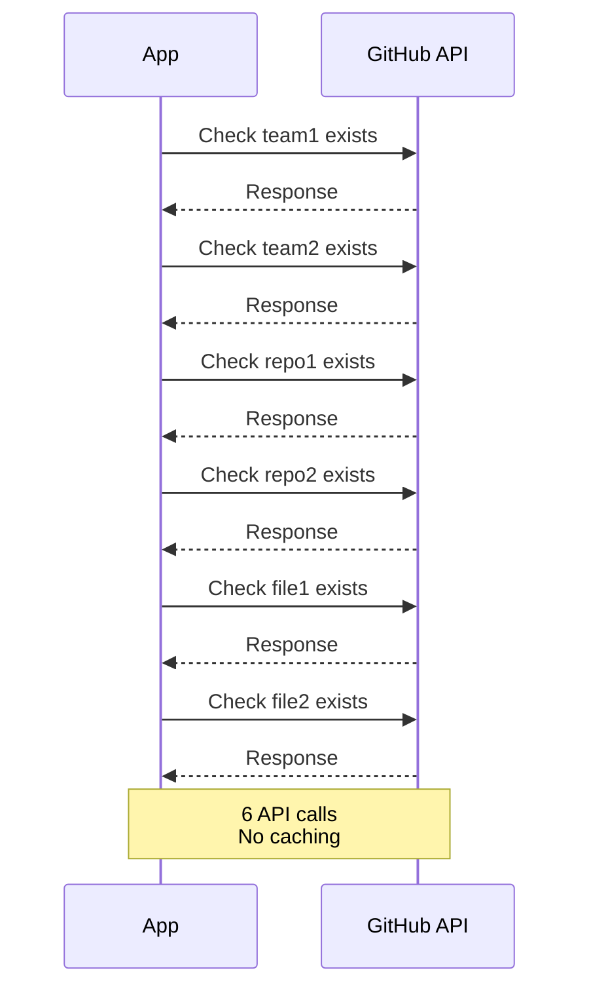

### Potential Optimization (With Caching)

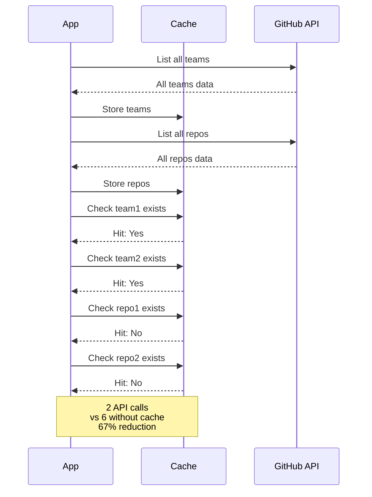

**Trade-offs:**
- **Pro:** Fewer API calls, faster execution
- **Pro:** Reduced rate limit impact
- **Con:** More complex implementation
- **Con:** Memory usage for cache
- **Con:** Potential stale data if external changes

---

*Last Updated: 2025-10-27*
