# Error Handling Design - GitHub Organization Automation

**Date:** 2025-10-27
**Version:** 1.0

---

## Overview

This document defines the comprehensive error handling strategy for the GitHub Organization Automation system. It covers error classification, handling approaches, recovery mechanisms, user messaging, logging, and testing strategies.

---

## Error Handling Philosophy

### Core Principles

1. **Fail Fast on Critical Errors** - Immediately exit on errors that prevent execution
2. **Continue on Non-Critical Errors** - Log and continue for recoverable errors
3. **Idempotent Operations** - Safe to retry without side effects
4. **Clear Error Messages** - Actionable guidance for users
5. **Graceful Degradation** - Partial success when possible


---

## Error Classification

### 1. Critical Errors (Exit Immediately)

**Characteristics:**
- Prevent all further execution
- Require user intervention
- Cannot be recovered automatically

**Examples:**

| Error | Cause | Exit Code |
|-------|-------|-----------|
| Missing .env | Configuration file not found | 1 |
| Invalid JSON | Syntax error in config | 1 |
| Not authenticated | GitHub authentication failed | 1 |
| Wrong account type | User account instead of Organization | 1 |
| Insufficient permissions | Not admin/owner of organization | 1 |
| Missing required tools | gh, jq, git, make not installed | 1 |

**Error Flow:**



```mermaid
sequenceDiagram
    participant User
    participant App as Application
    participant Check as Error Check

    User->>App: Execute command
    App->>Check: Validate prerequisites
    Check->>Check: Check .env file

    alt File missing
        Check-->>App: Error: .env not found
        App->>App: Display error message
        Note over App: ❌ ERROR: .env file not found<br/>Copy .env.example to .env
        App->>User: Exit 1
    else File exists
        Check-->>App: Success
        App->>App: Continue execution
    end
```

### 2. Recoverable Errors (Log and Continue)

**Characteristics:**
- Affect individual operations only
- Allow partial success
- Logged for user review

**Examples:**

| Error | Cause | Action |
|-------|-------|--------|
| Team already exists | Idempotent operation | Skip, log message |
| Repository already exists | Idempotent operation | Skip, log message |
| File already exists | Idempotent operation | Skip, log message |
| Missing template | Template file not found | Skip repo, log warning |
| Team assignment failure | API error after repo created | Log error, continue |

**Error Flow:**


### 3. Transient Errors (Retry)

**Characteristics:**
- Temporary failures
- May succeed on retry
- Limited retry attempts

**Examples:**

| Error | Cause | Retry Strategy |
|-------|-------|----------------|
| Rate limit exceeded (429) | Too many API calls | Wait until reset, retry |
| Network timeout | Network issues | Exponential backoff, max 3 retries |
| Service unavailable (503) | GitHub API down | Exponential backoff, max 3 retries |
| Gateway error (502) | Temporary gateway issue | Exponential backoff, max 3 retries |

**Error Flow:**


---

## Error Handling Strategies

### Strategy 1: Prerequisites Validation

**Purpose:** Validate all prerequisites before execution


**Implementation:**

```bash
check_prerequisites() {
    local errors=0

    echo "Checking Prerequisites"
    echo "━━━━━━━━━━━━━━━━━━━━━━━━━━━━━━━━━━━━━━━━━━━"

    # Check tools
    for tool in gh jq git make; do
        if ! command -v $tool &>/dev/null; then
            echo "❌ $tool not installed" >&2
            ((errors++))
        else
            echo "✅ $tool installed"
        fi
    done

    # Check .env
    if [ ! -f .env ]; then
        echo "❌ .env file not found" >&2
        echo "   Copy .env.example to .env and configure it" >&2
        ((errors++))
    else
        echo "✅ .env file exists"
    fi

    # Check authentication
    if ! gh auth status &>/dev/null; then
        echo "❌ Not authenticated with GitHub" >&2
        echo "   Run: gh auth login" >&2
        ((errors++))
    else
        echo "✅ Authenticated with GitHub"
    fi

    # Check account type
    local account_type=$(gh api /users/$ORG | jq -r '.type')
    if [ "$account_type" != "Organization" ]; then
        echo "❌ $ORG is a $account_type account, not Organization" >&2
        echo "   This tool requires an Organization account" >&2
        ((errors++))
    else
        echo "✅ $ORG is an Organization account"
    fi

    echo ""

    if [ $errors -gt 0 ]; then
        echo "❌ Prerequisites check failed with $errors error(s)" >&2
        return 1
    fi

    echo "✅ All prerequisites passed"
    return 0
}
```

### Strategy 2: Idempotent Operations

**Purpose:** Allow safe re-execution without side effects

```mermaid
flowchart TB
    Start[Operation Request] --> Check{Resource Exists?}

    Check -->|Yes| Exists[Resource Found]
    Check -->|No| DryRun{DRY_RUN mode?}

    Exists --> Skip[Skip Operation]
    Skip --> Log1["Log: ✅ Already exists"]

    DryRun -->|Yes| LogDry["Log: 🔍 Would create"]
    DryRun -->|No| Create[Create Resource]

    Create --> Result{Result?}
    Result -->|Success| Log2["Log: ✅ Created"]
    Result -->|Error| HandleError[Handle Error]

    Log1 --> Done[Continue]
    LogDry --> Done
    Log2 --> Done
    HandleError --> ErrorType{Error Type?}

    ErrorType -->|Critical| Fail[Exit 1]
    ErrorType -->|Recoverable| Done

    style Start fill:#e3f2fd
    style Done fill:#c8e6c9
    style Fail fill:#ffcdd2
```



**Implementation:**

```bash
create_team_idempotent() {
    local team="$1"
    local org="$2"
    local dry_run="$3"

    # Check if team exists
    if gh api "/orgs/$org/teams/$team" &>/dev/null; then
        echo "✅ Team already exists: $team"
        return 0
    fi

    # Team doesn't exist, create it
    if [ "$dry_run" = "1" ]; then
        echo "🔍 Would create team: $team"
        return 0
    fi

    # Create team
    if gh api "/orgs/$org/teams" \
        -f name="$team" \
        -f privacy="closed" \
        &>/dev/null; then
        echo "✅ Created team: $team"
        return 0
    else
        echo "❌ Failed to create team: $team" >&2
        return 1
    fi
}
```

### Strategy 3: Retry with Exponential Backoff

**Purpose:** Handle transient errors with intelligent retry


**Implementation:**

```bash
api_call_with_retry() {
    local endpoint="$1"
    shift
    local args=("$@")

    local max_retries=3
    local retry_count=0
    local wait_time=1

    while [ $retry_count -le $max_retries ]; do
        local response
        local exit_code

        response=$(gh api "$endpoint" "${args[@]}" 2>&1)
        exit_code=$?

        # Success
        if [ $exit_code -eq 0 ]; then
            echo "$response"
            return 0
        fi

        # Check error type
        if echo "$response" | grep -q "rate limit exceeded"; then
            # Rate limit: wait until reset
            local reset=$(gh api /rate_limit | jq -r '.rate.reset')
            local wait=$((reset - $(date +%s) + 10))

            echo "⚠️  Rate limit exceeded, waiting $wait seconds..." >&2
            sleep $wait
            continue
        fi

        if echo "$response" | grep -qE "503|502"; then
            # Service unavailable: exponential backoff
            if [ $retry_count -lt $max_retries ]; then
                echo "⚠️  Service unavailable, retrying in $wait_time seconds..." >&2
                sleep $wait_time
                wait_time=$((wait_time * 2))
                ((retry_count++))
                continue
            fi
        fi

        # Other error or max retries: fail
        echo "$response" >&2
        return $exit_code
    done

    echo "❌ Max retries exceeded" >&2
    return 1
}
```

### Strategy 4: Graceful Degradation

**Purpose:** Achieve partial success when possible


**Implementation:**

```bash
execute_with_graceful_degradation() {
    local success_count=0
    local failure_count=0
    local total_count=0

    echo "Creating Teams"
    for team in $TEAMS; do
        ((total_count++))
        if create_team_idempotent "$team" "$ORG" "$DRY_RUN"; then
            ((success_count++))
        else
            ((failure_count++))
        fi
    done

    echo ""
    echo "Summary: $success_count/$total_count teams created/verified"

    if [ $success_count -eq 0 ]; then
        echo "❌ No teams created, aborting" >&2
        return 1
    fi

    if [ $failure_count -gt 0 ]; then
        echo "⚠️  $failure_count team(s) failed, continuing with partial success" >&2
    fi

    return 0
}
```

---

## Error Message Design

### Message Format

**Standard Format:**
```
❌ ERROR: {Component}: {Description}
   {Additional Context}
   {Suggested Action}
```

**Example:**
```
❌ ERROR: Configuration: Invalid JSON in project-config.json
   Expected property name or '}' at line 5
   Fix the JSON syntax error and try again
   Run: jq . project-config.json
```

### Message Components

```mermaid
graph TB
    Error[Error Message] --> Icon[Icon/Emoji]
    Error --> Level[Error Level]
    Error --> Component[Component Name]
    Error --> Description[Description]
    Error --> Context[Additional Context]
    Error --> Action[Suggested Action]

    Icon --> |"❌"| Critical[Critical Error]
    Icon --> |"⚠️ "| Warning[Warning]
    Icon --> |"🔍"| DryRun[Dry-Run Preview]
    Icon --> |"✅"| Success[Success]

    Level --> |ERROR| Exit[Exit 1]
    Level --> |WARNING| Continue[Continue]
    Level --> |INFO| Log[Log only]

    style Critical fill:#ffcdd2
    style Warning fill:#fff9c4
    style DryRun fill:#ffe0b2
    style Success fill:#c8e6c9
```



### Error Message Templates

**Configuration Errors:**
```bash
# Missing .env
❌ ERROR: Configuration: .env file not found
   The environment configuration file is missing
   Copy .env.example to .env and configure your settings:
   cp .env.example .env && nano .env

# Invalid JSON
❌ ERROR: Configuration: Invalid JSON in project-config.json
   ${JSON_ERROR_MESSAGE}
   Validate your JSON syntax:
   jq . project-config.json

# Missing required field
❌ ERROR: Configuration: Missing required field 'teams'
   The configuration file must include a 'teams' array
   Add teams to your configuration:
   {"teams": ["team-name"], "projects": [...]}
```

**Authentication Errors:**
```bash
# Not authenticated
❌ ERROR: Authentication: Not authenticated with GitHub
   GitHub CLI authentication is required
   Authenticate with GitHub:
   gh auth login

# Authentication expired
❌ ERROR: Authentication: Authentication token expired
   Your GitHub authentication token has expired
   Re-authenticate with GitHub:
   gh auth login
```

**Permission Errors:**
```bash
# Wrong account type
❌ ERROR: Permissions: User account detected
   Account ${ORG} is a User account, not an Organization
   This tool requires a GitHub Organization account
   Teams cannot be created on user accounts

# Insufficient permissions
❌ ERROR: Permissions: Insufficient organization permissions
   You have '${ROLE}' role, but 'admin' or 'owner' is required
   Request admin access from your organization owner
```

**API Errors:**
```bash
# Rate limit
❌ ERROR: API: Rate limit exceeded
   GitHub API rate limit of 5000 requests/hour exceeded
   Rate limit resets at: ${RESET_TIME}
   Wait approximately ${WAIT_TIME} minutes before retrying

# Service unavailable
❌ ERROR: API: GitHub API unavailable (503)
   GitHub API is temporarily unavailable
   Check GitHub status: https://www.githubstatus.com/
   Retry in a few minutes
```

### Error Output Formatting

```bash
print_error() {
    local component="$1"
    local description="$2"
    local context="$3"
    local action="$4"

    {
        echo ""
        echo "❌ ERROR: $component: $description"
        if [ -n "$context" ]; then
            echo "   $context"
        fi
        if [ -n "$action" ]; then
            echo ""
            echo "   $action"
        fi
        echo ""
    } >&2
}

print_warning() {
    local description="$1"
    local context="$2"

    {
        echo ""
        echo "⚠️  WARNING: $description"
        if [ -n "$context" ]; then
            echo "   $context"
        fi
        echo ""
    } >&2
}
```

---

## Error Logging

### Log Levels

| Level | Icon | Use Case | Output |
|-------|------|----------|--------|
| ERROR | ❌ | Critical failures | stderr |
| WARNING | ⚠️  | Non-critical issues | stderr |
| INFO | ✅ | Success messages | stdout |
| DEBUG | 🔍 | Dry-run operations | stdout |

### Log Format

```bash
# Timestamp + Level + Component + Message
[2025-10-27 10:30:15] [ERROR] [TeamManager] Failed to create team: frontend-team
[2025-10-27 10:30:16] [WARNING] [TemplateManager] No template found for repo: project-alpha-custom
[2025-10-27 10:30:17] [INFO] [RepoManager] Created repository: project-alpha-frontend
[2025-10-27 10:30:18] [DEBUG] [Makefile] Dry-run mode: Would create team backend-team
```

### Logging Implementation

```bash
LOG_FILE="automation.log"
VERBOSE=${VERBOSE:-0}

log() {
    local level="$1"
    local component="$2"
    local message="$3"
    local timestamp=$(date '+%Y-%m-%d %H:%M:%S')

    local log_entry="[$timestamp] [$level] [$component] $message"

    # Always log to file
    echo "$log_entry" >> "$LOG_FILE"

    # Output based on level
    case $level in
        ERROR)
            echo "❌ ERROR: $component: $message" >&2
            ;;
        WARNING)
            echo "⚠️  WARNING: $message" >&2
            ;;
        INFO)
            echo "✅ $message"
            ;;
        DEBUG)
            if [ "$VERBOSE" = "1" ] || [ "$DRY_RUN" = "1" ]; then
                echo "🔍 $message"
            fi
            ;;
    esac
}

# Usage
log "INFO" "TeamManager" "Created team: frontend-team"
log "ERROR" "APIWrapper" "Rate limit exceeded"
log "WARNING" "TemplateManager" "Template not found: README-custom.md"
log "DEBUG" "Makefile" "Dry-run: Would create repository"
```

---

## Error Recovery

### Recovery Workflow


### Automatic Recovery

**Transient Errors:**
- Automatic retry with exponential backoff
- Maximum 3 retry attempts
- Wait time: 1s, 2s, 4s

**Rate Limit Errors:**
- Automatic wait until reset
- Check reset time from API
- Resume execution after reset

### Manual Recovery

**Configuration Errors:**
1. Fix configuration file
2. Validate with `jq . config.json`
3. Re-run command

**Authentication Errors:**
1. Run `gh auth login`
2. Complete OAuth flow
3. Re-run command

**Permission Errors:**
1. Request admin access from organization owner
2. Wait for approval
3. Re-run command

**Account Type Errors:**
1. Create GitHub Organization account
2. Update `ORG` in `.env`
3. Re-run command

---

## Testing Error Handling

### Test Scenarios


### Test Implementation

```bash
# tests/unit/test-error-handling.sh

test_missing_env() {
    # Remove .env temporarily
    mv .env .env.bak

    # Execute should fail
    local output
    output=$(make check-prereqs 2>&1)
    local exit_code=$?

    # Restore .env
    mv .env.bak .env

    # Verify error
    assert_exit_code 1 $exit_code "Should fail without .env"
    assert_contains "$output" "ERROR: .env file not found"
}

test_invalid_json() {
    # Create invalid JSON
    echo "{invalid}" > test-config.json

    # Execute should fail
    local output
    output=$(CONFIG=test-config.json make check-prereqs 2>&1)
    local exit_code=$?

    # Cleanup
    rm test-config.json

    # Verify error
    assert_exit_code 1 $exit_code "Should fail with invalid JSON"
    assert_contains "$output" "Invalid JSON"
}

test_idempotent_team_creation() {
    # Create team twice
    create_team_idempotent "test-team" "$ORG" "0"
    local first_result=$?

    create_team_idempotent "test-team" "$ORG" "0"
    local second_result=$?

    # Cleanup
    gh api -X DELETE "/orgs/$ORG/teams/test-team"

    # Both should succeed
    assert_exit_code 0 $first_result "First creation should succeed"
    assert_exit_code 0 $second_result "Second creation should succeed (idempotent)"
}
```

---

## Error Metrics

### Track Error Rates

| Metric | Description | Target |
|--------|-------------|--------|
| Critical Error Rate | % of executions with critical errors | < 5% |
| Recoverable Error Rate | % with non-critical errors | < 20% |
| Retry Success Rate | % of retries that succeed | > 80% |
| Mean Time to Recovery | Average time to fix and retry | < 5 minutes |

### Error Reporting

```bash
# Generate error report
generate_error_report() {
    local log_file="$1"

    echo "Error Report"
    echo "━━━━━━━━━━━━━━━━━━━━━━━━━━━━━━━━━━━━━━━━━━━"

    local total_errors=$(grep -c "\[ERROR\]" "$log_file")
    local total_warnings=$(grep -c "\[WARNING\]" "$log_file")
    local total_success=$(grep -c "\[INFO\]" "$log_file")

    echo "Errors: $total_errors"
    echo "Warnings: $total_warnings"
    echo "Successes: $total_success"
    echo ""

    echo "Error Breakdown:"
    grep "\[ERROR\]" "$log_file" | cut -d']' -f3 | sort | uniq -c | sort -rn
    echo ""

    echo "Most Recent Errors:"
    grep "\[ERROR\]" "$log_file" | tail -n 5
}
```

---

*Last Updated: 2025-10-27*
