# Workflow Design - GitHub Organization Automation

**Date:** 2025-10-27
**Version:** 1.0

---

## Overview

This document describes all workflows in the GitHub Organization Automation system, from simple dry-run executions to complex multi-project deployments. Each workflow is documented with step-by-step processes, decision points, and visual diagrams.

---

## 1. Complete Automation Workflow

### Main Workflow: `make all`

```mermaid
flowchart TB
    Start([User: make all]) --> CheckEnv{.env exists?}
    CheckEnv -->|No| ErrorEnv[❌ ERROR: Copy .env.example]
    CheckEnv -->|Yes| LoadEnv[Load Environment Variables]

    LoadEnv --> CheckConfig{CONFIG exists?}
    CheckConfig -->|No| ErrorConfig[❌ ERROR: Config not found]
    CheckConfig -->|Yes| LoadConfig[Load Configuration]

    LoadConfig --> ValidateJSON{Valid JSON?}
    ValidateJSON -->|No| ErrorJSON[❌ ERROR: Invalid JSON]
    ValidateJSON -->|Yes| ValidateSchema{Valid schema?}

    ValidateSchema -->|No| ErrorSchema[❌ ERROR: Invalid schema]
    ValidateSchema -->|Yes| Prerequisites[Check Prerequisites]

    Prerequisites --> CheckTools{Tools installed?}
    CheckTools -->|No| ErrorTools[❌ ERROR: Install tools]
    CheckTools -->|Yes| CheckAuth{Authenticated?}

    CheckAuth -->|No| ErrorAuth[❌ ERROR: Run gh auth login]
    CheckAuth -->|Yes| CheckAccountType{Account = Org?}

    CheckAccountType -->|No| ErrorAccount[❌ ERROR: Need Organization]
    CheckAccountType -->|Yes| CheckPerms{Admin perms?}

    CheckPerms -->|No| ErrorPerms[❌ ERROR: Need admin]
    CheckPerms -->|Yes| PrereqPass[✅ Prerequisites Pass]

    PrereqPass --> CreateTeams[Create Teams]
    CreateTeams --> TeamsDone[Teams Created/Verified]

    TeamsDone --> CreateRepos[Create Repositories]
    CreateRepos --> ReposDone[Repos Created/Verified]

    ReposDone --> AddReadmes[Add README Files]
    AddReadmes --> ReadmesDone[READMEs Added]

    ReadmesDone --> AddWorkflows[Add Workflows]
    AddWorkflows --> WorkflowsDone[Workflows Added]

    WorkflowsDone --> AddCodeowners[Add CODEOWNERS]
    AddCodeowners --> CodeownersDone[CODEOWNERS Added]

    CodeownersDone --> Summary[Print Summary]
    Summary --> Success([✅ Complete: Exit 0])

    ErrorEnv --> Fail([❌ Exit 1])
    ErrorConfig --> Fail
    ErrorJSON --> Fail
    ErrorSchema --> Fail
    ErrorTools --> Fail
    ErrorAuth --> Fail
    ErrorAccount --> Fail
    ErrorPerms --> Fail

    style Start fill:#e3f2fd
    style Success fill:#c8e6c9
    style PrereqPass fill:#a5d6a7
    style TeamsDone fill:#c8e6c9
    style ReposDone fill:#c8e6c9
    style ReadmesDone fill:#c8e6c9
    style WorkflowsDone fill:#c8e6c9
    style CodeownersDone fill:#c8e6c9
    style ErrorEnv fill:#ffcdd2
    style ErrorConfig fill:#ffcdd2
    style ErrorJSON fill:#ffcdd2
    style ErrorSchema fill:#ffcdd2
    style ErrorTools fill:#ffcdd2
    style ErrorAuth fill:#ffcdd2
    style ErrorAccount fill:#ffcdd2
    style ErrorPerms fill:#ffcdd2
    style Fail fill:#ffcdd2
```



### Execution Steps

1. **Environment Loading** (5 seconds)
   - Read `.env` file
   - Export environment variables
   - Validate required variables set

2. **Configuration Loading** (2 seconds)
   - Read `project-config.json`
   - Parse JSON structure
   - Extract teams and projects

3. **Validation** (5 seconds)
   - Validate JSON syntax
   - Validate schema structure
   - Validate team references
   - Validate permission values
   - Validate naming conventions

4. **Prerequisites Check** (10 seconds)
   - Check tools installed (gh, jq, git, make)
   - Check GitHub authentication
   - Verify account type (Organization)
   - Verify admin permissions
   - Check rate limits

5. **Team Creation** (10-20 seconds)
   - For each team in configuration:
     - Check if team exists
     - Skip if exists (idempotent)
     - Create if missing
     - Log result

6. **Repository Creation** (30-60 seconds)
   - For each project and repo:
     - Build full repository name
     - Check if repository exists
     - Skip if exists (idempotent)
     - Create repository if missing
     - Assign team with permissions
     - Log result

7. **README Addition** (20-30 seconds)
   - For each repository:
     - Match template by repo name
     - Check if README exists
     - Skip if exists
     - Read template file
     - Base64 encode content
     - Create file via API
     - Log result

8. **Workflow Addition** (20-30 seconds)
   - For each repository:
     - Match workflow template
     - Check if workflow exists
     - Skip if exists
     - Read template file
     - Base64 encode content
     - Create file via API
     - Log result

9. **CODEOWNERS Addition** (20-30 seconds)
   - For each repository:
     - Read CODEOWNERS template
     - Check if file exists
     - Skip if exists
     - Base64 encode content
     - Create file via API
     - Log result

10. **Summary** (1 second)
    - Print execution summary
    - Count teams created
    - Count repos created
    - Count files added
    - Print total time
    - Exit with success

**Total Time:** 2-3 minutes for 10 repositories

---

## 2. Dry-Run Workflow

### Dry-Run: `make all DRY_RUN=1`

```mermaid
flowchart TB
    Start([User: make all DRY_RUN=1]) --> SetDryRun[Set DRY_RUN=1]
    SetDryRun --> LoadConfig[Load Configuration]
    LoadConfig --> Validate[Validate Configuration]

    Validate --> ValidOK{Valid?}
    ValidOK -->|No| Error[❌ ERROR]
    ValidOK -->|Yes| Prereq[Check Prerequisites]

    Prereq --> PrereqOK{Prerequisites OK?}
    PrereqOK -->|No| ErrorPrereq[❌ ERROR]
    PrereqOK -->|Yes| SimTeams[Simulate Team Creation]

    SimTeams --> LogTeams["🔍 Log: Would create teams"]
    LogTeams --> SimRepos[Simulate Repo Creation]

    SimRepos --> LogRepos["🔍 Log: Would create repos"]
    LogRepos --> SimFiles[Simulate File Addition]

    SimFiles --> LogFiles["🔍 Log: Would add files"]
    LogFiles --> Summary[Print Summary]

    Summary --> Note["📝 Note: No changes made"]
    Note --> Success([✅ Dry-Run Complete])

    Error --> Fail([❌ Exit 1])
    ErrorPrereq --> Fail

    style Start fill:#e3f2fd
    style SetDryRun fill:#fff9c4
    style LogTeams fill:#ffe0b2
    style LogRepos fill:#ffe0b2
    style LogFiles fill:#ffe0b2
    style Note fill:#fff9c4
    style Success fill:#c8e6c9
    style Error fill:#ffcdd2
    style ErrorPrereq fill:#ffcdd2
    style Fail fill:#ffcdd2
```



### Dry-Run vs Live Execution


**Benefits of Dry-Run:**
- Preview all changes before execution
- Validate configuration without side effects
- Identify missing templates
- Estimate execution time
- Verify prerequisites
- Safe testing in production

---

## 3. Individual Target Workflows

### Workflow: `make teams`


### Workflow: `make repos`

```mermaid
flowchart TB
    Start([make repos]) --> DepsCheck[Check Dependencies]
    DepsCheck --> TeamsDone{Teams exist?}
    TeamsDone -->|No| Error[❌ ERROR: Run make teams first]
    TeamsDone -->|Yes| Load[Load Configuration]

    Load --> ProjectLoop{For Each Project}
    ProjectLoop -->|project| RepoLoop{For Each Repo}

    RepoLoop -->|repo| BuildName[Build Full Name]
    BuildName --> Name["project-{project}-{repo}"]

    Name --> Check{Repo Exists?}
    Check -->|Yes| Skip[Skip: Already exists]
    Check -->|No| DryRun{DRY_RUN?}

    DryRun -->|Yes| LogDry["🔍 Would create"]
    DryRun -->|No| CreateRepo[Create Repository]

    CreateRepo --> Created["✅ Repo created"]
    Created --> AssignTeam[Assign Team]
    AssignTeam --> Assigned["✅ Team assigned"]

    Skip --> NextRepo{More Repos?}
    LogDry --> NextRepo
    Assigned --> NextRepo

    NextRepo -->|Yes| RepoLoop
    NextRepo -->|No| NextProject{More Projects?}

    NextProject -->|Yes| ProjectLoop
    NextProject -->|No| Done([Complete])

    Error --> Fail([❌ Exit 1])

    style Start fill:#e3f2fd
    style Done fill:#c8e6c9
    style Error fill:#ffcdd2
    style Fail fill:#ffcdd2
```



### Workflow: `make readmes`

```mermaid
flowchart TB
    Start([make readmes]) --> DepsCheck[Check Dependencies]
    DepsCheck --> ReposDone{Repos exist?}
    ReposDone -->|No| Error[❌ ERROR: Run make repos first]
    ReposDone -->|Yes| Load[Load Configuration]

    Load --> RepoLoop{For Each Repo}
    RepoLoop -->|repo| Extract[Extract Repo Name]

    Extract --> Match[Match Template]
    Match --> Template["templates/README-{name}.md"]

    Template --> TemplateExists{Template Exists?}
    TemplateExists -->|No| Warn["⚠️  No template"]
    TemplateExists -->|Yes| Check{File Exists?}

    Check -->|Yes| Skip[Skip: Already exists]
    Check -->|No| DryRun{DRY_RUN?}

    DryRun -->|Yes| LogDry["🔍 Would add"]
    DryRun -->|No| Read[Read Template]

    Read --> Encode[Base64 Encode]
    Encode --> CreateFile[Create via API]
    CreateFile --> Success["✅ Added README"]

    Warn --> Next{More Repos?}
    Skip --> Next
    LogDry --> Next
    Success --> Next

    Next -->|Yes| RepoLoop
    Next -->|No| Done([Complete])

    Error --> Fail([❌ Exit 1])

    style Start fill:#e3f2fd
    style Done fill:#c8e6c9
    style Warn fill:#fff9c4
    style Error fill:#ffcdd2
    style Fail fill:#ffcdd2
```



---

## 4. Common Use Case Workflows

### Use Case 1: New Project with Single Team

**Scenario:** Create a simple project with one team managing all repos.


**Steps:**
1. Create `project-config.json` with single team
2. Run dry-run to preview: `make all DRY_RUN=1`
3. Review output for errors
4. Fix configuration if needed
5. Execute live: `make all`
6. Verify on GitHub web interface
7. Customize template files if needed

**Time:** 10 minutes

### Use Case 2: Multiple Projects with Shared Teams

**Scenario:** Multiple projects sharing the same specialized teams.

```mermaid
flowchart TB
    Start([Multiple Projects]) --> Config[Create Configuration]

    Config --> ConfigExample["Configuration:<br/>{<br/>  teams: ['frontend-team', 'backend-team'],<br/>  projects: [<br/>    {name: 'alpha', repos: [...]},<br/>    {name: 'beta', repos: [...]}<br/>  ]<br/>}"]

    ConfigExample --> DryRun[Run Dry-Run]
    DryRun --> Review[Review Output]

    Review --> ReviewTeams["Expected:<br/>- 2 teams<br/>- 4 repos (2 per project)<br/>- 12 files"]

    ReviewTeams --> OK{Looks Good?}
    OK -->|No| Fix[Adjust Config]
    Fix --> DryRun

    OK -->|Yes| Execute[Execute Live]
    Execute --> Monitor[Monitor Progress]

    Monitor --> Teams["✅ Teams created"]
    Teams --> Repos["✅ Repos created"]
    Repos --> Files["✅ Files added"]

    Files --> Verify[Verify Team Access]
    Verify --> Done([✅ Complete])

    style Start fill:#e3f2fd
    style DryRun fill:#fff9c4
    style Execute fill:#ffe0b2
    style Done fill:#c8e6c9
```



**Benefits:**
- Teams reused across projects
- Consistent permissions
- Easier team management
- Reduced access control overhead

**Time:** 15 minutes

### Use Case 3: Adding Repositories to Existing Project

**Scenario:** Add new repositories to an existing project.

```mermaid
flowchart TB
    Start([Add New Repos]) --> Edit[Edit Configuration]

    Edit --> Add["Add new repos to existing project:<br/>{<br/>  name: 'alpha',<br/>  repos: [<br/>    ...existing...,<br/>    {name: 'new-service', team: 'backend-team'}<br/>  ]<br/>}"]

    Add --> DryRun[Run Dry-Run]
    DryRun --> Review[Review Output]

    Review --> Expected["Expected Output:<br/>✅ Team exists: backend-team<br/>✅ Repo exists: project-alpha-frontend<br/>✅ Repo exists: project-alpha-backend<br/>🔍 Would create: project-alpha-new-service"]

    Expected --> Idempotent[✅ Idempotent: Skips existing]
    Idempotent --> Execute[Execute Live]

    Execute --> Result["Result:<br/>✅ Teams: 0 created, 2 exist<br/>✅ Repos: 1 created, 2 exist<br/>✅ Files: 3 added"]

    Result --> Done([✅ New Repo Ready])

    style Start fill:#e3f2fd
    style Idempotent fill:#c8e6c9
    style Done fill:#c8e6c9
```



**Key Points:**
- Idempotent: Safe to re-run
- Existing resources skipped
- Only new resources created
- No impact on existing repos

**Time:** 5 minutes

### Use Case 4: Updating Template Files

**Scenario:** Update README/workflow templates for existing repos.

```mermaid
flowchart TB
    Start([Update Templates]) --> Edit[Edit Template Files]

    Edit --> Templates["Edit:<br/>- templates/README-frontend.md<br/>- templates/workflow-frontend.yml"]

    Templates --> Problem{Problem?}
    Problem -->|Files exist| Conflict["❌ Files already exist<br/>in repositories"]

    Conflict --> Options[Options]
    Options --> Manual[Manual Update via GitHub UI]
    Options --> API[Delete + Re-create via API]
    Options --> Script[Custom Script]

    Manual --> Done1([✅ Manual updates])
    API --> Warning["⚠️  Loses git history"]
    API --> Done2([✅ Files updated])
    Script --> Done3([✅ Batch updated])

    style Start fill:#e3f2fd
    style Problem fill:#fff9c4
    style Conflict fill:#ffcdd2
    style Warning fill:#fff9c4
```



**Recommendation:**
- Templates apply only on first creation
- Updates require manual changes or custom script
- Consider using GitHub's web editor
- Or create PR with changes via gh CLI

**Time:** 30 minutes (manual) or 10 minutes (script)

---

## 5. Error Handling Workflows

### Error Recovery Workflow


### Common Errors and Solutions

| Error | Cause | Solution | Workflow |
|-------|-------|----------|----------|
| `.env not found` | Missing environment file | `cp .env.example .env` | Restart |
| `Invalid JSON` | Syntax error in config | Validate with `jq . config.json` | Fix + restart |
| `Not authenticated` | GitHub auth expired | `gh auth login` | Retry |
| `404 Not Found` | User account, not Org | Use Organization account | Change account |
| `403 Forbidden` | Insufficient permissions | Request admin access | Get perms + retry |
| `422 Validation` | Invalid data | Check team refs, permissions | Fix config + retry |
| `429 Rate Limit` | Too many requests | Wait ~1 hour | Wait + retry |

---

## 6. CI/CD Workflow

### GitHub Actions Workflow

```mermaid
flowchart TB
    Start([Push to main]) --> Trigger[Trigger Workflow]
    Trigger --> Checkout[Checkout Code]

    Checkout --> Setup[Setup Environment]
    Setup --> InstallGH[Install GitHub CLI]
    InstallGH --> InstallJQ[Install jq]

    InstallJQ --> Auth[Authenticate]
    Auth --> AuthSecret["Use GH_TOKEN secret"]

    AuthSecret --> SetEnv[Set Environment Variables]
    SetEnv --> EnvSecret["Use ORG secret"]

    EnvSecret --> Validate[Validate Configuration]
    Validate --> ValidOK{Valid?}

    ValidOK -->|No| FailValidate[❌ Fail Job]
    ValidOK -->|Yes| RunTests[Run Test Suite]

    RunTests --> TestsOK{Tests Pass?}
    TestsOK -->|No| FailTests[❌ Fail Job]
    TestsOK -->|Yes| DryRun[Run Dry-Run]

    DryRun --> DryRunOK{Dry-Run OK?}
    DryRunOK -->|No| FailDryRun[❌ Fail Job]
    DryRunOK -->|Yes| Manual{Manual Approval?}

    Manual -->|No| Success[✅ Tests Passed]
    Manual -->|Yes| Approve[Wait for Approval]

    Approve --> Approved{Approved?}
    Approved -->|No| Canceled[❌ Canceled]
    Approved -->|Yes| Execute[Execute Live]

    Execute --> ExecuteOK{Success?}
    ExecuteOK -->|No| FailExecute[❌ Fail Job]
    ExecuteOK -->|Yes| Complete[✅ Complete]

    FailValidate --> Notify[Notify Team]
    FailTests --> Notify
    FailDryRun --> Notify
    FailExecute --> Notify

    style Start fill:#e3f2fd
    style Success fill:#c8e6c9
    style Complete fill:#c8e6c9
    style FailValidate fill:#ffcdd2
    style FailTests fill:#ffcdd2
    style FailDryRun fill:#ffcdd2
    style FailExecute fill:#ffcdd2
    style Canceled fill:#ffcdd2
```



**Workflow File:**
```yaml
name: GitHub Organization Automation

on:
  push:
    branches: [main]
  workflow_dispatch:

jobs:
  validate:
    runs-on: ubuntu-latest
    steps:
      - uses: actions/checkout@v4
      - name: Install tools
        run: |
          sudo apt-get update
          sudo apt-get install -y jq
      - name: Validate configuration
        run: |
          jq . project-config.json
          ./scripts/validate-config.sh

  test:
    needs: validate
    runs-on: ubuntu-latest
    steps:
      - uses: actions/checkout@v4
      - name: Run tests
        run: ./tests/run-tests.sh all

  dry-run:
    needs: test
    runs-on: ubuntu-latest
    steps:
      - uses: actions/checkout@v4
      - name: Setup GitHub CLI
        run: |
          type -p gh > /dev/null || sudo apt install gh -y
      - name: Authenticate
        env:
          GH_TOKEN: ${{ secrets.GH_TOKEN }}
        run: echo "$GH_TOKEN" | gh auth login --with-token
      - name: Dry run
        env:
          ORG: ${{ secrets.ORG }}
        run: |
          echo "ORG=$ORG" > .env
          echo "CONFIG=project-config.json" >> .env
          echo "DRY_RUN=1" >> .env
          make all

  deploy:
    needs: dry-run
    runs-on: ubuntu-latest
    environment: production
    steps:
      - uses: actions/checkout@v4
      - name: Setup GitHub CLI
        run: |
          type -p gh > /dev/null || sudo apt install gh -y
      - name: Authenticate
        env:
          GH_TOKEN: ${{ secrets.GH_TOKEN }}
        run: echo "$GH_TOKEN" | gh auth login --with-token
      - name: Execute
        env:
          ORG: ${{ secrets.ORG }}
        run: |
          echo "ORG=$ORG" > .env
          echo "CONFIG=project-config.json" >> .env
          echo "DRY_RUN=0" >> .env
          make all
```

---

## 7. Rollback Workflow

### Manual Rollback Procedure


**Rollback Script Example:**

```bash
#!/bin/bash
# rollback.sh - Remove created resources

ORG="your-org"
CONFIG="project-config.json"

echo "⚠️  WARNING: This will delete resources"
read -p "Continue? (y/N): " confirm
[[ "$confirm" != "y" ]] && exit 0

# Extract repos to delete
REPOS=$(jq -r '.projects[].repos[] | "project-" + .project + "-" + .name' "$CONFIG")

echo "Deleting repositories..."
for repo in $REPOS; do
    full_name="$ORG/$repo"
    if gh repo view "$full_name" &>/dev/null; then
        echo "Deleting: $full_name"
        gh repo delete "$full_name" --yes
    fi
done

# Extract teams to delete
TEAMS=$(jq -r '.teams[]' "$CONFIG")

echo "Deleting teams..."
for team in $TEAMS; do
    if gh api "/orgs/$ORG/teams/$team" &>/dev/null; then
        echo "Deleting team: $team"
        gh api -X DELETE "/orgs/$ORG/teams/$team"
    fi
done

echo "✅ Rollback complete"
```

---

## 8. Performance Optimization Workflow

### Sequential vs Parallel Execution

**Current (Sequential):**
```mermaid
gantt
    title Sequential Execution (Current)
    dateFormat X
    axisFormat %s

    section Teams
    Create team1 :0, 5s
    Create team2 :5s, 5s

    section Repos
    Create repo1 :10s, 10s
    Create repo2 :20s, 10s

    section Files
    Add file1 :30s, 5s
    Add file2 :35s, 5s

    Total Time: 40s :milestone, 40s, 0s
```

**Optimized (Parallel):**
```mermaid
gantt
    title Parallel Execution (Optimized)
    dateFormat X
    axisFormat %s

    section Teams
    Create team1 :0, 5s
    Create team2 :0, 5s

    section Repos
    Create repo1 :5s, 10s
    Create repo2 :5s, 10s

    section Files
    Add file1 :15s, 5s
    Add file2 :15s, 5s

    Total Time: 20s :milestone, 20s, 0s
```

**Time Savings: 50%**

---

*Last Updated: 2025-10-27*
