# CLI Tool Guide - gh-org

**Version:** 1.0.0
**Last Updated:** 2025-10-27

## TL;DR

**Modern CLI for GitHub org automation**: `gh-org` provides user-friendly commands to create teams, repos, and apply templates. **Architecture**: Modular design (cmd/pkg/internal) following GitHub CLI patterns → Colored output → Rich help system → Dry-run support. **Quick start**: `./src/main/cli/gh-org setup --dry-run` then `./src/main/cli/gh-org setup`.

---

## Table of Contents

- [Overview](#overview)
- [Architecture](#architecture)
- [Installation](#installation)
- [Commands Reference](#commands-reference)
- [Workflows](#workflows)
- [Diagrams](#diagrams)
- [Comparison: CLI vs Makefile](#comparison-cli-vs-makefile)
- [Development Guide](#development-guide)
- [Troubleshooting](#troubleshooting)

---

## Overview

The `gh-org` CLI is a command-line tool for automating GitHub organization management. It provides a modern, user-friendly interface that follows the structure and conventions of the official GitHub CLI (`gh`).

### Key Features

- ✅ **User-friendly commands** - Intuitive command structure
- ✅ **Rich help system** - Detailed `--help` for every command
- ✅ **Colored output** - Visual feedback for success/errors/warnings
- ✅ **Dry-run mode** - Preview changes before executing
- ✅ **Verbose mode** - Debug output for troubleshooting
- ✅ **Idempotent** - Safe to run multiple times
- ✅ **Modular design** - Following gh CLI structure

---

## Architecture

### High-Level Structure


### Package Structure (Following gh CLI)

```
cli/
├── gh-org                 # Main entry point (routes commands)
├── cmd/                   # Command handlers (user-facing commands)
│   ├── check.sh          # Validate prerequisites
│   ├── teams.sh          # Team management commands
│   ├── repos.sh          # Repository management commands
│   ├── files.sh          # Template file operations
│   └── setup.sh          # Complete setup workflow
├── pkg/                   # Core business logic (reusable modules)
│   ├── config.sh         # Configuration file parsing
│   ├── github.sh         # GitHub API interactions
│   └── templates.sh      # Template file operations
└── internal/              # Internal utilities (not for external use)
    ├── output.sh         # Colored console output
    └── validation.sh     # Input validation and checks
```

### Design Principles

Following the GitHub CLI philosophy:

1. **Separation of concerns** - Commands (cmd/) separate from logic (pkg/)
2. **Reusability** - Core logic in pkg/ can be used by multiple commands
3. **User-focused** - Rich help text, colored output, clear error messages
4. **Testability** - Modular functions easy to test
5. **Maintainability** - Clear structure, consistent patterns

---

## Installation

### Method 1: Add to PATH (Recommended)

```bash
# Add CLI directory to PATH
export PATH="/home/developer/project-management/src/main/cli:$PATH"

# Add to ~/.bashrc for persistence
echo 'export PATH="/home/developer/project-management/src/main/cli:$PATH"' >> ~/.bashrc

# Reload shell
source ~/.bashrc

# Test
gh-org --help
```

### Method 2: Symlink to System Bin

```bash
# Create symlink
sudo ln -s /home/developer/project-management/src/main/cli/gh-org /usr/local/bin/gh-org

# Test
gh-org --help
```

### Method 3: Direct Execution

```bash
# Run from project root
./src/main/cli/gh-org --help

# Or use full path
/home/developer/project-management/src/main/cli/gh-org --help
```

### Verification

```bash
# Check help
gh-org --help

# Check version
gh-org version

# Verify prerequisites
gh-org check
```

---

## Commands Reference

### Command Hierarchy


### check

**Purpose:** Validate prerequisites before running operations.

```bash
gh-org check
```

**What it checks:**
- ✓ Required CLI tools (gh, jq, git)
- ✓ `.env` file exists and configured
- ✓ `project-config.json` exists and valid
- ✓ GitHub authentication active
- ✓ Template files present

**Output:**
```
Checking prerequisites...
✓ All prerequisites met
```

---

### teams

**Purpose:** Manage GitHub teams.

```bash
# Create teams from configuration
gh-org teams create

# Preview without creating
gh-org teams create --dry-run

# Get help
gh-org teams --help
```

**What it does:**
1. Reads teams from `project-config.json`
2. For each team:
   - Checks if team exists (idempotent)
   - Creates team with 'closed' privacy
   - Reports success/failure

**Output:**
```
Creating GitHub teams
ℹ Creating team: frontend-team
✓ Team created: frontend-team
ℹ Team already exists: backend-team
✓ All teams created successfully
```

---

### repos

**Purpose:** Manage GitHub repositories.

```bash
# Create repositories and assign teams
gh-org repos create

# Preview without creating
gh-org repos create --dry-run

# Get help
gh-org repos --help
```

**What it does:**
1. Reads projects/repos from `project-config.json`
2. For each repo:
   - Creates private repository (if not exists)
   - Assigns team with specified permissions
   - Uses naming: `project-{project}-{repo}`

**Output:**
```
Creating GitHub repositories
ℹ Processing: project-alpha-frontend
ℹ Creating repository: project-alpha-frontend
✓ Repository created: project-alpha-frontend
ℹ Assigning team 'frontend-team' to 'project-alpha-frontend' with 'push' permission
✓ Team assigned: frontend-team -> project-alpha-frontend (push)
✓ All repositories created and configured successfully
```

---

### files

**Purpose:** Manage template files in repositories.

```bash
# Add README files
gh-org files readme

# Add GitHub Actions workflows
gh-org files workflow

# Add CODEOWNERS files
gh-org files codeowners

# Preview without applying
gh-org files readme --dry-run

# Get help
gh-org files --help
```

**What it does:**
1. For each repository:
   - Clones repository to temp directory
   - Copies template file (based on role)
   - Commits and pushes changes
   - Cleans up temp directory

**Output:**
```
Adding README files to repositories
ℹ Processing: project-alpha-frontend
✓ Repository cloned successfully
✓ README added
✓ Changes committed and pushed
✓ README files added to all repositories
```

---

### setup

**Purpose:** Run complete organization setup.

```bash
# Full setup
gh-org setup

# Preview all steps
gh-org setup --dry-run

# Get help
gh-org setup --help
```

**Execution order:**
1. Check prerequisites
2. Create teams
3. Create repositories
4. Add README files
5. Add workflow files
6. Add CODEOWNERS files

**Output:**
```
Running complete GitHub organization setup

Checking prerequisites...
✓ All prerequisites met

Step 1/5: Creating teams
✓ All teams created successfully

Step 2/5: Creating repositories
✓ All repositories created and configured successfully

Step 3/5: Adding README files
✓ README files added to all repositories

Step 4/5: Adding workflow files
✓ Workflow files added to all repositories

Step 5/5: Adding CODEOWNERS files
✓ CODEOWNERS files added to all repositories

✓ Setup completed successfully!
ℹ Your GitHub organization is now configured
```

---

## Workflows

### Complete Setup Workflow

```mermaid
flowchart TB
    Start([User runs gh-org setup]) --> Check{Check<br/>Prerequisites}
    Check -->|Fail| Error1[❌ Show errors<br/>Exit 1]
    Check -->|Pass| Teams[Create Teams]

    Teams --> TeamsOK{Success?}
    TeamsOK -->|No| TeamsErr[⚠ Log error<br/>Continue]
    TeamsOK -->|Yes| TeamsSucc[✓ Teams created]

    TeamsErr --> Repos
    TeamsSucc --> Repos[Create Repositories]

    Repos --> ReposOK{Success?}
    ReposOK -->|No| ReposErr[⚠ Log error<br/>Continue]
    ReposOK -->|Yes| ReposSucc[✓ Repos created]

    ReposErr --> README
    ReposSucc --> README[Add README Files]

    README --> ReadmeOK{Success?}
    ReadmeOK -->|No| ReadmeErr[⚠ Log error<br/>Continue]
    ReadmeOK -->|Yes| ReadmeSucc[✓ READMEs added]

    ReadmeErr --> Workflow
    ReadmeSucc --> Workflow[Add Workflow Files]

    Workflow --> WorkflowOK{Success?}
    WorkflowOK -->|No| WorkflowErr[⚠ Log error<br/>Continue]
    WorkflowOK -->|Yes| WorkflowSucc[✓ Workflows added]

    WorkflowErr --> CODEOWNERS
    WorkflowSucc --> CODEOWNERS[Add CODEOWNERS]

    CODEOWNERS --> CodeownersOK{Success?}
    CodeownersOK -->|No| CodeownersErr[⚠ Log error<br/>Continue]
    CodeownersOK -->|Yes| CodeownersSucc[✓ CODEOWNERS added]

    CodeownersErr --> Summary
    CodeownersSucc --> Summary{Any<br/>Errors?}

    Summary -->|Yes| ErrorSummary[❌ Setup completed with errors<br/>Exit 1]
    Summary -->|No| Success[✓ Setup completed successfully!<br/>Exit 0]

    style Start fill:#e1f5ff
    style Check fill:#fff4e6
    style Error1 fill:#ffebee
    style TeamsSucc fill:#e8f5e9
    style ReposSucc fill:#e8f5e9
    style ReadmeSucc fill:#e8f5e9
    style WorkflowSucc fill:#e8f5e9
    style CodeownersSucc fill:#e8f5e9
    style Success fill:#c8e6c9
    style ErrorSummary fill:#ffebee
```



### File Addition Workflow


### Data Flow

```mermaid
flowchart TB
    subgraph Input
        A[.env<br/>ORG name]
        B[project-config.json<br/>Teams, projects, repos]
        C[templates/<br/>Template files]
    end

    subgraph "CLI Processing"
        D[gh-org command]
        E[Parse arguments]
        F[Load config]
        G[Execute business logic]
    end

    subgraph "GitHub API"
        H[Create teams]
        I[Create repos]
        J[Assign permissions]
        K[Clone repos]
        L[Push changes]
    end

    subgraph Output
        M[Teams created]
        N[Repos created]
        O[Files committed]
        P[Console output]
    end

    A --> F
    B --> F
    C --> G

    D --> E
    E --> F
    F --> G

    G --> H
    G --> I
    G --> J
    G --> K
    G --> L

    H --> M
    I --> N
    J --> N
    L --> O

    G --> P

    style Input fill:#e3f2fd
    style "CLI Processing" fill:#fff3e0
    style "GitHub API" fill:#f3e5f5
    style Output fill:#e8f5e9
```

---

## Diagrams

### Command Execution Flow


### Module Dependencies


### Dry-Run vs Execute Mode


---

## Comparison: CLI vs Makefile

### Feature Comparison

| Feature | CLI (gh-org) | Makefile |
|---------|--------------|----------|
| **Command syntax** | `gh-org teams create` | `make teams` |
| **Help system** | ✓ Rich `--help` text | ✗ Limited (comments) |
| **Colored output** | ✓ Green/red/yellow | ✗ Plain text |
| **Error messages** | ✓ Detailed, contextual | ✗ Generic |
| **Dry-run** | `--dry-run` flag | `DRY_RUN=1` variable |
| **Verbose mode** | `--verbose` flag | N/A |
| **Modularity** | ✓ cmd/pkg/internal | ✗ Single Makefile |
| **Testability** | ✓ Easy to unit test | ✗ Hard to test |
| **Portability** | ✓ Pure bash | ⚠ Requires `make` |
| **CI/CD friendly** | ✓ Exit codes | ✓ Exit codes |
| **Documentation** | ✓ Built-in help | ⚠ External docs |

### Usage Comparison

**CLI:**
```bash
# Intuitive command structure
gh-org check
gh-org teams create
gh-org repos create
gh-org setup --dry-run

# Rich help at every level
gh-org --help
gh-org teams --help
gh-org files --help
```

**Makefile:**
```bash
# Make-style targets
make -C src/main check-prereqs
make -C src/main teams
make -C src/main repos
make -C src/main all DRY_RUN=1

# Limited help
make -C src/main help  # if implemented
```

### When to Use Each

**Use CLI (`gh-org`) when:**
- ✅ Interactive use by developers
- ✅ Need rich help/documentation
- ✅ Want colored, user-friendly output
- ✅ Developing/debugging
- ✅ Running one-off operations

**Use Makefile when:**
- ✅ CI/CD pipelines
- ✅ Automated scripts
- ✅ Integration with existing Make workflows
- ✅ Legacy compatibility
- ✅ Need specific Make features (dependencies, phony targets)

### Side-by-Side Example

**Creating teams:**

```bash
# CLI (user-friendly)
$ gh-org teams create
Creating GitHub teams
ℹ Creating team: frontend-team
✓ Team created: frontend-team
ℹ Creating team: backend-team
✓ Team created: backend-team
✓ All teams created successfully

# Makefile (automation-friendly)
$ make -C src/main teams
🔧 Creating teams...
gh api -X POST /orgs/phdsystems/teams -f name="frontend-team" -f privacy="closed"
✅ Team created: frontend-team
gh api -X POST /orgs/phdsystems/teams -f name="backend-team" -f privacy="closed"
✅ Team created: backend-team
```

**Recommendation:** Use **CLI for interactive work**, **Makefile for automation**.

---

## Development Guide

### Adding a New Command

1. **Create command handler** in `cmd/`:

```bash
# cmd/mycommand.sh
#!/bin/bash

# Source dependencies
SCRIPT_DIR="$(cd "$(dirname "${BASH_SOURCE[0]}")" && pwd)"
source "${SCRIPT_DIR}/../internal/output.sh"

cmd::mycommand::run() {
  local root_dir="$1"
  output::header "Running my command"
  # Implementation
  output::success "Command completed"
}

cmd::mycommand::help() {
  cat <<EOF
My command description.

Usage:
  gh-org mycommand [options]

Options:
  -h, --help    Show this help
EOF
}
```

2. **Source in main CLI** (`gh-org`):

```bash
# Add to source section
source "${CLI_DIR}/cmd/mycommand.sh"

# Add to router
case "$command" in
  mycommand)
    cmd::mycommand::run "$ROOT_DIR"
    ;;
  # ...
esac
```

3. **Test the command:**

```bash
./src/main/cli/gh-org mycommand --help
./src/main/cli/gh-org mycommand
```

### Adding Business Logic

Add reusable functions to `pkg/`:

```bash
# pkg/mymodule.sh
#!/bin/bash

_PKG_DIR="$(cd "$(dirname "${BASH_SOURCE[0]}")" && pwd)"
source "${_PKG_DIR}/../internal/output.sh"

mymodule::do_something() {
  local arg="$1"
  output::info "Doing something with: $arg"
  # Logic here
  return 0
}
```

Source in command handlers:

```bash
source "${SCRIPT_DIR}/../pkg/mymodule.sh"
```

### Testing

**Manual testing:**
```bash
# Test help
./src/main/cli/gh-org mycommand --help

# Test dry-run
./src/main/cli/gh-org mycommand --dry-run

# Test execution
./src/main/cli/gh-org mycommand

# Test with verbose
./src/main/cli/gh-org --verbose mycommand
```

**Debugging:**
```bash
# Run with bash debug mode
bash -x ./src/main/cli/gh-org mycommand 2>&1 | less
```

---

## Troubleshooting

### Command not found

**Symptom:**
```bash
$ gh-org --help
bash: gh-org: command not found
```

**Solution:**
```bash
# Option 1: Use full path
./src/main/cli/gh-org --help

# Option 2: Add to PATH
export PATH="/home/developer/project-management/src/main/cli:$PATH"
```

---

### Permission denied

**Symptom:**
```bash
$ ./src/main/cli/gh-org --help
bash: ./src/main/cli/gh-org: Permission denied
```

**Solution:**
```bash
chmod +x /home/developer/project-management/src/main/cli/gh-org
```

---

### GitHub authentication failed

**Symptom:**
```
✗ Not authenticated with GitHub
```

**Solution:**
```bash
gh auth login
gh auth status
```

---

### Configuration file not found

**Symptom:**
```
✗ .env file not found
```

**Solution:**
```bash
# Copy example file
cp .env.example .env

# Edit configuration
nano .env

# Set ORG name
ORG=your-org-name
```

---

### Invalid JSON in config

**Symptom:**
```
✗ Invalid JSON in file: project-config.json
```

**Solution:**
```bash
# Validate JSON
jq . project-config.json

# Fix syntax errors (missing commas, quotes, brackets)
nano project-config.json
```

---

### Template file not found

**Symptom:**
```
✗ README template not found for role: frontend
```

**Solution:**
```bash
# Check template exists
ls -la src/main/templates/README-frontend.md

# Create template if missing
nano src/main/templates/README-frontend.md
```

---

### Colors not showing

**Symptom:**
Colors don't display in output

**Solution:**
```bash
# Check if output is a TTY
tty

# Force colors (if piping)
FORCE_COLOR=1 gh-org teams create
```

---

## Related Documentation

- **CLI README:** [src/main/cli/README.md](../src/main/cli/README.md)
- **User Guide:** [user-guide.md](user-guide.md)
- **Quick Reference:** [quick-reference.md](quick-reference.md)
- **Makefile Documentation:** [src/main/Makefile](../src/main/Makefile)

---

## References

- **GitHub CLI Structure:** https://github.com/cli/cli
- **Bash Best Practices:** https://google.github.io/styleguide/shellguide.html
- **CLI Design Patterns:** https://clig.dev/

---

*Last Updated: 2025-10-27*
