# User Guide: GitHub Organization Automation

**Version:** 2.0.0
**Last Updated:** 2025-10-27

## Table of Contents

- [Introduction](#introduction)
- [Quick Start](#quick-start)
- [Prerequisites](#prerequisites)
- [Installation](#installation)
- [Configuration](#configuration)
- [Basic Usage](#basic-usage)
- [Common Workflows](#common-workflows)
- [Advanced Usage](#advanced-usage)
- [Troubleshooting](#troubleshooting)
- [Best Practices](#best-practices)
- [FAQ](#faq)
- [Reference](#reference)

---

## Introduction

> **💡 Note:** This guide covers the **Makefile** approach. If you prefer a modern CLI interface with colored output and rich help text, see the **[CLI Guide](cli-guide.md)** for the `gh-org` command-line tool.

### What is GitHub Organization Automation?

This tool automates the creation and configuration of GitHub teams, repositories, and standard files across multiple projects in your GitHub Organization.

**Two interfaces available:**
1. **Makefile** (covered in this guide) - Traditional `make` targets
2. **CLI Tool** (`gh-org`) - Modern command-line interface ([CLI Guide](cli-guide.md))

**What it does:**
- Creates teams with proper permissions
- Creates private repositories with naming conventions
- Assigns teams to repositories
- Adds README templates based on repository role
- Configures GitHub Actions CI/CD workflows
- Sets up CODEOWNERS files for code review automation

### Why use this tool?

**Without automation:**
```
For each project (alpha, beta, gamma...):
  1. Click "New Repository" → 3 repositories
  2. Configure each repo settings
  3. Create teams manually
  4. Assign team permissions
  5. Clone repos locally
  6. Create README files
  7. Create .github/workflows/ci.yml
  8. Create .github/CODEOWNERS
  9. Commit and push
  10. Repeat for next project...

Time: ~30 minutes per project × 10 projects = 5 hours
```

**With automation:**
```bash
make all

Time: ~2 minutes for 10 projects
```

### Who should use this?

- **DevOps Engineers** - Setting up infrastructure for multiple projects
- **Engineering Managers** - Standardizing team repositories
- **Platform Teams** - Creating consistent project structures
- **Consultants** - Setting up client organizations quickly

---

## Quick Start

### TL;DR - Get Running in 5 Minutes

```bash
# 1. Clone the repository
git clone https://github.com/phdsystems/project-management-automation.git
cd project-management-automation

# 2. Configure your organization
cp .env.example .env
nano .env  # Set ORG=your-org-name

# 3. Create configuration
cat > project-config.json <<EOF
{
  "teams": ["dev-team"],
  "projects": [{
    "name": "myproject",
    "repos": [{
      "name": "frontend",
      "team": "dev-team",
      "permission": "push"
    }]
  }]
}
EOF

# 4. Authenticate with GitHub
gh auth login

# 5. Preview changes (dry-run)
make all DRY_RUN=1

# 6. Execute
make all
```

Done! Your organization now has:
- ✅ Team: `dev-team`
- ✅ Repository: `project-myproject-frontend`
- ✅ README, CI workflow, and CODEOWNERS files

### Quick Start Visual Flow

```mermaid
flowchart LR
    A[1. Clone Repo] --> B[2. Configure .env]
    B --> C[3. Create config.json]
    C --> D[4. Authenticate gh]
    D --> E[5. Dry-run]
    E --> F{Review OK?}
    F -->|No| G[Fix Config]
    G --> E
    F -->|Yes| H[6. Execute]
    H --> I[✅ Done!]

    style A fill:#e3f2fd
    style B fill:#fff3e0
    style C fill:#fff3e0
    style D fill:#f3e5f5
    style E fill:#fff9c4
    style F fill:#ffecb3
    style H fill:#c8e6c9
    style I fill:#a5d6a7
```



---

## Prerequisites

### Required Tools

#### 1. GitHub CLI (`gh`)

**Install:**
```bash
# macOS
brew install gh

# Ubuntu/Debian
curl -fsSL https://cli.github.com/packages/githubcli-archive-keyring.gpg | sudo dd of=/usr/share/keyrings/githubcli-archive-keyring.gpg
echo "deb [arch=$(dpkg --print-architecture) signed-by=/usr/share/keyrings/githubcli-archive-keyring.gpg] https://cli.github.com/packages stable main" | sudo tee /etc/apt/sources.list.d/github-cli.list > /dev/null
sudo apt update
sudo apt install gh

# Windows
winget install --id GitHub.cli
```

**Verify:**
```bash
gh --version
# Should output: gh version 2.x.x
```

**Authenticate:**
```bash
gh auth login
# Follow prompts to authenticate
```

**Required Scopes:**
- `admin:org` - Create and manage teams
- `repo` - Create and manage repositories
- `workflow` - Manage GitHub Actions

#### 2. jq (JSON Processor)

**Install:**
```bash
# macOS
brew install jq

# Ubuntu/Debian
sudo apt-get install jq

# Windows
choco install jq
```

**Verify:**
```bash
jq --version
# Should output: jq-1.6 or higher
```

#### 3. Make

**Usually pre-installed on Linux/macOS**

**Verify:**
```bash
make --version
# Should output: GNU Make 4.x
```

**Windows:** Install via WSL, Cygwin, or Git Bash

#### 4. Git

**Verify:**
```bash
git --version
# Should output: git version 2.x.x
```

### GitHub Requirements

#### Organization Account (CRITICAL)

⚠️ **You MUST have a GitHub Organization, not a personal user account.**

**Check your account type:**
```bash
gh api /users/YOUR_USERNAME | jq -r '.type'
```

**Output should be:** `Organization`

**If output is:** `User` → You need to create an organization first.

**Create an organization:**
1. Go to https://github.com/organizations/new
2. Choose a name and plan
3. Complete setup

#### Organization Permissions

You need **Owner** or **Admin** permissions in the organization.

**Check permissions:**
```bash
gh api /orgs/YOUR_ORG/memberships/YOUR_USERNAME | jq -r '.role'
```

**Should output:** `admin` or `owner`

### Prerequisites Checklist

```mermaid
flowchart TD
    Start([Start Prerequisites Check]) --> A{gh CLI<br/>installed?}
    A -->|No| A1[Install GitHub CLI]
    A1 --> A
    A -->|Yes| B{jq<br/>installed?}

    B -->|No| B1[Install jq]
    B1 --> B
    B -->|Yes| C{make<br/>installed?}

    C -->|No| C1[Install make]
    C1 --> C
    C -->|Yes| D{git<br/>installed?}

    D -->|No| D1[Install git]
    D1 --> D
    D -->|Yes| E{GitHub<br/>authenticated?}

    E -->|No| E1[Run: gh auth login]
    E1 --> E
    E -->|Yes| F{Organization<br/>account?}

    F -->|No| F1[Create Organization]
    F1 --> F
    F -->|Yes| G{Admin<br/>permissions?}

    G -->|No| G1[Request org access]
    G1 --> G
    G -->|Yes| H([✅ Ready to Start])

    style Start fill:#e3f2fd
    style H fill:#c8e6c9
    style A1 fill:#ffcdd2
    style B1 fill:#ffcdd2
    style C1 fill:#ffcdd2
    style D1 fill:#ffcdd2
    style E1 fill:#fff9c4
    style F1 fill:#fff9c4
    style G1 fill:#fff9c4
```



---

## Installation

### Option 1: Clone from GitHub

```bash
git clone https://github.com/phdsystems/project-management-automation.git
cd project-management-automation
```

### Option 2: Download ZIP

1. Visit https://github.com/phdsystems/project-management-automation
2. Click "Code" → "Download ZIP"
3. Extract and navigate to directory

### Verify Installation

```bash
# Check Makefile exists
ls -la Makefile

# Check templates exist
ls -la templates/

# Run prerequisites check
make check-prereqs
```

---

## Configuration

### Step 1: Environment Variables

Create `.env` file:

```bash
cp .env.example .env
```

Edit `.env`:

```bash
# Required
ORG=your-github-org-name

# Optional (defaults shown)
CONFIG=project-config.json
DEFAULT_BRANCH=main
DRY_RUN=0
VERBOSE=0
```

**Important:** The `.env` file is gitignored for security.

### Configuration Architecture


### Step 2: Project Configuration

Create `project-config.json`:

```json
{
  "teams": [
    "frontend-team",
    "backend-team",
    "infra-team"
  ],
  "projects": [
    {
      "name": "alpha",
      "repos": [
        {
          "name": "frontend",
          "team": "frontend-team",
          "permission": "push"
        },
        {
          "name": "backend",
          "team": "backend-team",
          "permission": "push"
        },
        {
          "name": "infra",
          "team": "infra-team",
          "permission": "admin"
        }
      ]
    }
  ]
}
```

#### Configuration Schema

**Teams array:**
- List of team names to create
- Teams are created with "closed" privacy (visible to org members only)

**Projects array:**
Each project contains:
- `name` (string) - Project identifier (used in repo naming)
- `repos` (array) - List of repositories for this project

**Repository object:**
- `name` (string) - Repository role (frontend/backend/infra)
- `team` (string) - Team to assign (must exist in teams array)
- `permission` (string) - Permission level (see below)

#### Permission Levels

| Permission | Access Level |
|------------|--------------|
| `pull` | Read-only access |
| `push` | Read + write access (recommended for developers) |
| `maintain` | Push + manage issues/PRs |
| `admin` | Full administrative access |
| `triage` | Manage issues/PRs without code access |

#### Repository Naming Convention

Repositories are named: `project-{PROJECT_NAME}-{REPO_NAME}`

**Examples:**
- Project: `alpha`, Repo: `frontend` → `project-alpha-frontend`
- Project: `beta`, Repo: `backend` → `project-beta-backend`


### Step 3: Customize Templates (Optional)

Templates are in `templates/` directory:

```
templates/
├── README-frontend.md          # Frontend README
├── README-backend.md           # Backend README
├── README-infra.md             # Infrastructure README
├── workflow-frontend.yml       # Frontend CI/CD
├── workflow-backend.yml        # Backend CI/CD
├── workflow-infra.yml          # Infrastructure CI/CD
└── CODEOWNERS                  # Code ownership rules
```

**Template Selection:**
Templates are matched by the `name` field in repo configuration:
- `name: "frontend"` → Uses `README-frontend.md` and `workflow-frontend.yml`
- `name: "backend"` → Uses `README-backend.md` and `workflow-backend.yml`
- `name: "infra"` → Uses `README-infra.md` and `workflow-infra.yml`

```mermaid
flowchart TD
    A[Repo name: 'frontend'] --> B{Extract Role}
    B --> C[Role: 'frontend']

    C --> D[templates/README-frontend.md]
    C --> E[templates/workflow-frontend.yml]

    D --> F[→ README.md]
    E --> G[→ .github/workflows/ci.yml]

    H[Repo name: 'backend'] --> I{Extract Role}
    I --> J[Role: 'backend']

    J --> K[templates/README-backend.md]
    J --> L[templates/workflow-backend.yml]

    K --> M[→ README.md]
    L --> N[→ .github/workflows/ci.yml]

    style A fill:#e3f2fd
    style H fill:#e3f2fd
    style D fill:#fff3e0
    style E fill:#fff3e0
    style K fill:#fff3e0
    style L fill:#fff3e0
    style F fill:#c8e6c9
    style G fill:#c8e6c9
    style M fill:#c8e6c9
    style N fill:#c8e6c9
```



**To customize:**
1. Edit template files directly
2. Add your own template files (must match naming pattern)
3. Update team names in CODEOWNERS file

---

## Basic Usage

### Dry-Run Mode (Always Start Here!)

**Preview what will be created without making changes:**

```bash
make all DRY_RUN=1
```

**Output:**
```
🔍 Checking prerequisites...
✅ All prerequisites met (ORG: your-org)
🔧 Creating teams...
[DRY RUN] Would create team: frontend-team
[DRY RUN] Would create team: backend-team
[DRY RUN] Would create team: infra-team
✅ Teams creation complete
📁 Creating repositories...
[DRY RUN] Would create repo: your-org/project-alpha-frontend
[DRY RUN] Would assign team 'frontend-team' with 'push' permission
...
```

Review the output carefully before proceeding.

### Execute Full Automation

```bash
make all
```

**This runs all targets in order:**
1. `check-prereqs` - Validate requirements
2. `teams` - Create teams
3. `repos` - Create repositories and assign teams
4. `readmes` - Add README templates
5. `workflows` - Add GitHub Actions workflows
6. `codeowners` - Add CODEOWNERS files

```mermaid
flowchart TD
    A[make all] --> B[check-prereqs]
    B --> C{All OK?}
    C -->|No| D[❌ Error]
    C -->|Yes| E[teams]

    E --> F{Team exists?}
    F -->|Yes| G[⏭️ Skip]
    F -->|No| H[✨ Create Team]

    G --> I[repos]
    H --> I

    I --> J{Repo exists?}
    J -->|Yes| K[⏭️ Skip]
    J -->|No| L[✨ Create Repo]

    K --> M[Assign Teams]
    L --> M

    M --> N[readmes]
    N --> O[Clone Repo]
    O --> P[Copy Template]
    P --> Q[Commit & Push]

    Q --> R[workflows]
    R --> S[Clone Repo]
    S --> T[Copy Template]
    T --> U[Commit & Push]

    U --> V[codeowners]
    V --> W[Clone Repo]
    W --> X[Copy Template]
    X --> Y[Commit & Push]

    Y --> Z[✅ Complete]

    style A fill:#e3f2fd
    style B fill:#fff3e0
    style E fill:#c8e6c9
    style I fill:#c8e6c9
    style N fill:#c8e6c9
    style R fill:#c8e6c9
    style V fill:#c8e6c9
    style Z fill:#a5d6a7
    style D fill:#ffcdd2
```



**Typical output:**
```
🔍 Checking prerequisites...
✅ All prerequisites met (ORG: your-org)
🔧 Creating teams...
✨ Creating team: frontend-team
✨ Creating team: backend-team
✨ Creating team: infra-team
✅ Teams creation complete
📁 Creating repositories and assigning teams...
✨ Creating repository: project-alpha-frontend
https://github.com/your-org/project-alpha-frontend
🔗 Assigning team 'frontend-team' with 'push' permission
✅ Repositories creation complete
📝 Adding README templates...
📄 Added README to: project-alpha-frontend
✅ README templates added
⚙️ Adding GitHub Actions workflows...
⚙️ Added workflow to: project-alpha-frontend
✅ Workflows added
🧾 Adding CODEOWNERS...
👥 Added CODEOWNERS to: project-alpha-frontend
✅ CODEOWNERS files added
```

### Individual Targets

Run specific operations:

```bash
# Create teams only
make teams

# Create repositories only (requires teams to exist)
make repos

# Add README files only (requires repos to exist)
make readmes

# Add workflows only (requires repos to exist)
make workflows

# Add CODEOWNERS only (requires repos to exist)
make codeowners
```

### Clean Up

```bash
# Remove temporary directories
make clean
```

---

## Common Workflows

### Workflow Decision Tree


### Workflow 1: Single Project Setup

**Scenario:** Create repositories for one project.

```json
{
  "teams": ["dev-team"],
  "projects": [{
    "name": "myapp",
    "repos": [
      {"name": "frontend", "team": "dev-team", "permission": "push"},
      {"name": "backend", "team": "dev-team", "permission": "push"}
    ]
  }]
}
```

**Commands:**
```bash
make all DRY_RUN=1  # Preview
make all            # Execute
```

**Result:**
- Team: `dev-team`
- Repositories: `project-myapp-frontend`, `project-myapp-backend`

**Visual:**


---

### Workflow 2: Multiple Projects, Same Teams

**Scenario:** Create multiple projects with shared teams.

```json
{
  "teams": ["frontend-team", "backend-team"],
  "projects": [
    {
      "name": "alpha",
      "repos": [
        {"name": "frontend", "team": "frontend-team", "permission": "push"},
        {"name": "backend", "team": "backend-team", "permission": "push"}
      ]
    },
    {
      "name": "beta",
      "repos": [
        {"name": "frontend", "team": "frontend-team", "permission": "push"},
        {"name": "backend", "team": "backend-team", "permission": "push"}
      ]
    }
  ]
}
```

**Result:**
- 2 teams: `frontend-team`, `backend-team`
- 4 repositories: `project-alpha-frontend`, `project-alpha-backend`, `project-beta-frontend`, `project-beta-backend`
- Frontend team has access to both frontend repos
- Backend team has access to both backend repos

**Visual:**


---

### Workflow 3: Microservices Architecture

**Scenario:** Create multiple microservices with dedicated teams.

```json
{
  "teams": [
    "auth-team",
    "payment-team",
    "notification-team",
    "platform-team"
  ],
  "projects": [{
    "name": "prod",
    "repos": [
      {"name": "auth-service", "team": "auth-team", "permission": "push"},
      {"name": "payment-service", "team": "payment-team", "permission": "push"},
      {"name": "notification-service", "team": "notification-team", "permission": "push"},
      {"name": "platform", "team": "platform-team", "permission": "admin"}
    ]
  }]
}
```

**Note:** You'll need custom templates for service-specific repos. Copy `templates/README-backend.md` to `templates/README-auth-service.md`, etc.

---

### Workflow 4: Adding New Project to Existing Setup

**Scenario:** Organization already has teams, add new project.

**Step 1:** Check existing teams
```bash
gh api /orgs/YOUR_ORG/teams | jq -r '.[].name'
```

**Step 2:** Add project to config (keep existing teams)
```json
{
  "teams": ["existing-frontend-team", "existing-backend-team"],
  "projects": [
    {
      "name": "new-project",
      "repos": [
        {"name": "frontend", "team": "existing-frontend-team", "permission": "push"},
        {"name": "backend", "team": "existing-backend-team", "permission": "push"}
      ]
    }
  ]
}
```

**Step 3:** Run (teams will be skipped if they exist)
```bash
make all DRY_RUN=1
make all
```

---

### Workflow 5: Incremental Updates

**Scenario:** Add README files to existing repositories.

**If you already have repos but no READMEs:**

```bash
# Only run readme target
make readmes DRY_RUN=1
make readmes
```

**Similarly for workflows or CODEOWNERS:**
```bash
make workflows
make codeowners
```

---

## Advanced Usage

### Custom Configuration File

Use a different config file:

```bash
CONFIG=my-custom-config.json make all DRY_RUN=1
```

Or set in `.env`:
```bash
CONFIG=production-config.json
```

### Override Organization

```bash
ORG=different-org make all DRY_RUN=1
```

### Multiple Environments

**Development:**
```bash
cp project-config.json dev-config.json
# Edit dev-config.json
CONFIG=dev-config.json make all DRY_RUN=1
```

**Production:**
```bash
cp project-config.json prod-config.json
# Edit prod-config.json
CONFIG=prod-config.json make all DRY_RUN=1
```

### Validation Only

```bash
# Check prerequisites without running automation
make check-prereqs
```

### Verbose Mode (Coming Soon)

```bash
VERBOSE=1 make all
```

---

## Troubleshooting

### Troubleshooting Decision Tree


### Common Issues

#### Issue: `.env file not found`

**Cause:** No `.env` file created

**Solution:**
```bash
cp .env.example .env
nano .env  # Set ORG variable
```

---

#### Issue: `ORG variable not set`

**Cause:** Empty ORG in `.env`

**Solution:**
Edit `.env` and set:
```bash
ORG=your-org-name
```

---

#### Issue: `gh CLI not installed`

**Cause:** GitHub CLI not installed

**Solution:**
```bash
# macOS
brew install gh

# Ubuntu
sudo apt-get install gh
```

---

#### Issue: `Not authenticated with GitHub`

**Cause:** Not logged in with `gh`

**Solution:**
```bash
gh auth login
# Follow prompts to authenticate
```

**Verify authentication:**
```bash
gh auth status
```

---

#### Issue: `project-config.json not found`

**Cause:** Configuration file missing

**Solution:**
Create `project-config.json` (see [Configuration](#configuration))

---

#### Issue: `templates/README-frontend.md not found`

**Cause:** Template file missing

**Solution:**
```bash
# Verify templates exist
ls -la templates/

# If missing, clone repository again or download templates
```

---

#### Issue: `Team already exists`

**This is normal!** The tool is idempotent.

**Output:**
```
⏭️  Team 'frontend-team' already exists, skipping...
```

**Action:** None needed, continue with workflow

---

#### Issue: `Repository already exists`

**This is normal!** The tool skips existing repos.

**Output:**
```
⏭️  Repository 'project-alpha-frontend' already exists, skipping...
```

**Action:** None needed

---

#### Issue: `Not Found (HTTP 404)` for teams

**Cause 1:** Using personal user account instead of organization

**Solution:** Create a GitHub Organization (see [Prerequisites](#github-requirements))

**Verify:**
```bash
gh api /users/YOUR_NAME | jq -r '.type'
# Should be "Organization", not "User"
```

**Cause 2:** Insufficient permissions

**Solution:** Ensure you have Owner/Admin role:
```bash
gh api /orgs/YOUR_ORG/memberships/YOUR_USERNAME | jq -r '.role'
# Should be "admin" or "owner"
```

---

#### Issue: Invalid JSON in config

**Cause:** Syntax error in `project-config.json`

**Solution:**
```bash
# Validate JSON
jq . project-config.json
```

**Common errors:**
- Missing comma between elements
- Missing closing brace `}`
- Missing closing bracket `]`
- Unquoted strings

---

#### Issue: Makefile syntax error

**Cause:** Incorrect shell (dash instead of bash)

**Solution:** Already fixed in version 2.0.0+

**Verify:**
```bash
grep "SHELL.*bash" Makefile
# Should show: SHELL := /bin/bash
```

---

### Debug Mode

**Check what would be executed:**

```bash
make -n all
```

This shows commands without executing them.

**Check specific target:**

```bash
make -n teams
```

---

### Getting Help

**View Makefile targets:**
```bash
make help
```

**View test results:**
```bash
./tests/run-tests.sh
```

**View GitHub CLI help:**
```bash
gh help api
gh help repo
```

---

## Best Practices

### Best Practices Workflow


### 1. Always Use Dry-Run First

```bash
# ✅ Good
make all DRY_RUN=1
# Review output
make all

# ❌ Bad
make all  # Without reviewing
```

---

### 2. Start Small

**First time:**
```json
{
  "teams": ["test-team"],
  "projects": [{
    "name": "test",
    "repos": [{"name": "frontend", "team": "test-team", "permission": "push"}]
  }]
}
```

**After validation, scale up.**

---

### 3. Use Version Control for Configuration

```bash
git add project-config.json
git commit -m "feat: add alpha project configuration"
```

**Don't commit `.env` (it's gitignored for security)**

---

### 4. Document Your Team Structure

Add comments to your config (use `_comment` fields):

```json
{
  "_comment": "Team structure for Q4 2025",
  "teams": ["frontend-team", "backend-team"],
  "_projects_comment": "Production projects",
  "projects": [...]
}
```

---

### 5. Use Consistent Naming

**Good:**
- `frontend-team`, `backend-team`, `infra-team`
- `project-alpha-frontend`, `project-beta-backend`

**Avoid:**
- `FrontEnd`, `front_end`, `Frontend` (inconsistent casing)
- `alpha-frontend` without `project-` prefix

---

### 6. Review CODEOWNERS

Edit `templates/CODEOWNERS` before running:

```bash
nano templates/CODEOWNERS
# Update team names
# Update file patterns
```

---

### 7. Test Templates Locally

Clone a repository and verify templates render correctly:

```bash
gh repo view your-org/project-test-frontend --web
```

---

### 8. Backup Before Bulk Operations

```bash
# Export current teams
gh api /orgs/YOUR_ORG/teams > teams-backup.json

# Export current repos
gh repo list YOUR_ORG --json name,visibility > repos-backup.json
```

---

### 9. Use Appropriate Permissions

**Guideline:**
- `push` - Most developers
- `maintain` - Team leads
- `admin` - Platform/DevOps teams only
- `pull` - External contractors (read-only)

---

### 10. Clean Up Test Artifacts

After testing:

```bash
# Delete test repository
gh repo delete your-org/project-test-frontend --yes

# Clean up temp files
make clean
```

---

## FAQ

### Q: Can I use this for personal user account?

**A:** No, this tool requires a GitHub **Organization**. Teams don't exist on personal accounts.

**Solution:** Create an organization at https://github.com/organizations/new

---

### Q: How do I delete created resources?

**A:** Manually via GitHub UI or CLI:

```bash
# Delete repository
gh repo delete your-org/repo-name --yes

# Delete team (via web UI only)
# Go to: https://github.com/orgs/YOUR_ORG/teams
```

**Note:** We may add `make destroy` in future versions.

---

### Q: Can I run this multiple times?

**A:** Yes! The tool is **idempotent**:
- Existing teams are skipped
- Existing repositories are skipped
- Files can be updated by re-running

---

### Q: What if I want different templates per project?

**A:** Currently not supported. Workaround:

1. Run automation for project 1
2. Update templates
3. Run automation for project 2

Or modify the Makefile to support project-specific templates.

---

### Q: Can I use this with GitHub Enterprise?

**A:** Yes, if `gh` CLI is configured for your enterprise instance:

```bash
gh auth login --hostname github.company.com
```

---

### Q: How do I add more team members?

**A:** Manually via web UI:

```
https://github.com/orgs/YOUR_ORG/teams/TEAM_NAME/members
```

Or via CLI:
```bash
gh api -X PUT /orgs/YOUR_ORG/teams/TEAM_NAME/memberships/USERNAME
```

---

### Q: Can I change repository permissions after creation?

**A:** Yes, manually:

```bash
gh api -X PUT /orgs/YOUR_ORG/teams/TEAM_NAME/repos/YOUR_ORG/REPO_NAME \
  -f permission=admin
```

Or update `project-config.json` and re-run (creates new, doesn't update existing).

---

### Q: What about private vs public repos?

**A:** Currently creates **private** repositories only.

To change: Edit Makefile line with `gh repo create` and remove `--private` flag.

---

### Q: How do I update existing README/workflows?

**A:** Re-run the specific target:

```bash
make readmes    # Updates README files
make workflows  # Updates workflow files
```

Git will commit new versions.

---

### Q: Can I test without affecting production?

**A:** Yes, create a test organization:

1. Create test organization: `your-org-test`
2. Set in `.env`: `ORG=your-org-test`
3. Run automation
4. Delete test org when done

---

## Reference

### Permission Hierarchy


### Makefile Targets

| Target | Description | Dependencies |
|--------|-------------|--------------|
| `all` | Run all targets | None |
| `check-prereqs` | Validate prerequisites | None |
| `teams` | Create teams | check-prereqs |
| `repos` | Create repositories | teams |
| `readmes` | Add README templates | repos |
| `workflows` | Add CI/CD workflows | repos |
| `codeowners` | Add CODEOWNERS files | repos |
| `clean` | Remove temp directories | None |

### Environment Variables

| Variable | Required | Default | Description |
|----------|----------|---------|-------------|
| `ORG` | ✅ Yes | - | GitHub organization name |
| `CONFIG` | No | `project-config.json` | Configuration file path |
| `DEFAULT_BRANCH` | No | `main` | Default git branch |
| `DRY_RUN` | No | `0` | Dry-run mode (0=off, 1=on) |
| `VERBOSE` | No | `0` | Verbose output (0=off, 1=on) |

### File Locations

| File | Purpose |
|------|---------|
| `.env` | Environment configuration (gitignored) |
| `project-config.json` | Project/team/repo definitions |
| `templates/` | Template files directory |
| `Makefile` | Main automation script |
| `README.md` | Project documentation |
| `TEST-REPORT.md` | Test results and findings |

### Template Naming Convention

| Repo Role | README Template | Workflow Template |
|-----------|-----------------|-------------------|
| `frontend` | `README-frontend.md` | `workflow-frontend.yml` |
| `backend` | `README-backend.md` | `workflow-backend.yml` |
| `infra` | `README-infra.md` | `workflow-infra.yml` |
| `*` (any) | `CODEOWNERS` | Applied to all repos |

### GitHub API Endpoints Used

| Endpoint | Purpose |
|----------|---------|
| `POST /orgs/{org}/teams` | Create team |
| `GET /orgs/{org}/teams/{team}` | Check team exists |
| `gh repo create` | Create repository |
| `PUT /orgs/{org}/teams/{team}/repos/{owner}/{repo}` | Assign team to repo |

### Exit Codes

| Code | Meaning |
|------|---------|
| `0` | Success |
| `1` | General error |
| `1` (prereqs) | Prerequisites not met |

---

## Getting Help

### Documentation

- **Main README:** `README.md`
- **User Guide:** `docs/user-guide.md` (this file)
- **Test Report:** `TEST-REPORT.md`
- **Test Suite:** `tests/README.md`
- **CI Parallelization:** `docs/ci-parallelization-strategies.md`

### GitHub Resources

- **Repository:** https://github.com/phdsystems/project-management-automation
- **Issues:** https://github.com/phdsystems/project-management-automation/issues
- **Discussions:** https://github.com/phdsystems/project-management-automation/discussions

### External Resources

- **GitHub CLI Manual:** https://cli.github.com/manual/
- **GitHub API Docs:** https://docs.github.com/en/rest
- **jq Manual:** https://stedolan.github.io/jq/manual/
- **GNU Make:** https://www.gnu.org/software/make/manual/

---

## Support

### Report Issues

https://github.com/phdsystems/project-management-automation/issues/new

**Include:**
- Error message
- Commands run
- `make --version`, `gh --version`, `jq --version`
- Operating system
- Configuration file (sanitized)

### Feature Requests

https://github.com/phdsystems/project-management-automation/discussions/new

---

**Happy automating! 🚀**

*Last Updated: 2025-10-27*
*Version: 2.0.0*
