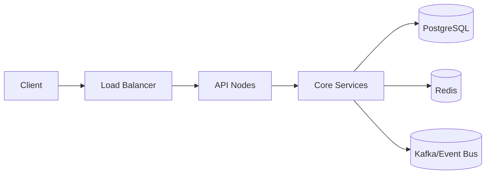

# GOAT - Go Auth Toolkit v2.0

GOAT is an enterprise-ready authentication and authorization platform for Go workloads. It layers MFA, SSO, audit, rate limiting, and eventing on top of a lightweight core so you can ship secure identity features fast.

## Start Here

- 📦 **What GOAT offers**: [System overview](./system-overview.md)
- 🛠️ **Environment prep**: [Pre-requisites](./pre-requisite.md)
- 🧪 **Local bootstrap**: [Local setup guide](./local-setup.md)
- 💻 **Team practices**: [Developer guide](./developer-guide.md)
- 🔌 **Endpoint reference**: [API documentation](./API_DOCUMENTATION_v2.md)
- 🛣️ **Forward plan**: [Roadmap](./ROADMAP_v2.md)

## Highlights

- Full JWx support (JWT/JWS/JWE/JWK) with signed key rotation
- MFA choices: TOTP, WebAuthn, SMS/email OTP, backup flows
- Federation hub for SAML, OIDC, LDAP/AD, and social providers
- Adaptive rate limiting, anomaly detection, and webhook/event infrastructure
- PostgreSQL + Redis foundation with extensible service interfaces

## Architecture Snapshot

For a deep dive, jump to the [system overview](./system-overview.md#architecture). At a glance:

## Contributing

1. Review the [developer guide](./developer-guide.md) for branching, testing, and review expectations.
2. Keep docs in sync—new features should land with corresponding updates.
3. Use the feature-specific test packs under `src/test/` to organise coverage.

Questions or proposals? Open a discussion or reach out to the platform team.
