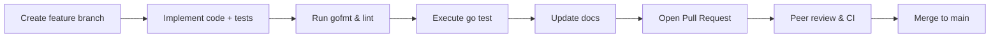

# Developer Guide

This document highlights day-to-day workflows for engineers working on GOAT.

## Repository layout

```
goat/
├── doc/                # Product and operational documentation
├── go.work             # Workspace file pointing at src/main
├── src/main/           # Go module (`module goat`)
│   ├── internal/       # Domain modules (auth, mfa, events, ...)
│   └── migrations/     # SQL migrations consumed by migrate runner
└── project-config.json # Tooling configuration
```

## Branching and commits

1. Branch from `main` using `feature/<short-description>` naming.
2. Keep commits focused (tests + code in the same commit).
3. Reference Jira issues in commit messages when applicable.



## Coding standards

- Run `gofmt` on every Go file.
- Aim for small, composable functions. Avoid introducing global state.
- Use interfaces for external dependencies (e.g., HTTP clients) to make testing easier.
- Provide targeted unit tests; prefer table-driven tests for logic heavy functions.
- Use integration tests (`...IT`) and end-to-end tests (`...E2E`) sparingly to cover cross-module behavior.

## Testing workflow

```bash
# run full suite without CGO dependencies
CGO_ENABLED=0 go test ./...

# run linting (if golangci-lint installed)
golangci-lint run ./...

# run integration suite only
go test ./internal/... -run IT
```

If a test requires external services, ensure Docker Compose services are running first.

## Database migrations

- Add new migrations inside `src/main/migrations` with incremental numeric prefixes.
- Keep SQL idempotent where feasible.
- Always accompany migrations with downgrade scripts when possible.

## Pull request checklist

- [ ] All tests pass locally (`go test ./...`).
- [ ] New functionality includes appropriate tests.
- [ ] Documentation is updated (README, doc/*, or inline comments).
- [ ] Breaking changes are flagged in the PR description.

Following these practices keeps the codebase maintainable and predictable for the entire team.

Need broader architectural context? Check the [system overview](./system-overview.md) and [roadmap](./ROADMAP_v2.md) to align changes with platform direction.
