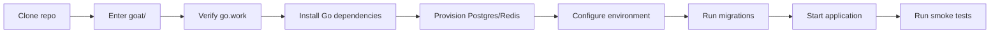

# Local Setup Guide

This guide walks through standing up the GOAT development environment on a workstation. It assumes you are using Go 1.22+ and have access to the required backing services (PostgreSQL and Redis).

## 1. Clone and enter the repository

```bash
git clone git@github.com:your-org/goat.git
cd goat
```

If you are working inside the monorepo, ensure you are in `goat/` before running any project commands.



## 2. Verify Go workspace

The repository already includes a `go.work` file pointing at `src/main`. Confirm the toolchain sees it:

```bash
go env GOWORK
```

The command should output the absolute path to `go.work`. No additional workspace commands are required unless you intentionally modify the workspace.

## 3. Install dependencies

The Go toolchain manages module dependencies automatically. Run:

```bash
cd src/main
go mod tidy
```

For database migrations we recommend [golang-migrate](https://github.com/golang-migrate/migrate). Install it if you plan to run migrations locally:

```bash
# install migrate CLI (example using Go install)
go install github.com/golang-migrate/migrate/v4/cmd/migrate@latest
```

## 4. Provision backing services

- **PostgreSQL**: create a database named `goat` and a user with permission to manage schemas.
- **Redis**: start a Redis instance for caching and rate limiting.

If you prefer containers, the snippet below can be saved as `docker-compose.yml` and started locally:

```yaml
services:
  postgres:
    image: postgres:15
    restart: unless-stopped
    environment:
      POSTGRES_DB: goat
      POSTGRES_USER: goat
      POSTGRES_PASSWORD: goat
    ports:
      - "5432:5432"
  redis:
    image: redis:7
    restart: unless-stopped
    ports:
      - "6379:6379"
```

Launch it with `docker compose up -d` from the same directory and tweak credentials or ports as needed.

## 5. Configure environment variables

Create an `.env.local` file (or copy from `.env.example` if the repository provides one) and populate the following values:

- `GOAT_DATABASE_DSN` – PostgreSQL connection string
- `GOAT_REDIS_ADDR` – Redis address
- `GOAT_JWT_SIGNING_KEY` – 32+ byte signing key
- `GOAT_ENV` – usually `local`

Load the file automatically by using a shell plugin (such as direnv) or export variables manually.

## 6. Run migrations

From `src/main` run:

```bash
migrate -path migrations -database "$GOAT_DATABASE_DSN" up
```

Alternatively use the Go embedded migration runner if you prefer running migrations from inside the application.

## 7. Start the application (when available)

Once a runnable entry point is added under `src/main/cmd/<name>`, you can launch it with:

```bash
cd src/main
go run ./cmd/<name>
```

Replace `<name>` with the actual binary directory (for example `goat`). Ensure the configuration values from step 5 are exported first.

## 8. Verify with smoke tests

```bash
CGO_ENABLED=0 go test ./...
```

For targeted checks of the webhook subsystem run:

```bash
CGO_ENABLED=0 go test ./internal/events -run TestDefaultWebhookDeliverer
```

You now have a working local instance ready for development.

Next steps: review the [developer guide](./developer-guide.md) for team workflows and the [system overview](./system-overview.md) to understand how each component interacts in production.
