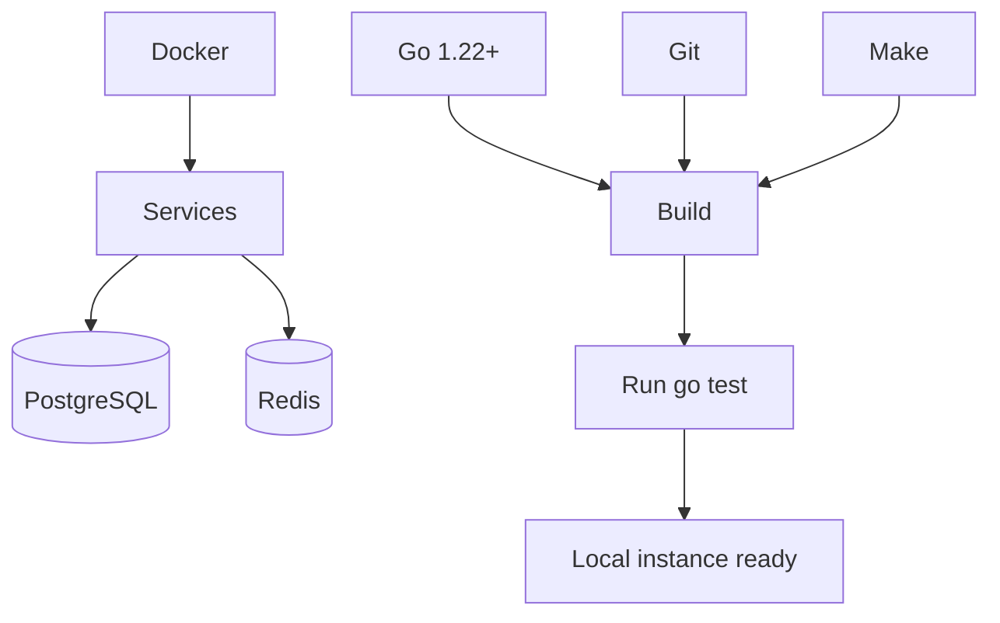

# Pre-requisites

Before contributing to GOAT ensure your workstation has the following tools and services available.

## Required tooling

| Component | Version | Purpose |
|-----------|---------|---------|
| Go | 1.22 or newer | Primary language toolchain |
| Git | 2.35+ | Source control |
| Make | optional but recommended | Task shortcuts |
| Docker / Docker Compose | latest stable | Local infrastructure services |

See also the [system overview](./system-overview.md) for a higher-level look at how these components fit together.

> **Tip:** On macOS install these with Homebrew. On Linux use your distribution package manager or the official installers.

## Databases and services

- **PostgreSQL 14+** – application data store
- **Redis 7+** – caching, rate limiting, and session storage
- **SMTP provider** *(optional)* – for email based MFA or notifications
- **SMS provider** *(optional)* – for SMS OTP delivery

Running these locally is easiest through Docker Compose. Production deployments should use managed services.

## Environment configuration

Set these variables in your shell or `.env` file:

- `GOAT_DATABASE_DSN`
- `GOAT_REDIS_ADDR`
- `GOAT_JWT_SIGNING_KEY`
- `GOAT_ENV`
- `GOAT_MIGRATIONS_DIR` *(optional override, defaults to `migrations/`)*

## IDE recommendations

Any editor with Go support works. We recommend:

- GoLand (JetBrains)
- VS Code with the official Go extension

Enable gofmt-on-save and staticcheck integrations to maintain code quality.

## Access and credentials

If you need access to shared services (CI secrets, staging infrastructure), reach out to the platform engineering team. Credentials should never be committed to the repository.
