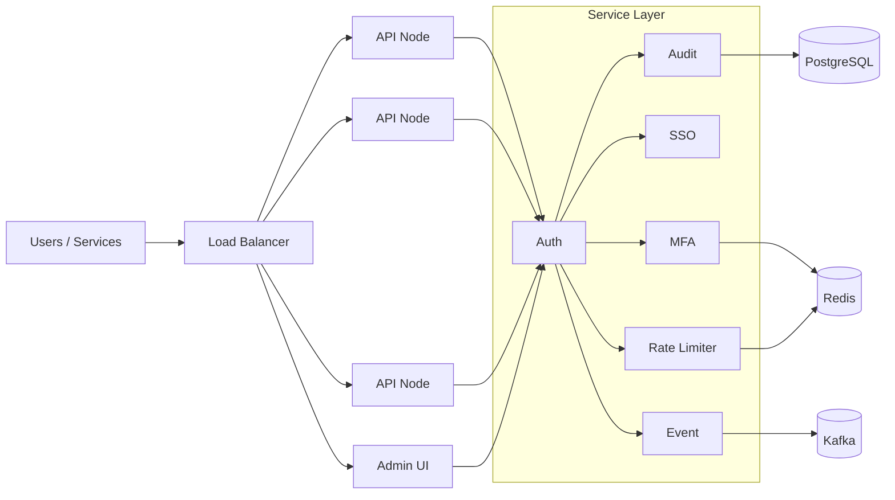
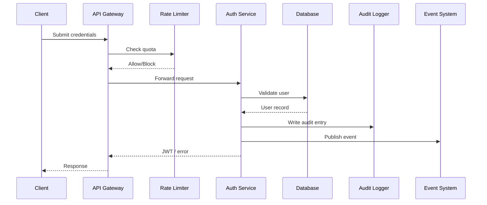
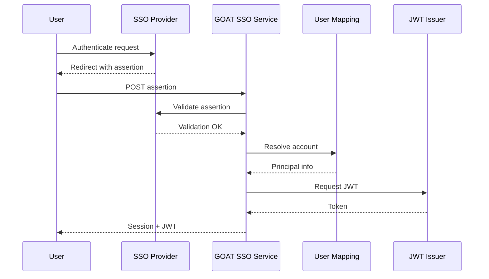

# GOAT System Overview

This document provides a detailed look at GOAT's capabilities, architecture, and operational concerns. Use it alongside the API documentation, setup guides, and roadmap for the full picture.

## Table of Contents

- [Feature Matrix](#feature-matrix)
  - [Core Authentication](#core-authentication)
  - [Audit & Compliance](#audit--compliance)
  - [Multi-Factor Authentication](#multi-factor-authentication)
  - [Federation & SSO](#federation--sso)
  - [Rate Limiting & DDoS Protection](#rate-limiting--ddos-protection)
  - [Webhook & Event System](#webhook--event-system)
- [Architecture](#architecture)
  - [High-Level Topology](#high-level-topology)
  - [Authentication Flow](#authentication-flow)
  - [SSO Flow](#sso-flow)
- [Security Model](#security-model)
- [Performance & Scaling](#performance--scaling)
- [Monitoring & Observability](#monitoring--observability)

## Feature Matrix

### Core Authentication

- **JWT Lifecycle**: Issue, refresh, revoke tokens with automatic JWK rotation
- **Session Management**: Redis-backed session store with concurrency tracking
- **Password Security**: Argon2id hashing with tunable parameters and breach checks
- **Account Workflows**: Registration, verification, recovery, and status management

### Audit & Compliance

- Comprehensive logging of auth, admin, and configuration activities
- GDPR/CCPA features covering export, deletion, and policy enforcement
- Security analytics: failed login tracking, anomaly detection, concurrent session alerts
- Automated compliance reporting with customizable retention policies

### Multi-Factor Authentication

- TOTP/HOTP with QR provisioning and authenticator compatibility
- SMS and email OTP delivery with throttling and retry controls
- WebAuthn/FIDO2 for hardware keys and biometrics
- Backup code issuance and trusted device flows

### Federation & SSO

- SAML 2.0 SP/IdP support with metadata management and signed assertions
- LDAP/Active Directory bridge plus OIDC provider integrations (Okta, Azure AD, etc.)
- Social login adapters for OAuth2 providers with attribute mapping
- Centralized federation management, trust relationships, and session orchestration

### Rate Limiting & DDoS Protection

- Adaptive throttling with behavioral scoring and anomaly detection
- Multi-dimensional limits (global, per-IP, per-user, per-endpoint)
- Redis-backed distributed sliding windows for cluster coordination
- Mitigation options such as CAPTCHA, proof-of-work, and temporary blocks

### Webhook & Event System

- Configurable webhooks with retry policies, signature verification, and delivery history
- Event bus integrations (Kafka, NATS, EventBridge) for downstream pipelines
- Real-time streaming via SSE and WebSocket with filtering
- Dead-letter queues and aggregation for observability

## Architecture

### High-Level Topology

### Authentication Flow

### SSO Flow

## Security Model

- **Defense in Depth**: Layered validation from edge rate limiting to backend policy enforcement
- **Zero Trust Defaults**: Authenticate every call, authorize each resource action
- **Encryption**: TLS 1.3 on the wire, AES-256-GCM for sensitive data at rest
- **Key Management**: Hardware security module integrations and automated rotation
- **Governance**: Configurable retention, tamper-evident audit logs, and policy attestation

## Performance & Scaling

- Horizontally scalable stateless API nodes behind a load balancer
- Asynchronous webhook workers with adjustable concurrency and queue depth
- Redis-backed caching for session/token quick lookups and rate limit counters
- Observability hooks to measure p99 latency, throughput, and error rates per feature

## Monitoring & Observability

- **Metrics**: Prometheus/Grafana dashboards for authentication latency, rate-limit status, queue depth
- **Logging**: Structured logs with trace IDs and security classifications
- **Tracing**: OpenTelemetry instrumentation across API, services, and data stores
- **Alerting**: Thresholds for auth failures, queue saturation, anomaly detection signals

For implementation details, continue with the [API documentation](./API_DOCUMENTATION_v2.md) and follow the [local setup guide](./local-setup.md) to start a development instance.
